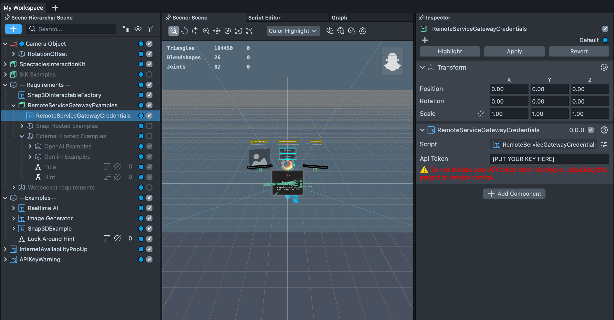
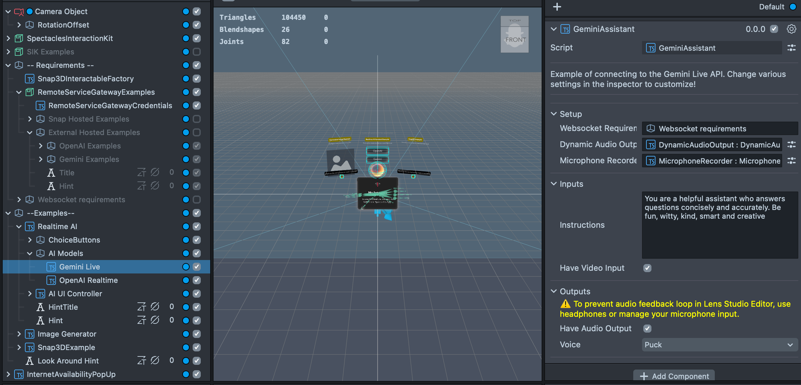
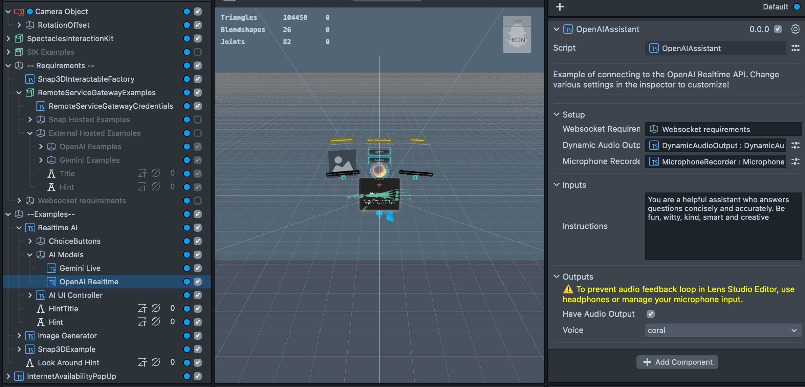
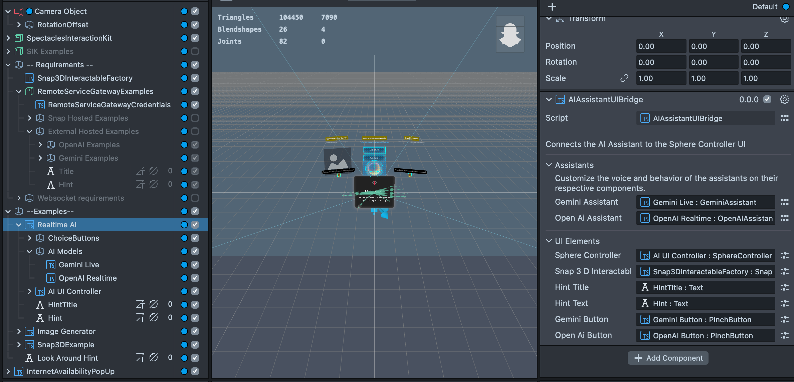
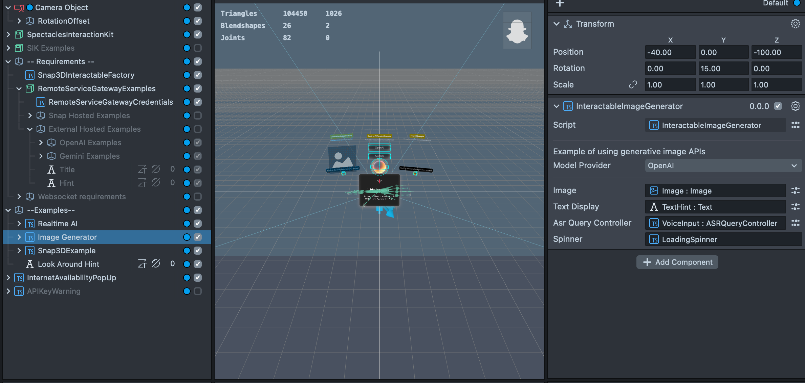
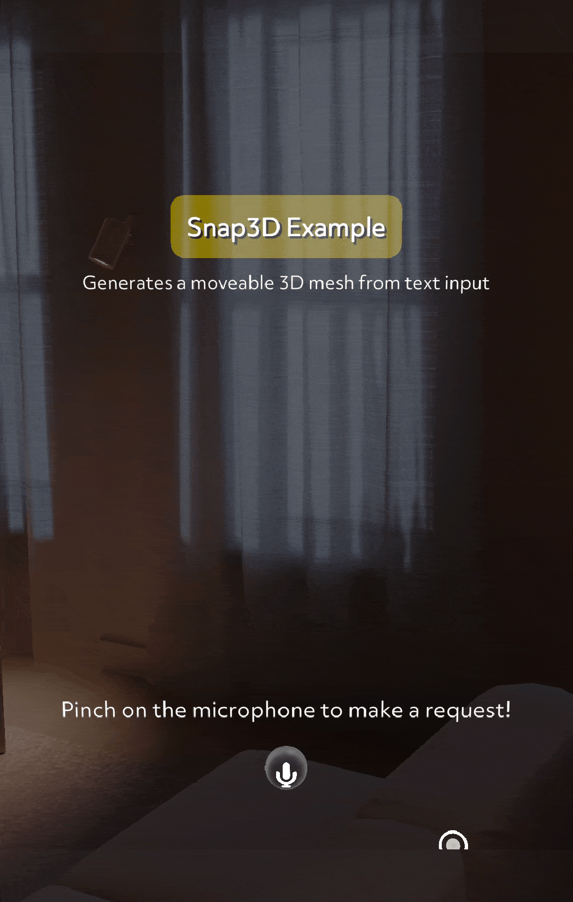

# AI Playground

        

## Overview

This is a sample project showing how to connect to various AI APIs with Remote Service Gateway and interact with them.

> **NOTE:**
> This project will only work for the Spectacles platform. You must set the simulation mode on Lens Studio Preview to `Spectacles (2024)`.
> You must also provide your own Remote Service Gateway Key to use the functionality provided by this project.

## Design Guidelines

Designing Lenses for Spectacles offers all-new possibilities to rethink user interaction with digital spaces and the physical world.
Get started using our [Design Guidelines](https://developers.snap.com/spectacles/best-practices/design-for-spectacles/introduction-to-spatial-design)

## Prerequisites

- **Lens Studio**: v5.10.0+
- **Spectacles OS Version**: v5.62+
- **Spectacles App iOS**: v0.62+
- **Spectacles App Android**: v0.62+

To update your Spectacles device and mobile app, please refer to this [guide](https://support.spectacles.com/hc/en-us/articles/30214953982740-Updating).

You can download the latest version of Lens Studio from [here](https://ar.snap.com/download?lang=en-US).

## Getting Started

To obtain the project folder, clone the repository.

> **IMPORTANT:**
> This project uses Git Large Files Support (LFS). Downloading a zip file using the green button on GitHub **will not work**. You must clone the project with a version of git that has LFS.
> You can download Git LFS [here](https://git-lfs.github.com/).

## Initial Project Setup

In order to use this project and call Remote Service Gateway APIs, you need to:

1. Install the Remote Service Gateway Token Generator plug-in from the Asset Browser
2. Go to Window -> Remote Service Gateway Token
3. Click "Generate Token"
4. Copy paste the token into the "RemoteServiceGatewayCredentials" object in the Inspector

## Key Features

### Realtime Multimodal LLM Connections

This Lens is able to connect to OpenAI Realtime and Gemini Live, realtime AI models that connect to the lens via Websocket to stream audio/camera data.

The Gemini Live object in the scene hierarchy has an script component named `GeminiAssistant` attached where you can configure the prompt, inputs, and outputs of the AI Assistant

The OpenAI Realtime object in the scene hierarchy has a script componened named `OpenAIAssistant` attached where you can configure the prompt, inputs, and outputs of the AI Assistant

The connection from both of these LLMs to the UI of the lens happens in the RealtimeAI object on the `AIAssistantUIBridge` component

See more at [Gemini Live](https://ai.google.dev/gemini-api/docs/live)

See more at [OpenAI Realtime](https://platform.openai.com/docs/api-reference/realtime)

### Text to Image Generation

This lens is able to connect to OpenAI's Image Generation API as well as use Gemini to generate 2D images from text prompts. You can configure the `InteractableImageGenerator` to switch between OpenAI and Gemini models.

See more at [OpenAI Image Generations](https://platform.openai.com/docs/api-reference/images/create)

See more at [Gemini Image Generations](https://ai.google.dev/gemini-api/docs/image-generation)

### Text to 3D Generation

This lens uses Snap3D in order to generate 3D meshes from text prompts.

## Key Scripts

### GeminiAssistant.ts

This script provides an example of how to connect to Gemini Live and stream/recieve data from the API.

`createGeminiLiveSession` sets the audio output to 24kHz and the audio input to 16 kHz and subscribes to the GeminiLiveWebsocket events, calling `sessionSetup` on websocket open and handling Gemini messages onMessage. Within onMessage, the script will check if the data contains audio in which case it will access the dynamicAudioOutput and call `addAudioFrame` to take PCM16 audio and play it back for the user. Additionally it calls `setupInputs` when a session setup is complete.

`sessionSetup` sets the function calls, the generation config and any settings for the Live session.

`setupInputs` will subscribe to `onAudioFrame` from the microphoneRecorder to let the script know when new audio input is ready. When new audio input is ready it is handled by the audioProcessor to convert it to Base64 encoded PCM16 which emits a string of encoded audio when `onAudioChunkReady` is invoked. This then sends the encoded audio data as RealtimeInput to the GeminiLive session. If video input is enabled, the videoController will emit encoded images from the `onEncodedFrame` event that will subsequently be sent to Gemini.

`streamData` enables/disables input from being sent to Gemini from the camera (if video input is enabled) and from the microphone.

`sendFunctionCallUpdate` allows the lens to send responses back to Gemini after a function has been executed, enabling an interactive conversation with function calling capabilities.

### OpenAIAssistant.ts

This script provides an example of how to connect to OpenAI Realtime and stream/receive data from the API.

`createOpenAIRealtimeSession` sets the audio output to 24kHz and the audio input to 24kHz (unlike Gemini's 16kHz) and subscribes to the OpenAIRealtimeWebsocket events, calling `sessionSetup` on websocket open and handling OpenAI messages. Within the message handler, the script processes different message types: text responses (`response.text.delta`), audio transcriptions (`response.audio_transcript.delta`), audio playback (`response.audio.delta`), function calls (`response.output_item.done`), and user speech detection (`input_audio_buffer.speech_started`). For audio playback, it accesses the dynamicAudioOutput and calls `addAudioFrame` to play back decoded PCM16 audio for the user.

`sessionSetup` sets up the session configuration including the assistant's instructions, voice selection, input/output modalities, and available tools. It also sets up audio format to PCM16 and configures turn detection settings for conversation management. Additionally, it establishes the audio processing pipeline to convert microphone input to the appropriate format for transmission.

`streamData` enables/disables input from being sent to OpenAI from the microphone, controlling when the assistant is actively listening.

`sendFunctionCallUpdate` allows the lens to send function execution results back to OpenAI, providing the function name, call ID (which OpenAI requires to track the specific function call), and the response text. This enables interactive function calling capabilities and maintains conversation context.

### ImageGenerator.ts

This script wraps the OpenAI and Gemini image generation APIs to create a function called `generateImage` that returns a promise of a Texture asset. The function shows the differences between how to generate an image with Gemini versus OpenAI's APIs. An example usage of it can be found in `InteractableImageGenerator.ts`.

### Snap3DInteractableFactory.ts

With the `createInteractable3DObject` function this script creates a moveable 3D object with Snap3D. It provides an example of how to submit a query to Snap3D and reflect its output onto an interactable 3D prefab with the `Snap3DInteractable` component

## Helper Scripts

### ASRQueryController.ts

This script implements a simple single query microphone button with [ASR](https://developers.snap.com/spectacles/about-spectacles-features/apis/asr-module#overview) that on pinch begins to listen for a query and will invoke an `onQueryEvent` with a callback containing the voice query

### InternetAvailabilityPopup.ts

This script warns the user that the lens will not work properly without internet connection

### SphereController.ts

This script provides a controller for a simple AI UI that attached to the user's hand, can be placed in the world, and can be visible in screen space.

### AIAssistantUIBridge.ts

This script connects the AI assistants to the `SphereController` and `Snap3DInteractableFactory`, giving the AI UI controls and the ability to trigger and get information back from Snap3D from voice queries

### Snap3DInteractable.ts

This script recieves data from `Snap3DInteractableFactory.ts` to reflect the output of Snap3D on an interactable SceneObject

## Testing the Lens

### In Lens Studio Editor

1. Open the Preview panel in Lens Studio.
2. Ensure your Remote Service Gateway key is correctly set to see accurate results.

### On Spectacles Device

1. Build and deploy the project to your Spectacles device.
2. Follow the [Spectacles guide](https://developers.snap.com/spectacles/get-started/start-building/preview-panel) for device testing.

## OpenAI Disclaimer

Ensure that you comply with [OpenAI’s API usage policies](https://openai.com/policies/usage-policies/) and [Spectacles’ terms of service](https://www.snap.com/terms/spectacles) when deploying this project.

## Gemini Disclaimer

Ensure that you comply with [Gemini's API usage policies](https://ai.google.dev/gemini-api/terms) and [Spectacles’ terms of service](https://www.snap.com/terms/spectacles) when deploying this project.

## Support

If you have any questions or need assistance, please don't hesitate to reach out. Our community is here to help, and you can connect with us and ask for support [here](https://www.reddit.com/r/Spectacles/). We look forward to hearing from you and are excited to assist you on your journey!

## Contributing

Feel free to provide improvements or suggestions or directly contributing via merge request. By sharing insights, you help everyone else build better Lenses.
