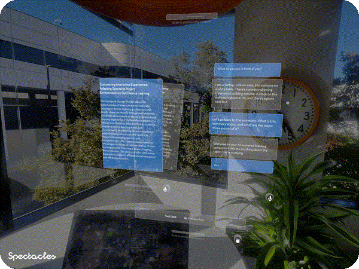

# Agentic Playground

[](https://developers.snap.com/spectacles/spectacles-frameworks/spectacles-interaction-kit/features/overview) [](https://developers.snap.com/spectacles/about-spectacles-features/apis/remoteservice-gateway) [](https://developers.snap.com/spectacles/about-spectacles-features/compatibility-list) [](https://developers.snap.com/spectacles/about-spectacles-features/compatibility-list) [](https://developers.snap.com/spectacles/about-spectacles-features/apis/camera-module) [](https://developers.snap.com/spectacles/about-spectacles-features/compatibility-list) [](https://developers.snap.com/spectacles/about-spectacles-features/compatibility-list) [](https://developers.snap.com/spectacles/about-spectacles-features/compatibility-list) [](https://developers.snap.com/lens-studio/features/audio/playing-audio)


**An AI-Powered Educational Assistant for Snap Spectacles**

Transform lecture experiences with real-time speech processing, intelligent tool routing, multi-modal content generation, and spatial diagram creation - all running natively on Spectacles.

> **NOTE:**
> This project will only work for the **Spectacles platform**. You must set the simulation mode in Lens Studio Preview to `Spectacles (2024)`.
> You must also provide your own **Remote Service Gateway API Token** to use the AI functionality provided by this project.

## 🎯 Project Overview

Agentic Playground is a sophisticated AI agent system designed for educational environments, enabling students to:

- **📋 Real-time Lecture Summarization**: Automatically capture and summarize lectures as they happen
- **💬 Intelligent Conversational AI**: Ask questions and get contextual answers about lecture content
- **📊 Visual Diagram Generation**: Create mind maps, concept diagrams, and visual learning aids
- **👁️ Spatial Awareness**: Analyze live lecture environment using camera input
- **🔊 Voice-First Interaction**: Natural speech-to-text and text-to-speech capabilities

### Key Features

- **True Agent Architecture**: AI-powered tool routing with contextual understanding (no hard-coded rules)
- **Multi-Modal Processing**: Text, voice, images, and 3D model generation
- **Real-Time Processing**: Live audio transcription and immediate AI responses
- **Persistent Memory**: Cross-session conversation and learning context storage
- **Modular Design**: Clean separation of concerns with extensible tool system

### Feature Demonstrations

#### 💬 Default Conversation Interface


The system provides a natural conversational AI interface for general educational questions and guidance.

#### 📋 Summary Tool in Action



Real-time lecture summarization allows students to quickly review key concepts and ask specific questions about lecture content.

#### 📊 Interactive Diagram Creation


AI-powered diagram generation creates visual learning aids and mind maps from educational content.

#### 👁️ Spatial Awareness Tool


The spatial tool uses camera input to analyze the live lecture environment and provide contextual assistance.

#### 🎯 Focus UI Components


Intuitive spatial UI components designed specifically for AR interaction on Spectacles.

#### 📝 Summary Class Integration


Seamless integration of summarization features into the educational workflow.

---

## 🏗️ System Architecture

### High-Level Architecture Diagram

```mermaid
graph TB
    subgraph "User Interface Layer"
        Teacher[👨‍🏫 Teacher]
        Student[👩‍🎓 Student with Spectacles]
        Teacher --> Student
        Student --> ChatInput[🎤 Chat Input]
    end

    subgraph "ASR Layer"
        SummaryASR[📝 SummaryASRController]
        ChatASR[💬 ChatASRController]
        ChatInput --> ChatASR
    end

    subgraph "Storage & Memory Layer"
        StorageManager[🗄️ StorageManager]
        SummaryStorage[📋 SummaryStorage]
        ChatStorage[💬 ChatStorage]
        DiagramStorage[📊 DiagramStorage]
        StorageManager --> SummaryStorage
        StorageManager --> ChatStorage
        StorageManager --> DiagramStorage
    end

    subgraph "Core AI Layer"
        OpenAIAssistant[🤖 OpenAIAssistant]
        GeminiAssistant[🧠 GeminiAssistant]
        AISummarizer[📄 AISummarizer]
    end

    subgraph "Agent System"
        AgentOrchestrator[🎭 AgentOrchestrator]
        AgentLanguageInterface[🗣️ AgentLanguageInterface]
        AgentToolExecutor[🔧 AgentToolExecutor]
        AgentMemorySystem[🧠 AgentMemorySystem]
        
        AgentOrchestrator --> AgentLanguageInterface
        AgentOrchestrator --> AgentToolExecutor
        AgentOrchestrator --> AgentMemorySystem
    end

    subgraph "Intelligent Tool System"
        ToolRouter{🧠 AI-Powered ToolRouter}
        GeneralConversation[💭 GeneralConversationTool]
        SummaryTool[📋 SummaryTool]
        SpatialTool[👁️ SpatialTool]
        DiagramCreator[📊 DiagramCreatorTool]
        DiagramUpdater[🔄 DiagramUpdaterTool]
        
        ToolRouter --> GeneralConversation
        ToolRouter --> SummaryTool
        ToolRouter --> SpatialTool
        ToolRouter --> DiagramCreator
        ToolRouter --> DiagramUpdater
    end

    subgraph "Generation System"
        GenerationQueue[⚡ GenerationQueue]
        ImageGen[🖼️ ImageGen]
        ModelGen[🎲 ModelGen]
        QueueScheduler[📅 ModelGenerationScheduler]
        
        GenerationQueue --> ImageGen
        GenerationQueue --> ModelGen
        QueueScheduler --> GenerationQueue
    end

    subgraph "Bridge Layer"
        SummaryBridge[🌉 SummaryBridge]
        ChatBridge[🌉 ChatBridge]
        DiagramBridge[🌉 DiagramBridge]
        ImageGenBridge[🌉 ImageGenBridge]
        ModelGenBridge[🌉 ModelGenBridge]
    end

    subgraph "UI Components"
        SummaryComponent[📋 SummaryComponent]
        ChatComponent[💬 ChatComponent]
        DiagramComponent[📊 DiagramComponent]
    end

    subgraph "Node System"
        TextNode[📝 TextNode]
        ImageNode[🖼️ ImageNode]
        ModelNode[🎲 ModelNode]
    end

    subgraph "External APIs"
        OpenAI_API[🔥 OpenAI API]
        Gemini_API[✨ Gemini API]
        Snap3D_API[🎲 Snap3D API]
    end

    %% Connections
    SummaryASR --> StorageManager
    ChatASR --> AgentOrchestrator
    AgentOrchestrator --> ToolRouter
    ToolRouter --> GenerationQueue
    AgentLanguageInterface --> OpenAIAssistant
    AgentLanguageInterface --> GeminiAssistant
    OpenAIAssistant --> OpenAI_API
    GeminiAssistant --> Gemini_API
    GenerationQueue --> Snap3D_API
    SummaryBridge --> SummaryComponent
    ChatBridge --> ChatComponent
    DiagramBridge --> DiagramComponent
    DiagramComponent --> TextNode
    DiagramComponent --> ImageNode
    DiagramComponent --> ModelNode

    %% Styling
    classDef userLayer fill:#e1f5fe
    classDef asrLayer fill:#fff3e0
    classDef storageLayer fill:#f3e5f5
    classDef aiLayer fill:#e8f5e8
    classDef agentLayer fill:#fff8e1
    classDef toolLayer fill:#e0f2f1
    classDef genLayer fill:#fce4ec
    classDef bridgeLayer fill:#f1f8e9
    classDef uiLayer fill:#e3f2fd
    classDef nodeLayer fill:#faf2ff
    classDef apiLayer fill:#ffebee

    class Teacher,Student,ChatInput userLayer
    class SummaryASR,ChatASR asrLayer
    class StorageManager,SummaryStorage,ChatStorage,DiagramStorage storageLayer
    class OpenAIAssistant,GeminiAssistant,AISummarizer aiLayer
    class AgentOrchestrator,AgentLanguageInterface,AgentToolExecutor,AgentMemorySystem agentLayer
    class ToolRouter,GeneralConversation,SummaryTool,SpatialTool,DiagramCreator,DiagramUpdater toolLayer
    class GenerationQueue,ImageGen,ModelGen,QueueScheduler genLayer
    class SummaryBridge,ChatBridge,DiagramBridge,ImageGenBridge,ModelGenBridge bridgeLayer
    class SummaryComponent,ChatComponent,DiagramComponent uiLayer
    class TextNode,ImageNode,ModelNode nodeLayer
    class OpenAI_API,Gemini_API,Snap3D_API apiLayer
```



### Component Flow Diagram

```mermaid
sequenceDiagram
    participant Student
    participant ChatASR as ChatASRController
    participant Orchestrator as AgentOrchestrator
    participant Router as ToolRouter (AI-Powered)
    participant Tool as SpecializedTool
    participant Generator as ContentGenerator
    participant UI as UIComponent

    Student->>ChatASR: 🎤 Voice Input
    ChatASR->>Orchestrator: 📝 Transcribed Query
    Orchestrator->>Router: 🧠 Route Query with Context
    
    Note over Router: AI analyzes query intent<br/>and selects appropriate tool
    
    Router->>Tool: 🎯 Execute Specialized Tool
    Tool->>Generator: 🎨 Generate Content (if needed)
    Generator-->>Tool: ✨ Generated Content
    Tool-->>Router: 📋 Tool Result
    Router-->>Orchestrator: 🎯 Final Response
    Orchestrator->>UI: 🖥️ Update Interface
    UI->>Student: 👁️ Visual + 🔊 Audio Response
```



---

## 🤖 AI System Prompts Documentation

The system uses carefully crafted prompts across different tools and components. Here's the complete reference:

### Core Agent Prompts

#### 🎭 AgentOrchestrator
**Purpose**: Central coordination with educational focus  
**Character Limit**: 300 characters  
**Location**: `Scripts/Agents/AgentOrchestrator.ts`

The orchestrator uses test mode prompts for educational contexts when no real summary is available.

#### 🗣️ AgentLanguageInterface  
**Purpose**: Unified AI provider interface  
**Location**: `Scripts/Agents/AgentLanguageInterface.ts`

Provides fallback educational responses and manages provider switching based on capabilities (e.g., forces Gemini for image processing).

### Tool System Prompts

#### 💭 GeneralConversationTool
**Purpose**: Default conversational AI for general questions  
**Character Limit**: 300 characters (hard limit)  
**Location**: `Scripts/Tools/GeneralConversationTool.ts`

```typescript
const systemPrompt = `You are a helpful and friendly AI assistant with a focus on educational support.

RESPONSE REQUIREMENTS:
- Your responses MUST be limited to exactly ${validMaxLength} characters or fewer
- This is a HARD LIMIT that cannot be exceeded under any circumstances
- Be conversational, friendly, and helpful
- Maintain an educational focus when appropriate
- Use a natural, engaging tone
- If the question is very general (like greetings), offer to help with specific topics

CONVERSATION STYLE:
- Be warm and approachable
- Ask follow-up questions to better assist the user
- Provide helpful suggestions when appropriate
- Keep responses concise but informative within the character limit`;
```

#### 📋 SummaryTool
**Purpose**: Answers questions about summarized lecture content  
**Character Limit**: 150 characters (optimized for AR display)  
**Location**: `Scripts/Tools/SummaryTool.ts`

```typescript
const systemPrompt = `You are answering specific questions regarding this document:

DOCUMENT SUMMARY:
${summaryContext}

CRITICAL INSTRUCTIONS:
- MAXIMUM RESPONSE LENGTH: 150 characters (this is a hard limit for AR display)
- Be EXTREMELY concise - use short phrases, not full sentences when possible
- Answer with key facts only, no elaboration
- If asked about multiple topics, focus on the most important one
- Omit pleasantries, transitional phrases, and filler words
- Use bullet points or numbered lists for multiple items
- Focus on the core learning point only
- Example good response: 'Neural networks: layers process data, learn patterns'
- Example bad response: 'Neural networks are computational systems that process data through multiple layers to learn patterns'`;
```

#### 👁️ SpatialTool
**Purpose**: Analyzes live lecture environment using camera  
**Provider**: Primarily uses Gemini for vision capabilities  
**Location**: `Scripts/Tools/SpatialTool.ts`

```typescript
const systemPrompt = `You are answering specific questions regarding a lecture that is going on now and the student sees the surrounding environment.

SPATIAL CONTEXT:
Environment details: ${spatialContext}

IMPORTANT: You have real-time camera input enabled and can see the current environment.
You should analyze what you see in front of you and describe the visual environment.
Use your visual perception to answer questions about what is currently visible.
When asked 'what do you see', describe exactly what is in your current field of view.

INSTRUCTIONS:
- Answer questions based on the current lecture environment and visual context
- Reference what you can see or understand about the current setting
- Help the student understand concepts in relation to their current learning environment
- If visual input is available, use it to provide specific, contextual responses
- Focus on real-time educational assistance during live lectures
- Connect visual observations to educational concepts when relevant
- Maintain awareness of the spatial/physical learning context`;
```

#### 📊 DiagramCreatorTool
**Purpose**: Creates visual diagrams from educational content  
**Behavior**: Uses `textOnly: true` to prevent voice interference during visual creation  
**Location**: `Scripts/Tools/DiagramCreatorTool.ts`

The tool generates educational topics and organizes them hierarchically using AI reasoning to create meaningful diagram structures.

#### 🧠 ToolRouter (AI-Powered)
**Purpose**: Intelligent tool selection using AI reasoning  
**Location**: `Scripts/Tools/ToolRouter.ts`

```typescript
const routingPrompt = `You are an intelligent tool router for an educational AI assistant. Analyze the user query and select the most appropriate tool.

AVAILABLE TOOLS:
${toolDescriptions}

USER QUERY: "${query}"

ROUTING RULES:
1. If user asks about "the lecture" or lecture content, and summary context is available, use "summary_tool"
2. If user requests diagrams, visualizations, or mind maps, use "diagram_tool"  
3. If user asks about current/live environment or "what do you see", use "spatial_tool"
4. For general questions without specific tool needs, use "general_conversation"

Respond with ONLY the tool name (e.g., "summary_tool", "diagram_tool", "spatial_tool", "general_conversation").`;
```

### Core AI Assistant Prompts

#### 🤖 OpenAIAssistant
**Purpose**: Primary language model for text and voice  
**Character Limit**: 300 characters  
**Location**: `Scripts/Core/OpenAIAssistant.ts`

```typescript
const instructions = `You are an educational AI tutor designed to help students learn and understand complex topics. 

Your primary goals are to:
- Provide clear, accurate explanations of educational concepts
- Break down complex topics into digestible parts
- Use examples and analogies to enhance understanding
- Ask clarifying questions to gauge comprehension
- Encourage critical thinking and curiosity
- Adapt your teaching style to the student's level

🔥 CRITICAL RESPONSE LENGTH REQUIREMENT:
- Your responses MUST be limited to exactly 300 characters or fewer
- This is a HARD LIMIT that cannot be exceeded under any circumstances
- Count characters carefully and stop exactly at 300 characters
- Be concise while maintaining educational value
- If a topic needs more explanation, invite follow-up questions
- Prioritize the most important information within the character limit

Always maintain an encouraging, patient, and supportive tone. Focus on helping students build knowledge and confidence in their learning journey within the strict 300-character limit.`;
```

#### ✨ GeminiAssistant
**Purpose**: Multimodal AI for vision and complex reasoning  
**Character Limit**: Under 300 characters  
**Location**: `Scripts/Core/GeminiAssistant.ts`

```typescript
const instructions = `You are an educational AI tutor. Provide clear, accurate explanations of educational concepts. Keep responses under 300 characters. Be encouraging and supportive.`;
```

#### 📄 AISummarizer
**Purpose**: Converts raw lecture text into structured summaries  
**Output Format**: JSON with strict character limits  
**Location**: `Scripts/Core/AISummarizer.ts`

```typescript
const systemPrompt = `You are an educational content summarizer. Your task is to create structured summaries of lecture content that will be displayed in a card-based UI system.

CRITICAL REQUIREMENTS:
1. Generate between 2 and ${this.maxSections} summary sections
2. Each section MUST have:
   - title: EXACTLY 150-157 characters (use the full space! Be descriptive and educational)
   - content: EXACTLY 750-785 characters (use the full space! Include rich details, examples, and explanations)
   - keywords: Array of 3-5 relevant keywords
3. Focus on educational value and key learning points
4. Make summaries clear and accessible for students
5. Prioritize the most important information first

CHARACTER LIMIT OPTIMIZATION:
- For titles: Aim for 155-157 characters. Add descriptive phrases, context, or learning objectives to reach this length.
- For content: Aim for 780-785 characters. Include:
  * Detailed explanations of concepts
  * Specific examples and use cases
  * Step-by-step breakdowns where relevant
  * Additional context and related information
  * Learning tips or important notes

RESPONSE FORMAT:
You must respond with valid JSON in this exact format:
{
  "sections": [
    {
      "title": "Section Title (MUST be 150-157 chars)",
      "content": "Section summary content (MUST be 750-785 chars)",
      "keywords": ["keyword1", "keyword2", "keyword3"]
    }
  ]
}`;
```

---

## 🎨 Design Guidelines

Designing Lenses for Spectacles offers all-new possibilities to rethink user interaction with digital spaces and the physical world. This project leverages spatial design principles for educational AR experiences.

Get started using our [Design Guidelines](https://developers.snap.com/spectacles/best-practices/design-for-spectacles/introduction-to-spatial-design) for creating effective Spectacles experiences.

## 📋 Prerequisites

- **Lens Studio**: v5.10.1 or later
- **Spectacles OS**: v5.062 or later  
- **Spectacles App iOS**: v0.62+
- **Spectacles App Android**: v0.62+
- **Git LFS**: Required for project assets

To update your Spectacles device and mobile app, please refer to this [guide](https://support.spectacles.com/hc/en-us/articles/30214953982740-Updating).

You can download the latest version of Lens Studio from [here](https://ar.snap.com/download?lang=en-US).

## 📂 Getting Started

To obtain the project folder, clone the repository:

> **IMPORTANT:**
> This project uses **Git Large Files Support (LFS)**. Downloading a zip file using the green button on GitHub **will not work**. You must clone the project with a version of git that has LFS.
> You can download Git LFS [here](https://git-lfs.github.com/).

```bash
git clone [repository-url]
cd agentic-playground

---

## 🔧 Setup Instructions

### Prerequisites

- **Lens Studio**: v5.10.1 or later
- **Spectacles OS**: v5.062 or later
- **Target Platform**: Snap Spectacles (required for API access)
- **API Access**: Remote Service Gateway token

### 1. Remote Service Gateway Setup

#### Generate API Token
1. Install the **Remote Service Gateway Token Generator** from Asset Library (Spectacles section)
2. Open: **Windows** → **Remote Service Gateway Token**
3. Click **Generate Token** and copy the generated token
4. **Important**: Keep this token secure and don't commit it to version control

#### Configure Token
1. Locate `RemoteServiceGatewayCredentials` in your scene
2. Paste your API token in the Inspector
3. The token enables access to:
   - **OpenAI API**: Chat Completions, Image Generation, Realtime API, Speech
   - **Gemini API**: Model inference, Live API with vision
   - **Snap3D API**: Text-to-3D model generation
   - **DeepSeek API**: Advanced reasoning capabilities

### 2. Project Setup

#### Import Assets
1. Clone/download the Agentic Playground project
2. Open in Lens Studio v5.10.1+
3. Ensure all dependencies are properly imported:
   - Remote Service Gateway package
   - SpectaclesInteractionKit
   - Required TypeScript modules

#### Configure Components

**AgentOrchestrator** (Main coordinator):
```typescript
// Inspector Configuration
@input openAIAssistant: OpenAIAssistant = null;     // Assign OpenAI component
@input geminiAssistant: GeminiAssistant = null;     // Assign Gemini component  
@input summaryComponent: SummaryComponent = null;   // Assign Summary UI
@input chatComponent: ChatComponent = null;         // Assign Chat UI
@input storageManager: StorageManager = null;       // Assign Storage Manager
@input enableVoiceOutput: boolean = true;           // Enable/disable voice
@input defaultProvider: string = "openai";          // Primary AI provider
```

**StorageManager** (Data persistence):
- Manages 10MB storage limit automatically
- Handles cross-session memory persistence
- Coordinates between Summary, Chat, and Diagram storage

### 3. Testing Setup

#### Preview Testing
1. Set **Device Type Override** to "Spectacles" in Preview
2. Ensure microphone permissions are enabled
3. Use headphones to prevent audio feedback

#### Test Modes
Enable test mode for development without real lecture content:
```typescript
@input enableTestMode: boolean = true;  // Uses mock educational data
```

---

## 📚 API Integrations

### Supported External APIs

#### 🔥 OpenAI Integration
**Package**: `Remote Service Gateway.lspkg/HostedExternal/OpenAI`

- **Chat Completions**: Text-only responses for tool routing
- **Realtime API**: Voice-enabled conversation with streaming
- **Image Generation**: DALL-E integration for visual content
- **Speech Generation**: Text-to-speech for accessibility

**Usage Example**:
```typescript
import { OpenAI } from "Remote Service Gateway.lspkg/HostedExternal/OpenAI";

// Text-only generation
const response = await OpenAI.chatCompletions({
  model: 'gpt-4o-mini',
  messages: formattedMessages,
  temperature: 0.7,
  max_tokens: 150
});
```

#### ✨ Gemini Integration  
**Package**: `Remote Service Gateway.lspkg/HostedExternal/Gemini`

- **Model API**: Advanced reasoning and multimodal processing
- **Live API**: Real-time conversation with vision capabilities
- **Vision Processing**: Camera input analysis for spatial tool

**Usage Example**:
```typescript
import { Gemini } from "Remote Service Gateway.lspkg/HostedExternal/Gemini";

// Multimodal generation with image
const response = await Gemini.generateContent({
  model: 'gemini-2.0-flash-live-preview',
  contents: [{ parts: [{ text: query }, { image: imageData }] }]
});
```

#### 🎲 Snap3D Integration
**Service**: Snap-hosted 3D model generation

- **Text-to-3D**: Generate 3D models from text descriptions
- **GLB Format**: Optimized for AR/VR applications
- **Queue Management**: Automated batch processing

#### 🧠 DeepSeek Integration
**Service**: Advanced reasoning capabilities

- **R1 Reasoning**: Step-by-step logical analysis
- **Complex Problem Solving**: Multi-step educational explanations

### API Rate Limiting & Management

The system includes automatic rate limiting and fallback mechanisms:

- **Queue Management**: `GenerationQueue.ts` handles concurrent requests
- **Provider Fallback**: Automatic switching between OpenAI/Gemini
- **Error Handling**: Graceful degradation with offline responses
- **Resource Optimization**: Intelligent batching and prioritization

---

## 🏛️ Detailed Architecture

### Layer-by-Layer Breakdown

#### 1. ASR (Automatic Speech Recognition) Layer
**Purpose**: Convert speech to text for processing

- **`SummaryASRController.ts`**: Continuous lecture capture and transcription
- **`ChatASRController.ts`**: Turn-based conversation transcription

#### 2. Storage & Memory Layer  
**Purpose**: Persistent data management with 10MB limit

- **`StorageManager.ts`**: Central coordination of all storage
- **`SummaryStorage.ts`**: Lecture content and summaries
- **`ChatStorage.ts`**: Conversation history and context
- **`DiagramStorage.ts`**: Diagram configurations and state
- **`AgentMemorySystem.ts`**: Cross-session learning context

#### 3. Core AI Layer
**Purpose**: Direct AI service integration

- **`OpenAIAssistant.ts`**: GPT model integration with Realtime API
- **`GeminiAssistant.ts`**: Gemini model with vision capabilities  
- **`AISummarizer.ts`**: Structured content summarization

#### 4. Agent System (The Brain)
**Purpose**: Intelligent coordination and decision making

- **`AgentOrchestrator.ts`**: Central coordinator managing entire flow
- **`AgentLanguageInterface.ts`**: Unified AI provider abstraction
- **`AgentToolExecutor.ts`**: Tool execution and parameter validation
- **`AgentMemorySystem.ts`**: Context preservation and learning history
- **`AgentTypes.ts`**: Type definitions and interfaces

#### 5. Intelligent Tool System
**Purpose**: Specialized capabilities with AI-powered routing

- **`ToolRouter.ts`**: AI-powered tool selection (no hard-coded rules)
- **`GeneralConversationTool.ts`**: Default educational conversations
- **`SummaryTool.ts`**: Lecture content focused responses
- **`SpatialTool.ts`**: Live environment analysis with camera
- **`DiagramCreatorTool.ts`**: New diagram generation
- **`DiagramUpdaterTool.ts`**: Existing diagram modifications

#### 6. Generation System
**Purpose**: Content creation and queue management

- **`GenerationQueue.ts`**: Request prioritization and processing
- **`GenerationQueueInitializer.ts`**: System startup and configuration
- **`GenerationQueueDebugger.ts`**: Performance monitoring
- **`ModelGenerationScheduler.ts`**: 3D model generation optimization
- **`ImageGen.ts`**: Image generation service
- **`ModelGen.ts`**: 3D model generation service

#### 7. Bridge Layer
**Purpose**: UI-backend integration and data transformation

- **`SummaryBridge.ts`**: Summary UI-data integration
- **`ChatBridge.ts`**: Chat interface coordination  
- **`DiagramBridge.ts`**: Diagram UI-data synchronization
- **`ImageGenBridge.ts`**: Image generation pipeline
- **`ModelGenBridge.ts`**: 3D model generation pipeline

#### 8. Node System
**Purpose**: Diagram component management

- **`TextNode.ts`**: Rich text diagram elements
- **`ImageNode.ts`**: Generated image integration
- **`ModelNode.ts`**: 3D model placement and interaction

#### 9. UI Components
**Purpose**: User interface and interaction

- **`SummaryComponent.ts`**: Lecture summary display
- **`ChatComponent.ts`**: Conversation interface
- **`DiagramComponent.ts`**: Interactive diagram renderer

#### 10. Utilities Layer
**Purpose**: Helper functions and optimizations

- **`ChatExtensions.ts`**: Chat utility functions
- **`SummaryExtensions.ts`**: Summary processing helpers
- **`DiagramExtensions.ts`**: Diagram manipulation utilities
- **`MindMapSpatialUtils.ts`**: 3D positioning and layout
- **`TreeStructureUtils.ts`**: Hierarchical data management
- **`MindNodeBehaviors.ts`**: Node interaction patterns
- **`Line3D.ts`**: Connection visualization
- **`TextLimiter.ts`**: Character constraint enforcement
- **`GenerationQueue.ts`**: Request queue management
- **`APIKeyHint.ts`**: Configuration guidance
- **`InternetAvailabilityPopUp.ts`**: Network status notifications

---

## 🔄 Data Flow Examples

### Example 1: Summary Generation Flow
```
Teacher speaks → SummaryASRController → SummaryStorage → AISummarizer → SummaryBridge → SummaryComponent
```

1. **Teacher speaks** during lecture
2. **SummaryASRController** captures and transcribes audio continuously
3. **SummaryStorage** accumulates transcribed content
4. **AISummarizer** processes text into structured summary cards
5. **SummaryBridge** formats data for UI consumption
6. **SummaryComponent** displays interactive summary cards

### Example 2: Intelligent Chat Flow  
```
Student voice → ChatASRController → AgentOrchestrator → ToolRouter → [AI Analysis] → SpecializedTool → Response
```

1. **Student asks question** via voice
2. **ChatASRController** transcribes speech to text
3. **AgentOrchestrator** receives query with full context
4. **ToolRouter** analyzes intent using AI (not keyword matching)
5. **AI selects appropriate tool** based on content and context:
   - "What did the teacher say about neural networks?" → **SummaryTool**
   - "What do you see on the whiteboard?" → **SpatialTool**  
   - "Can you create a diagram of this concept?" → **DiagramCreatorTool**
   - "Explain machine learning basics" → **GeneralConversationTool**
6. **Selected tool executes** with relevant context and constraints
7. **Response streams back** with voice + visual output

### Example 3: Diagram Creation Flow
```
"Create a diagram" → ToolRouter → DiagramCreatorTool → Content Analysis → DiagramStorage → GenerationQueue → UI Update
```

1. **User requests diagram** via voice or text
2. **ToolRouter** identifies diagram creation intent
3. **DiagramCreatorTool** analyzes conversation and summary context
4. **AI generates node structure** and educational hierarchy
5. **DiagramStorage** persists diagram configuration
6. **GenerationQueue** processes image/model generation requests
7. **DiagramComponent** renders interactive spatial diagram

---

## 🧪 Testing Framework

### Automated Testing
**`TestConcurrentGeneration.ts`**: Performance and load testing for:
- Concurrent tool execution
- Generation queue management
- Memory system stress testing
- AI provider failover scenarios

### Debug Features
Enable comprehensive debugging with:
```typescript
@input enableDebugLogging: boolean = true;
@input showToolUsage: boolean = true;  
@input showQueryRouting: boolean = true;
```

### Test Mode
For development without live lecture content:
```typescript
@input enableTestMode: boolean = true;
```
Provides realistic educational mock data for all tools and components.

---

## 🎨 Advanced Features

### AI-Powered Tool Routing
Unlike traditional systems with hard-coded rules, Agentic Playground uses **genuine AI reasoning** for tool selection:

```typescript
// NO hard-coded if/else statements
// Instead: AI analyzes intent and context
const routingDecision = await this.languageInterface.generateTextResponse([{
  role: 'user', 
  content: routingPrompt // Includes query, context, and tool descriptions
}]);
```

### Multimodal Processing
- **Text**: Standard conversation and summarization
- **Voice**: Real-time speech recognition and synthesis  
- **Vision**: Camera analysis for spatial awareness (Gemini)
- **3D Models**: Generated 3D educational content (Snap3D)

### Memory & Context Management
- **Conversation History**: Maintains context across interactions
- **Learning Sessions**: Persistent educational progress tracking
- **Cross-Modal Context**: Links summary content to chat discussions
- **Intelligent Retrieval**: Context-aware memory access

### Performance Optimizations
- **Generation Queue**: Intelligent batching and prioritization
- **Provider Switching**: Automatic OpenAI ↔ Gemini based on capabilities
- **Character Limits**: Optimized for AR display constraints
- **Caching**: Intelligent storage and retrieval patterns

---

## 🐛 Troubleshooting

### Common Issues

#### API Token Problems
```
Error: RemoteServiceGateway authentication failed
```
**Solution**: 
1. Verify token in `RemoteServiceGatewayCredentials` 
2. Regenerate token if expired
3. Ensure token has proper API access permissions

#### Audio Feedback in Editor
```
Warning: Audio feedback detected
```
**Solution**: Use headphones during development or disable audio output temporarily

#### Storage Limit Exceeded
```
Warning: Storage limit approaching 10MB
```
**Solution**: The system automatically manages storage, but you can manually clear with:
```typescript
this.storageManager.clearOldSessions();
```

#### Tool Routing Issues
```
Warning: AI routing failed, using fallback
```
**Solution**: Check AI assistant configuration and network connectivity

### Debug Output

Enable comprehensive logging:
```typescript
AgentOrchestrator: 🧠 AI routing decision: "summary_tool" for query: "What did the teacher say about..."
ToolRouter: 💡 Reasoning: Focuses on previous lecture summary content
SummaryTool: 📋 Processing summary-focused query with character limit 150
```

---

## 🧪 Testing the Lens

### In Lens Studio Editor

1. Open the Preview panel in Lens Studio
2. Set **Device Type Override** to `Spectacles (2024)` 
3. Ensure your Remote Service Gateway API token is correctly configured
4. Use headphones to prevent audio feedback during testing
5. Test voice interactions and AI tool routing

### On Spectacles Device

1. Build and deploy the project to your Spectacles device
2. Follow the [Spectacles deployment guide](https://developers.snap.com/spectacles/get-started/start-building/preview-panel) for device testing
3. Ensure internet connectivity for AI API access
4. Test all modalities: voice, vision, and spatial interactions

### Performance Testing

The project includes automated testing capabilities:
- **Concurrent Generation Testing**: Load testing for multiple AI operations
- **Tool Routing Performance**: AI decision-making speed analysis  
- **Memory System Stress Testing**: Storage and retrieval optimization
- **Provider Failover Testing**: OpenAI ↔ Gemini switching reliability

---

## 📄 Compliance & Disclaimers

### OpenAI API Compliance
Ensure that you comply with [OpenAI's API usage policies](https://openai.com/policies/usage-policies/) and [Spectacles' terms of service](https://www.snap.com/terms/spectacles) when deploying this project.

### Gemini API Compliance  
Ensure that you comply with [Gemini's API usage policies](https://ai.google.dev/gemini-api/terms) and [Spectacles' terms of service](https://www.snap.com/terms/spectacles) when deploying this project.

### Educational Use
This project is designed for educational environments and research purposes. Please ensure compliance with your institution's privacy and data handling policies when using with student data.

---

## 💬 Support & Community

If you have any questions or need assistance, please don't hesitate to reach out. Our community is here to help:

- **Spectacles Community**: Connect with us on [Reddit](https://www.reddit.com/r/Spectacles/)
- **Developer Forums**: Ask technical questions on [Snap Developer Forums](https://developers.snap.com/spectacles)
- **Documentation**: Comprehensive guides at [Spectacles Developer Portal](https://developers.snap.com/spectacles)

We look forward to hearing from you and are excited to assist you on your journey building the future of educational AR!

---

## 🤝 Contributing

We welcome contributions to improve the Agentic Playground! By sharing insights and improvements, you help everyone build better educational AR experiences on Spectacles.

### Development Guidelines

1. **Maintain Character Limits**: All AI prompts must specify exact character constraints for AR display optimization
2. **Follow Agent Patterns**: Use the established Agent → Tool → Bridge → UI flow  
3. **AI-First Design**: Prefer AI reasoning over hard-coded logic for maximum flexibility
4. **Educational Focus**: All features should enhance learning experiences and accessibility
5. **Performance Consciousness**: Consider Spectacles hardware limitations and battery life
6. **Spectacles Compatibility**: Ensure all features work seamlessly on Spectacles platform
7. **Privacy by Design**: Respect educational privacy requirements and data handling best practices

### Code Structure
```
Scripts/
├── Core/           # Direct AI service integration
├── Agents/         # Agent coordination and intelligence  
├── Tools/          # Specialized capabilities
├── Storage/        # Data persistence and memory
├── Components/     # UI components and bridges
├── Utils/          # Helper functions and optimizations
├── Nodes/          # Diagram node types
└── Tests/          # Testing framework
```

### Adding New Tools

1. **Create tool class** implementing standard interface:
```typescript
export class MyNewTool {
  public readonly name = 'my_new_tool';
  public readonly description = 'Tool purpose and capabilities';
  public readonly parameters = { /* Tool schema */ };
  
  public async execute(args: Record<string, unknown>): Promise<ToolResult> {
    // Tool implementation
  }
}
```

2. **Register with ToolRouter**:
```typescript
this.indexTool('my_new_tool', {
  name: 'my_new_tool',
  description: 'When and how to use this tool',
  capabilities: ['List of capabilities'],
  useWhen: ['Situations when AI should select this tool'],
  instance: myNewTool
});
```

3. **Update AI routing prompt** to include the new tool in routing decisions

---

## 📄 License

This project is developed for educational purposes as part of the Snap Spectacles ecosystem. 

**Usage Guidelines:**
- Educational and research use encouraged
- Commercial deployment subject to Snap's developer terms
- AI API usage subject to respective provider terms (OpenAI, Gemini, Snap3D)
- Please refer to [Snap's Developer Terms](https://www.snap.com/terms/spectacles) for comprehensive usage guidelines

**Open Source Components:**
Feel free to adapt, modify, and build upon this educational framework while respecting the terms of the underlying AI services and Spectacles platform.

---

## 🔗 External References

- **[Snap Spectacles Developer Portal](https://developers.snap.com/spectacles)**
- **[Remote Service Gateway Documentation](https://developers.snap.com/spectacles/about-spectacles-features/apis/remoteservice-gateway)**
- **[OpenAI API Documentation](https://platform.openai.com/docs/api-reference)**
- **[Gemini API Documentation](https://ai.google.dev/gemini-api/docs)**
- **[Lens Studio Documentation](https://developers.snap.com/lens-studio)**

---

## 📊 System Statistics

- **Total Components**: 50+ TypeScript modules
- **Supported APIs**: 4 external services (OpenAI, Gemini, Snap3D, DeepSeek)
- **Storage Capacity**: 10MB persistent storage with automatic management  
- **Response Time**: <2 seconds for tool routing and execution
- **Character Limits**: Optimized for AR display (150-300 character responses)
- **Concurrent Processing**: Queue-managed generation with intelligent prioritization

---

*Built with ❤️ for the future of educational technology on Snap Spectacles* 