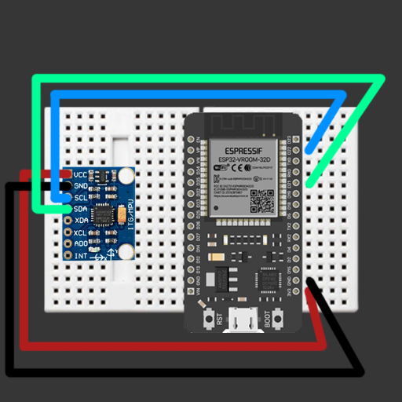

# BLE Arduino

  

## Overview

This example shows an Arduino board with an IMU sending euler angles from Arduino to Spectacles via BLE.

> **NOTE:**
> This project will only work for the Spectacles platform and Lens Studio.

## Design Guidelines

Designing Lenses for Spectacles offers all-new possibilities to rethink user interaction with digital spaces and the physical world.
Get started using our [Design Guidelines](https://developers.snap.com/spectacles/best-practices/design-for-spectacles/introduction-to-spatial-design)

## Prerequisites

- **Lens Studio**: v5.10.0+
- **Spectacles OS Version**: v5.62+
- **Spectacles App iOS**: v0.62+
- **Spectacles App Android**: v0.62+

To update your Spectacles device and mobile app, please refer to this [guide](https://support.spectacles.com/hc/en-us/articles/30214953982740-Updating).

You can download the latest version of Lens Studio from [here](https://ar.snap.com/download?lang=en-US).

## Getting Started

To obtain the project folder, clone the repository.

> **IMPORTANT:**
> This project uses Git Large Files Support (LFS). Downloading a zip file using the green button on GitHub **will not work**. You must clone the project with a version of git that has LFS.
> You can download Git LFS [here](https://git-lfs.github.com/).

## Initial Project Setup

1.) Download and install the latest <a href="https://www.arduino.cc/en/software/">Arduino IDE</a>.

2.) Install esp32 by Espressif Systems from the <a href="https://support.arduino.cc/hc/en-us/articles/360016119519-Add-boards-to-Arduino-IDE">board manager</a>.

3.) Install MPU6050_light.h by rfetick from the <a href="https://docs.arduino.cc/software/ide-v1/tutorials/installing-libraries/">libraries manager</a>.

4.) Choose board Esp32 -> Node32s

5.) Choose port /dev/cu.usbserial-0001

6.) <a href="https://support.arduino.cc/hc/en-us/articles/4733418441116-Upload-a-sketch-in-Arduino-IDE">Upload</a> the Arduino code!

<a href="https://www.amazon.com/HiLetgo-ESP-WROOM-32-Development-Microcontroller-Integrated/dp/B0718T232Z/ref=sr_1_4?keywords=ESP32&qid=1653938550&sr=8-4">ESP32 on Amazon</a>

<a href="https://www.amazon.com/Gy-521-MPU-6050-MPU6050-Sensors-Accelerometer/dp/B008BOPN40/ref=sr_1_6?crid=2B4BL34XHLEVM&keywords=mpu6050&qid=1653938597&sprefix=mou+6050%2Caps%2C125&sr=8-6">MPU-6050 on Amazon</a> 

## Testing the Lens

> **IMPORTANT:**
> The BLE API does not support editor testing at this time.

### On Spectacles Device

[Extended Permissions](https://developers.snap.com/spectacles/permission-privacy/extended-permissions) mode must be enabled because this lens uses the experimental BLE API.

1. Build and deploy the project to your Spectacles device.
2. Follow the [Spectacles guide](https://developers.snap.com/spectacles/get-started/start-building/preview-panel) for device testing.

## Support

If you have any questions or need assistance, please don't hesitate to reach out. Our community is here to help, and you can connect with us and ask for support [here](https://www.reddit.com/r/Spectacles/). We look forward to hearing from you and are excited to assist you on your journey!

## Disclaimer

This repository includes references to third-party websites and products for educational and reference purposes only. These references are provided to enhance learning and understanding. We do not endorse or have any affiliation with the mentioned third-party resources

## Contributing

Feel free to provide improvements or suggestions or directly contributing via merge request. By sharing insights, you help everyone else build better Lenses.
