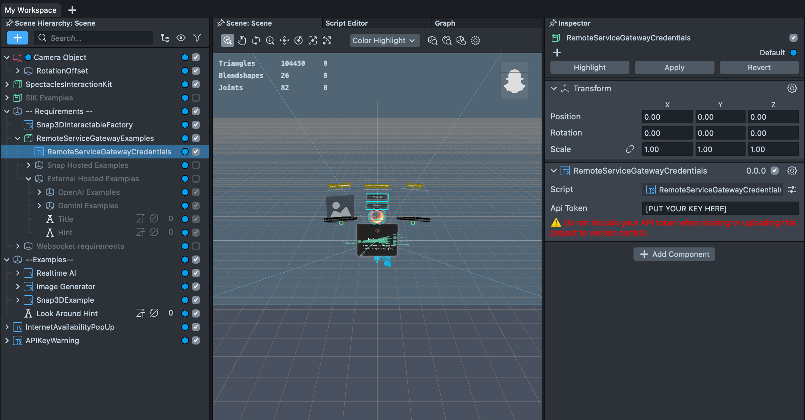
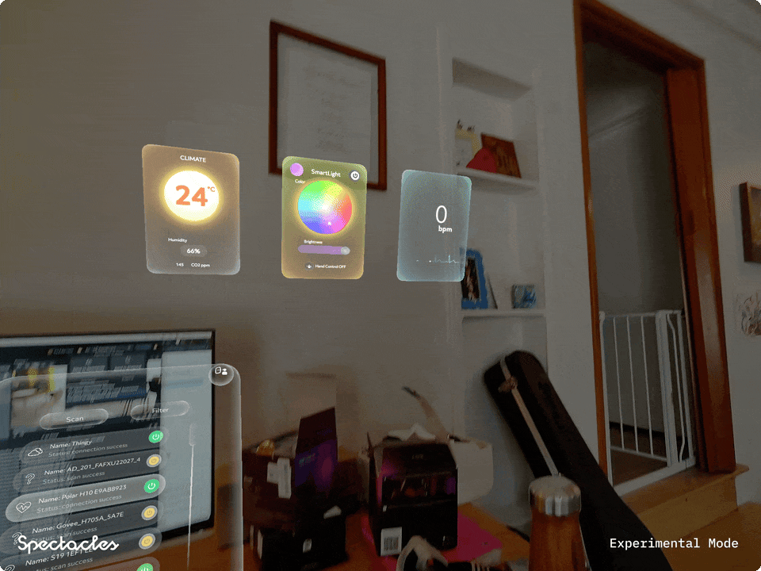

# BLE Playground

[](https://developers.snap.com/spectacles/spectacles-frameworks/spectacles-interaction-kit/features/overview?) [](https://developers.snap.com/spectacles/about-spectacles-features/apis/experimental-apis?) [](https://developers.snap.com/spectacles/about-spectacles-features/compatibility-list) [](https://developers.snap.com/spectacles/about-spectacles-features/overview)


## Overview
This project provides a Bluetooth Low Energy (BLE) implementation template for Snapchat Spectacles. It enables the creation of Lenses that can communicate with BLE peripheral devices, specifically implementing support for Hue smart lights and heart rate monitors. The template demonstrates how to scan for devices, connect to them, and interact with their services and characteristics.

## Initial Project Setup

In order to use this project and call Remote Service Gateway APIs, you need to:

1. Install the Remote Service Gateway Token Generator plug-in from the Asset Browser
2. Go to Window -> Remote Service Gateway Token
3. Click "Generate Token"
4. Copy paste the token into the "RemoteServiceGatewayCredentials" object in the Inspector



## Architecture

```
+----------------------------+                            +-------------------------+
|     Ble Service Handler    |                            |    Controller Factory   |
|----------------------------|                            |-------------------------|
| - Scan Button input        |                            | - If type is found,     |
| - Start scan               |                            |   create widget &       |
| - Stop scan => send to     |                            |   controller by type    |
|   Scan Results Handler     |                            | - Return widget or null |
+-------------+--------------+                            +------------+------------+
              |                                                          |
              v                                                          v
+-----------------------------+                              +--------------------+
|     Scan Results Handler    |                              |     Pfb Widget     |
|-----------------------------|                              |--------------------|
| - Subscribe to BLE events   |                              | - Container        |
| - Instantiate scan results  |                              | - Controls snapping|
| - Filter + select results   |                              |   to hub           |
| - Manage autoconnections    |                              +--------+-----------+
+-------------+---------------+                                       |
              |                                                       |
              v                                                       |
+-------------------------------+                                     |
|        Pfb Scan Result        |                                     |
|-------------------------------|                                     |
| - Displays scan status        |                                     |
| - Controls connection/widget  |                                     |
| - Calls ControllerFactory     |                                     |
| - Registers type              |                                     |
+-------------------------------+                                     |
                                                                      |
                                                                      |
                                                                      v
           +----------------------------------------------------------+---------------------+
           |                                                                                 |
           v                                                                                 v
+-----------------------------+              +----------------------------+    +------------------------------+
|     Pfb Light Controller    |              |     Pfb HR Controller      |    |   Pfb Climate Controller      |
|-----------------------------|              |----------------------------|    |-------------------------------|
| - LightController           |              | - Show BPM                 |    | - Show temperature            |
|   - Sends to HueEmitter     |              | - Show EKG effects         |    | - Show humidity, air quality  |
|                             |              +----------------------------+    +-------------------------------+
| - LightColorWheelInputMgr   |
|   - Color wheel input       |
|                             |
| - LightHandEventListener    |
|   - Listens to HandInputMgr |
|                             |
| - LightAiEventListener      |
|   - Listens to AiInputMgr   |
|                             |
| - HueEventEmitter           |
|   - Sets power, brightness  |
|     and color               |
+-----------------------------+
```

The architecture diagram illustrates the interaction between key components:

1. **BLE Service Handler**: Core component for BLE scanning operations.

2. **Scan Results Manager**: Instantiates scan results, filters by device type. Manages auto connection and  selection.

3. **Pfb Scan Result**: UI component displaying device information and providing connection controls.

4. **Controller Factory**: Creates appropriate controllers based on peripheral type.

5. **Pfb Widget**: Parent container for peripheral controllers that provides positioning in the hub.

6. **Peripheral Controllers**:
   - **Pfb Light Controller**: Controls light parameters including power, brightness, and color
   - **Pfb HR Controller**: Manages heart rate monitor data
   - **Pfb Climate Controller**: Handles climate-related data like temperature and humidity

> **NOTE:**
> This project will only work for the Spectacles platform.
> The BLE APIs are experimental and may change in future updates.

## Design Guidelines

Designing BLE-enabled Lenses for Spectacles offers exciting possibilities to interact with the physical world through connected devices.
Get started using our [Design Guidelines](https://developers.snap.com/spectacles/best-practices/design-for-spectacles/introduction-to-spatial-design)

## Prerequisites

- **Lens Studio**: v5.9.0+
- **Spectacles OS Version**: v5.61.371+
- **Spectacles App iOS**: v0.61.1.0+
- **Spectacles App Android**: v0.61.1.1+

To update your Spectacles device and mobile app, please refer to this [guide](https://support.spectacles.com/hc/en-us/articles/30214953982740-Updating).

You can download the latest version of Lens Studio from [here](https://ar.snap.com/download?lang=en-US).

The Bluetooth feature requires you to use Experimental APIs. Please see Experimental APIs for more details [here](https://developers.snap.com/spectacles/about-spectacles-features/apis/experimental-apis).

Extended Permissions mode on device must be enabled for enabling Bluetooth APIs. Please see Extended Permissions for more details [here](https://developers.snap.com/spectacles/permission-privacy/extended-permissions).

## Getting Started

To obtain the project folder, clone the repository.

> **IMPORTANT:**
> This project uses Git Large Files Support (LFS). Downloading a zip file using the green button on GitHub **will not work**. You must clone the project with a version of git that has LFS.
> You can download Git LFS [here](https://git-lfs.github.com/).

## Initial Project Setup

The project should be pre-configured to get you started without any additional steps. However, ensure you:

1. Open the project in Lens Studio
2. Configure your compatible BLE devices (such as Hue lights or heart rate monitors)
3. Adjust device names and UUIDs in `PeripheralTypeData.ts` if needed
4. Configure scanning settings in `BleServiceHandler.ts` based on your requirements

## Key Features



### Device Discovery

The application uses BLE scanning to find compatible devices within range. This feature is powered by the `BleServiceHandler.ts` script and allows filtering by device name or service UUID.

```typescript
// Example: Start scanning for devices
bleServiceHandler.onStartScan();
```

### Smart Light Control

Control Hue smart lights including power, brightness, and color settings. This feature is handled by the `HueLightController.ts` script.

```typescript
// Example: Toggle light power
hueLightController.togglePower(true);

// Example: Set light color
hueLightController.setColor(new vec4(1, 0, 0, 1)); // Red
```


### Heart Rate Monitoring

Connect to and read data from heart rate monitor devices like Polar H10. This feature is handled by the `HeartRateController.ts` script.

```typescript
// Heart rate data will be processed automatically via notifications
// and displayed in the connected text component
```

### Debug Mode

Test BLE functionality in the editor without actual hardware. This is particularly useful during development and is configured through the `LensInitializer.ts` script.

## Project Structure

```
Assets/Scripts/
├── Core/                   # Core framework components
│   ├── BleServiceHandler.ts        # BLE service management
│   ├── ControllerFactory.ts        # Creates controllers for peripherals
│   ├── HandHintSequence.ts         # Calls hand hint animations
│   ├── LensInitializer.ts          # Lens initialization
│   ├── PeripheralTypeData.ts       # Peripheral UUID definitions
│   ├── ScanResult.ts               # Displays/controls scan result status, connection state, and widget state
│   ├── ScanResultsManager.ts       # Spawns, filters, and auto connects scan results
│   └── Widget.ts                   # Handles the generic container for all peripheral controllers
├── Helpers/                # Utility functions
│   ├── Colors.ts                   # Common colors
│   ├── CursorVisualHelper.ts       # Makes cursor shown/hidden
│   ├── ErrorUtils.ts               # Logs error object data (if available)
│   ├── HelperFunctions.ts          # Common utility functions
│   ├── Logger.ts                   # Logging utility
│   ├── RotateScreenTransform.ts    # Used for try connecting arrow texture rotation
│   └── UniqueColorService.ts       # Provides a unique color that stands out from color array param
├── PeripheralHeartRate/    # Heart rate monitor implementation
│   └── HeartRateController.ts      # Heart rate device controller
└── PeripheralLight/        # Hue light implementation
│   ├── GeminiDepthLightEstimator.ts            # In Scene: Estimates light positions via Gemini + Depth cache api 
│   ├── GeminiDepthLightEstimatorListener.ts    # On Pfb: Listens for its position
│   ├── HueEventEmitter.ts                      # On Pfb: Writes to the Hue light bulb
│   ├── LightAiEventListener.ts                 # On Pfb: Listens for Ai input events, sends to Light Controller
│   ├── LightAiInputManager.ts                  # In Scene: Processes user prompt into Ai json for light scheme 
│   ├── LightAiJsonEventEmitter.ts              # In Scene: Processes Json into light events for Light Controller
│   ├── LightColorWheelInputManager.ts          # On Pfb: Manages color wheel ui and drag input for Light Controller
│   ├── LightController.ts                      # On Pfb: Processes all light inputs for HueEventEmitter
│   ├── LightHandEventListener.ts               # On Pfb: Listens for Hand input events for Light Controller
│   ├── LightHandInputManager.ts                # In Scene: Manages Hand input events 
│   └── LightStatusVisual.ts                    # On Pfb: Mirrors Hue status across UL sphere and brightness slider 
```

## Key Scripts

### BleServiceHandler.ts

This script handles:

- Scanning for BLE devices
- Managing device connections
- Processing scan results
- Dispatching events for discovered devices

### HueLightController.ts

This script handles:

- Connecting to Hue light devices
- Controlling light power, brightness, and color
- Managing GATT services and characteristics for lights
- Processing notifications from the light device

### HeartRateController.ts

This script handles:

- Connecting to heart rate monitor devices
- Reading heart rate data
- Processing and displaying heart rate information
- Managing notifications from the heart rate monitor

## Developer Resources

### GATT Specification

The Bluetooth GATT (Generic Attribute Profile) specification defines how BLE devices exchange data using services, characteristics, and descriptors. For detailed information, refer to the official specification supplement:

- [GATT Specification Supplement](https://btprodspecificationrefs.blob.core.windows.net/gatt-specification-supplement/GATT_Specification_Supplement.pdf) (Version Date: 2025-01-15)

This document contains the definitions for all GATT characteristics and characteristic descriptors, which is essential for understanding and implementing BLE communication.

### Gotchas

When working with BLE in this template, keep these common issues in mind:

- **Promise Handling**: Use try/catch, then() and finally() for proper error handling with promises
- **Device Verification**: Check device name, UUIDs, and properties using tools like nRFConnect before implementation
- **Scan Results**: `startScan()` will return a result object if successful, not just a boolean
- **UUID Comparison**: When comparing UUIDs, remember that `UuidCompare` is checking for substring inclusion, not exact matching

### Notes

**Heart Rate Monitors:**
- Use a dedicated app for initial setup of the heart rate monitor
- Avoid connecting with a second app while using this template
- The monitor will only pair with one device at a time

### API Tips

- You can use `await` or promise chaining (`.then()`) - both approaches work
- For lengthy operations, consider using non-blocking calls
- Register notification handlers before writing to characteristics when possible

## Testing the Lens

### In Lens Studio Editor

1. Open the Preview panel in Lens Studio.
2. Enable debug mode in `LensInitializer.ts` by setting `isNoBleDebug = true`.
3. Test the UI and interaction flow without requiring actual BLE devices.

### On Spectacles Device

1. Build and deploy the project to your Spectacles device.
2. Follow the [Spectacles guide](https://developers.snap.com/spectacles/get-started/start-building/preview-panel) for device testing.
3. Ensure your BLE devices are powered on and within range.
4. Use the interface to scan for and connect to your devices.

## Bluetooth API Disclaimer

The Bluetooth APIs used in this project are experimental and subject to change. Ensure that you comply with Bluetooth LE standards and Spectacles' terms of service when deploying this project.

## General Disclaimer

This repository includes references to third-party websites and products for educational and reference purposes only. These references are provided to enhance learning and understanding. We do not endorse or have any affiliation with the mentioned third-party resources.

## OpenAI Disclaimer

Ensure that you comply with [OpenAI's API usage policies](https://openai.com/policies/usage-policies/) and [Spectacles' terms of service](https://www.snap.com/terms/spectacles) when deploying this project.

## Gemini Disclaimer

Ensure that you comply with [Gemini's API usage policies](https://ai.google.dev/gemini-api/terms) and [Spectacles' terms of service](https://www.snap.com/terms/spectacles) when deploying this project.

## Support

If you have any questions or need assistance, please don't hesitate to reach out. Our community is here to help, and you can connect with us and ask for support [here](https://www.reddit.com/r/Spectacles/). We look forward to hearing from you and are excited to assist you on your journey!

## Contributing

Feel free to provide improvements or suggestions or directly contributing via merge request. By sharing insights, you help everyone else build better BLE-enabled Lenses.

## Supported Peripherals

### Heart Rate Monitors
- **Default Device**: Polar H10
- **Services**: Heart Rate Service (0x180D)
- **Characteristics**: Heart Rate Measurement (0x2A37)

### Hue Smart Lights
- **Default Device**: Hue color lamp
- **Services**: Base Service (932C32BD-0000-47A2-835A-A8D455B859DD)
- **Characteristics**:
  - Power (932C32BD-0002-47A2-835A-A8D455B859DD)
  - Brightness (932C32BD-0003-47A2-835A-A8D455B859DD)
  - Color (932C32BD-0005-47A2-835A-A8D455B859DD)

## Device Debugging Tips

### Connect to Hue Light 
Light must be on to connect. If you previously paired with your phone (eg, via nRF Connect or the Hue app), you must reset your bulb to connect to Spectacles. Ble will only auto connect to your bulb if it is named "Hue color lamp" (default name).  You can connect manually by tapping scan result. 

### Reset Hue Light 
If you are having trouble writing to hue bulb, you can try resetting bulb via Power Cycling:
- Power off: Turn off the power to the bulb for 10 seconds (either at the wall switch or by unplugging the lamp).
- Power on: Turn the power back on and leave it on for 3 seconds. 
- Power off: Turn the power off again for 10 seconds. 
- Repeat: Repeat the on and off cycle until the bulb flashes, with each on period lasting 3 seconds and each off period lasting 10 seconds. 
- Confirm reset: The bulb should blink or cycle colors to indicate a successful reset. 

### Connect to Polar Chest Band 
- Download Polar Flow app
- Connect battery to strap
- Place strap around chest with skin contact.  Now your device is advertising -- but only to the mobile app
- In mobile app:
  - Select the “...” in the lower right corner
  - Select Devices
  - If your polar band is on and battery is full, it should appear
  - Select Connect 
  - In the next screen, make sure all four fields are selected, including “2 Bluetooth devices”.  This enables your band to be connected to your phone and spectacles at the same time. 
If you’re still having trouble connecting, you may need to [reset your device](https://www.youtube.com/watch?v=wFvB8MUy9Z4)
