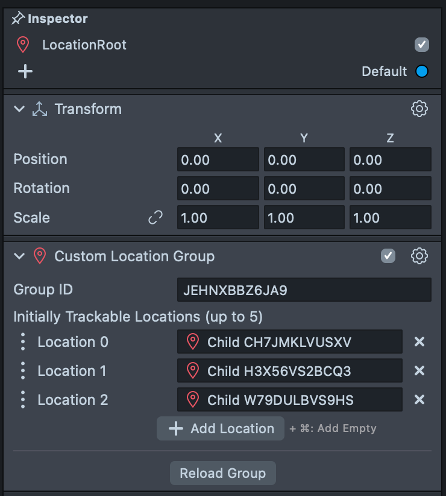
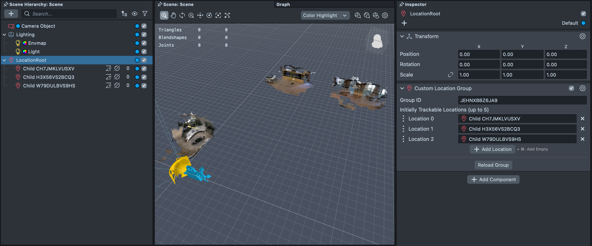
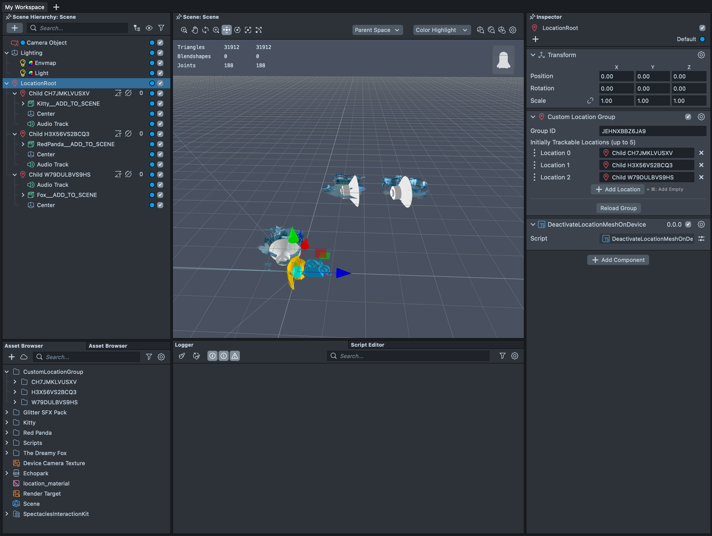

# Custom Locations

 

## Overview

This project contains a sample application built to localize against a location in London. It is expected that the users uses the Custom Location lens to produce a location group.

> **NOTE:**
> This project will only work for the Spectacles platform.

## Design Guidelines

Designing Lenses for Spectacles offers all-new possibilities to rethink user interaction with digital spaces and the physical world.
Get started using our [Design Guidelines](https://developers.snap.com/spectacles/best-practices/design-for-spectacles/introduction-to-spatial-design)

## Prerequisites

- **Lens Studio**: v5.10.0+
- **Spectacles OS Version**: v5.62+
- **Spectacles App iOS**: v0.62+
- **Spectacles App Android**: v0.62+

To update your Spectacles device and mobile app, refer to this [guide](https://support.spectacles.com/hc/en-us/articles/30214953982740-Updating).

You can download the latest version of Lens Studio from [here](https://ar.snap.com/download?lang=en-US).

## Getting the project

To obtain the project folder, you need to clone the repository.

> **IMPORTANT**:
> This project uses Git Large Files Support (LFS). Downloading a zip file using the green button on Github
> **will not work**. You must clone the project with a version of git that has LFS.
> You can download Git LFS here: https://git-lfs.github.com/.

## Initial Project Setup

The project as cloned has a working example scene, but it will require you to reconfigure it to a Custom Location Group of your choosing.

Further information about creating scans can be found [here](https://developers.snap.com/spectacles/about-spectacles-features/apis/custom-locations).

## Key Scripts

[ActivateWhenInCameraView.ts](./Assets/Scripts/ActivateWhenInCameraView.ts): This script attaches to a `LocatedAtComponent` and calls activate and deactivate functions on attached listeners.

[ScaleInLocatedObject.ts](./Assets/Scripts/ScaleInLocatedObject.ts): This is an example script that scales in an object when the user approached.

## Walkthrough

### Scan Locations

At the physical location at which the AR content is anchored, create a series of scans for each of the main content areas.

### Create Group

Once the scans have been created and published, create a group including all of the scans.
Stabilize each of the members of the group and publish the Custom Location Group.

### Import Group to Lens Studio

Add a Custom Location Group to the scene hierarchy of your project and press "Reload Group".

### Load the Sample Project in Lens Studio

1. Open this project in Lens Studio
2. Add an empty SceneObject to your scene hierarchy
3. Add a `Custom Location Group` component to the SceneObject
4. Add the ID of the scan to the "Group ID" field
5. Click "Reload Group"

### Use Sample Assets to Create

1. On the SceneObject with the `CustomLocationGroup` component, add `DeactivateLocationMeshOnDevice`
2. On the SceneObject with the `LocatedAt` component of the first location
   1. Parent the desired content and position relative to the scan mesh
   2. Create an empty scene object representing the center of the scan
   3. Attach the `ActivateWhenInCameraView` script
   4. Update references to the scene's main camera and the center SceneObject
   5. Add the `ScaleInLocatedObject` script
   6. Update references to the content and `LocatedAt` component
   7. Add as a child an audio asset scene object
   8. Add the `AudioLocatedObject` to that object
   9. Add both `LocatedObject` scripts to the "Listener Objects" field on the activate script
3. Repeat this for all locations as appropriate

Add the content that is to be anchored to each of the locations.

### Test Your Lens

The final lens with assets correctly parented can now be sent to Spectacles and tested at the scanned location.

## Notes on Testing the Lens

### In Lens Studio Editor

Open the project and observe a pre-made Custom Location of an office. The statue in the center has an animated cat set to spawn on approach. Moving the camera preview window will simulate the approach of the user and the cat can be observed to appear and a sound effect is played.

### On Spectacles Device

Custom Locations are by nature attached to real places. To test this lens on device, the Custom Location Group will need to be changed. Following the guide linked at the start of this document, replace the Group ID on the SceneObject "LocationRoot" with a scan you have made; follow the instructions to recreate the parented assets to this new scan.
Once completed, send the lens to the Spectacles, launch the new lens and move to the scanned location.

## Support

If you have any questions or need assistance, please don't hesitate to reach out. Our community is here to help, and you can connect with us and ask for support [here](https://www.reddit.com/r/Spectacles/). We look forward to hearing from you and are excited to assist you on your journey!

## Contributing

Feel free to provide improvements or suggestions or directly contributing via merge request. By sharing insights, you help everyone else build better Lenses.
