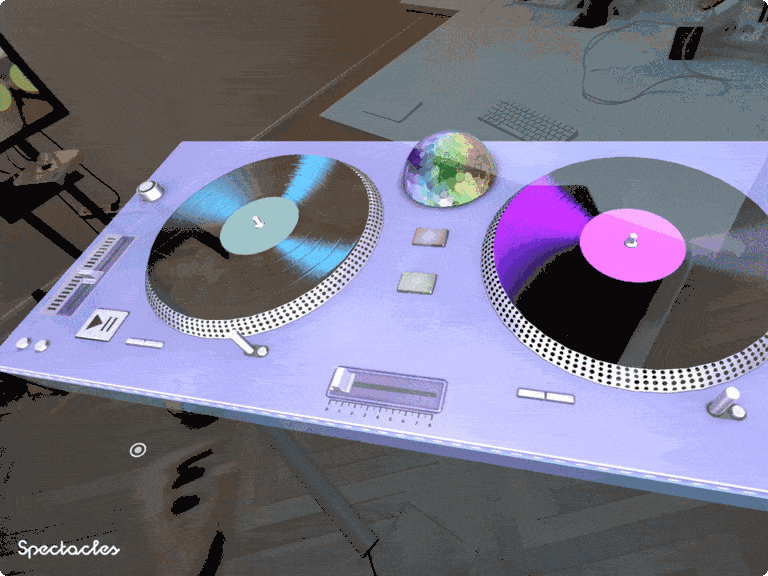
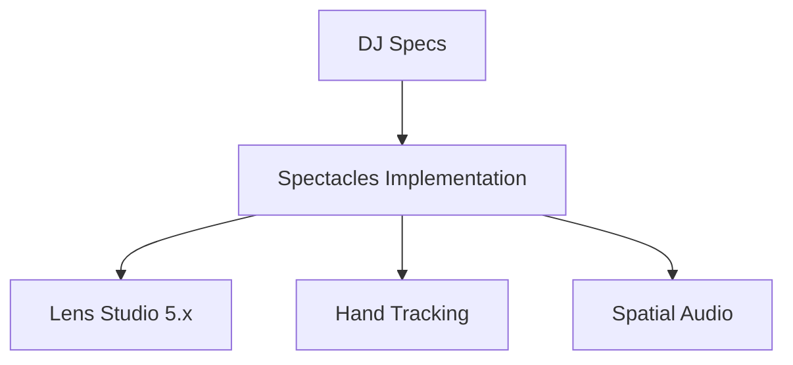
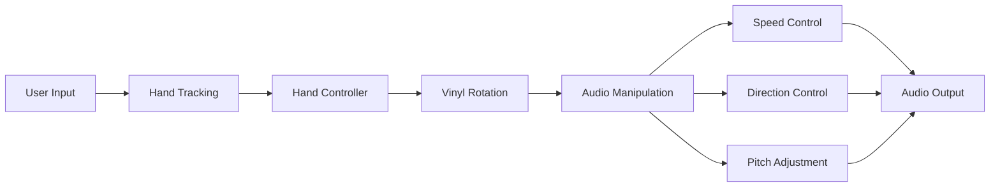
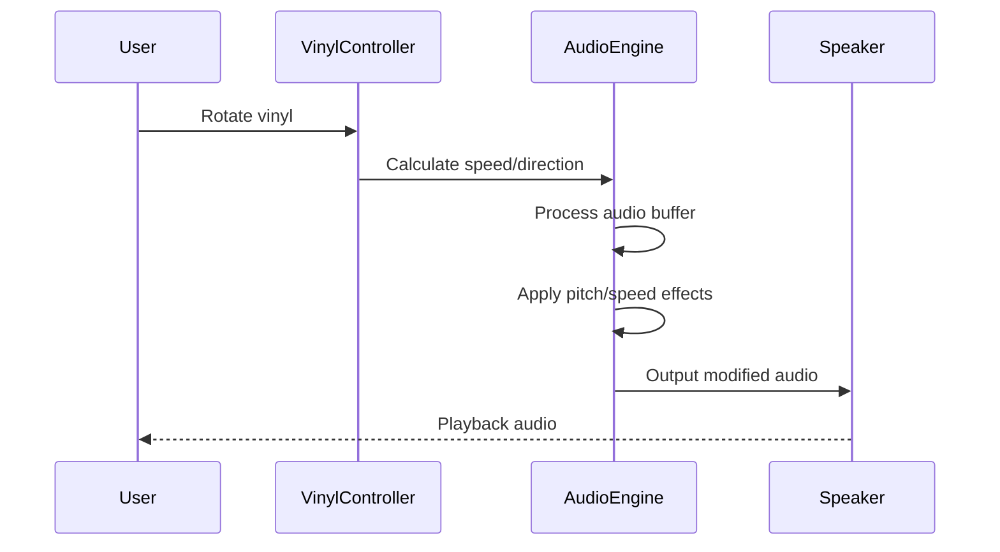
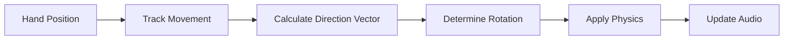

# DJ Specs

[](https://developers.snap.com/spectacles/spectacles-frameworks/spectacles-interaction-kit/get-started) [](https://developers.snap.com/lens-studio/features/audio/audio-output#guide) [](https://developers.snap.com/spectacles/spectacles-frameworks/spectacles-interaction-kit/features/handtracking) [](https://developers.snap.com/spectacles/spectacles-frameworks/spectacles-interaction-kit/features/handtracking)



A comprehensive **Snapchat Lens** project featuring an interactive DJ turntable experience with realistic vinyl physics, multi-track audio mixing, and hand tracking optimized for **Spectacles**.

## Overview

This repository contains a modern DJ mixing experience built with Lens Studio 5.x and optimized specifically for Spectacles with advanced hand tracking capabilities.

> **NOTE:**
> This project requires Spectacles hardware for full hand tracking functionality and demonstrates advanced spatial AR development.

> **NOTE:**
> This project is currently developed in Javascript, will be provided a Typescript variant in the future. As many developers asked us to enhance our audio experience with features like Playback Speed, we thought this was a fun way to fill the gap until then. 

## Design Guidelines

Designing Lenses for Spectacles offers all-new possibilities to rethink user interaction with digital spaces and the physical world.
Get started using our [Design Guidelines](https://developers.snap.com/spectacles/best-practices/design-for-spectacles/introduction-to-spatial-design)

## Prerequisites

- **Lens Studio**: v5.10.0+
- **Spectacles OS Version**: v5.62+
- **Spectacles App iOS**: v0.62+
- **Spectacles App Android**: v0.62+

To update your Spectacles device and mobile app, please refer to this [guide](https://support.spectacles.com/hc/en-us/articles/30214953982740-Updating).

You can download the latest version of Lens Studio from [here](https://ar.snap.com/download?lang=en-US).

The hand tracking features require you to use Experimental APIs. Please see Experimental APIs for more details [here](https://developers.snap.com/spectacles/about-spectacles-features/apis/experimental-apis).

Extended Permissions mode on device must be enabled for enabling some of the Spectacles APIs. Please see Extended Permissions for more details [here](https://developers.snap.com/spectacles/permission-privacy/extended-permissions).

## Getting Started

To obtain the project folder, clone the repository.

> **IMPORTANT:**
> This project uses Git Large Files Support (LFS). Downloading a zip file using the green button on GitHub **will not work**. You must clone the project with a version of git that has LFS.
> You can download Git LFS [here](https://git-lfs.github.com/).

## Initial Project Setup

The project should be pre-configured to get you started without any additional steps. However, ensure you:

1. Open the project file: `DJSpecs.esproj` in Lens Studio 5.10+

2. Verify audio assets are properly loaded in `Assets/Audio/`

3. Check that all script dependencies are resolved in the project.

Failure to properly load audio assets will result in silent playback when testing the DJ functionality.



## Project Architecture

### Directory Structure

```
DJ Specs/
├── DJSpecs.esproj           # Lens Studio project file
├── Assets/                  # Audio and visual assets
│   ├── Audio/               # Audio tracks and effects
│   ├── Scene/               # Scene configuration
│   ├── Materials/           # Visual materials
│   └── Textures/            # Texture assets
├── Cache/                   # Build cache
├── Packages/                # Dependencies
└── README.md               # This documentation
```

## Core Features

### DJ Turntable Simulation

The project implements a realistic DJ experience with the following features:



### Interactive Components

#### Vinyl Physics System
Located in: `Assets/Scene/Scripts/VinylRotator.js`

```javascript
class VinylInertia {
    // Simulates realistic vinyl physics with:
    // - Decay time constants for realistic slowdown
    // - Momentum-based rotation
    // - Friction simulation
    constructor(decayTimeConstSec) {
        this.decayTimeConstSec = decayTimeConstSec;
        this.decay = -2.30258 / decayTimeConstSec; // -ln(0.1)
        this.playbackRate = 0.0;
        this.timePassed = 100.0;
    }
}
```

#### Audio Controller
Located in: `Assets/Scene/Scripts/AudioController.js`

- **Real-time audio processing** with configurable sample rates
- **Speed manipulation** for scratching effects  
- **Direction control** for forward/reverse playback
- **Pitch shifting** capabilities

## Platform Support

**Key Files:**
- `Assets/Scene/Scripts/HandController.js` - Hand tracking implementation
- `Assets/Scene/Scripts/VinylInteraction.js` - 3D vinyl manipulation

## Audio System

### Track Management
The project includes multiple audio tracks optimized for different BPMs:

```
Assets/Audio/
├── SpecsDJ_Celebration130bpm.mp3    # Party track (130 BPM)
├── SpecsDJ_CuteGame150bpm.mp3       # Game-style track (150 BPM)
├── SpecsDJ_GreatDay150bpm.mp3       # Upbeat track (150 BPM)  
├── SpecsDJ_OhYeah180bpm.mp3         # High-energy track (180 BPM)
└── SpecsDJ_Zeo130bpm.mp3            # Electronic track (130 BPM)
```

### Audio Processing Pipeline



## Development Scripts

### Tween Animation System
The project includes a comprehensive tweening system for smooth animations:

**Core Tween Files:**
- `TweenManager.js` - Central animation coordinator
- `TweenAlpha.js` - Opacity animations
- `TweenColor.js` - Color transitions
- `TweenTransform.js` - Position/rotation/scale animations

### Easing Functions
Various easing functions for natural motion:
- `LinearFunc.js` - Linear interpolation
- `QuadraticFunc.js` - Quadratic easing
- `ElasticFunc.js` - Bouncy elastic effects
- `SinusoidalFunc.js` - Smooth sine-wave transitions

## Development Setup

### Prerequisites
- **Lens Studio 5.10+**
- **Node.js** (for build tools)
- **Git LFS** (for large assets)

### Environment Configuration

```bash
# Clone the repository
git clone <repository-url>
cd DJ-Specs

# Initialize Git LFS for large files
git lfs install
git lfs pull

# Set up pre-commit hooks
pre-commit install
```

### Project Configuration Files

#### TypeScript Support
```json
// tsconfig.json
{
  "compilerOptions": {
    "module": "commonjs",
    "target": "es2019",
    "isolatedModules": true,
    "experimentalDecorators": true,
    "paths": {
      "*": ["./Packages/*", "./Cache/TypeScript/Src/Assets/*"]
    }
  }
}
```

## Key Interaction Systems

### Hand Tracking Control (Spectacles)


## Visual Effects

### Material System
- **PBR Materials**: Realistic lighting and reflections
- **Custom Shaders**: Specialized effects for vinyl appearance
- **Dynamic Textures**: Real-time visual feedback

### Animation Features
- **Vinyl Spinning**: Realistic rotation with physics
- **UI Transitions**: Smooth interface animations
- **Visual Feedback**: Color changes based on interaction

## Performance Optimization

### Spectacles Optimizations  
- Hand tracking efficiency
- Spatial audio processing
- Low-latency interaction response

## Testing & Quality Assurance

### Automated Testing
- **Code Quality**: ESLint and style checking
- **Performance**: Frame rate and memory usage analysis

### Manual Testing Checklist
- [ ] Hand tracking interactions work smoothly
- [ ] Audio playback is synchronized
- [ ] Visual effects render correctly
- [ ] Performance meets target metrics

### Performance Targets
- **Frame Rate**: 60 FPS on target devices
- **Audio Latency**: <50ms for real-time interaction
- **Memory Usage**: <150MB peak usage
- **Battery Impact**: Minimal on mobile devices

## Script Architecture

### Core Script Files

#### Audio Processing
```javascript
// AudioController.js - Main audio processing engine
class AudioController {
    setSpeed(value)      // Adjust playback speed
    pause()              // Pause audio playback
    resume()             // Resume audio playback
    setDirection(dir)    // Set forward/reverse playback
    setPitch(pitch)      // Adjust audio pitch
}
```

#### Interaction Systems
```javascript
// VinylRotator.js - Physics-based vinyl simulation
class VinylInertia {
    getPlaybackRate(currentTime)    // Calculate current playback rate
    setPlaybackRate(rate)           // Set new playback rate with inertia
}

// HandController.js - Hand tracking for Spectacles
function getRotationDirection(handPosition)  // Calculate rotation from hand movement
function getTouchMoveSpeed(handPosition)     // Calculate movement speed
```

### Animation Framework
The project uses a modular tween system for smooth animations:

```javascript
// TweenManager.js - Central animation system
TweenManager.startTween(object, property, target, duration, easing)
TweenManager.stopTween(tweenId)
TweenManager.pauseAllTweens()
```

## Testing the Lens

### In Lens Studio Editor

1. Open the Preview panel in Lens Studio.
2. Use simulated camera input to test the DJ functionality.
3. Verify audio tracks load correctly and playback responds to simulated interactions.
4. Test hand tracking interactions in preview mode.

### On Spectacles Device

1. Build and deploy the project to your Spectacles device.
2. Follow the [Spectacles guide](https://developers.snap.com/spectacles/get-started/start-building/preview-panel) for device testing.
3. Calibrate hand tracking and test 3D vinyl manipulation.
4. Experience spatial audio positioning and hand gesture controls.

## Documentation References

- [Lens Studio Documentation](https://developers.snap.com/lens-studio/)
- [Spectacles Development Guide](https://developers.snap.com/spectacles/)
- [Audio Processing in Lens Studio](https://developers.snap.com/lens-studio/features/audio/)
- [Hand Tracking API](https://developers.snap.com/spectacles/about-spectacles-features/apis/)
- [Spectacles Interaction Kit](https://docs.snap.com/spectacles/spectacles-frameworks/spectacles-interaction-kit/)

## Support

If you have any questions or need assistance, please don't hesitate to reach out. Our community is here to help, and you can connect with us and ask for support [here](https://www.reddit.com/r/SnapLenses/). We look forward to hearing from you and are excited to assist you on your journey with AR development!

For technical issues specific to this project:
- Check the Issues section of this repository
- Review the troubleshooting guide in the wiki
- Contact the development team for Lens Studio specific questions

## Contributing

Feel free to provide improvements or suggestions or directly contributing via merge request. By sharing insights, you help everyone else build better Lenses.
