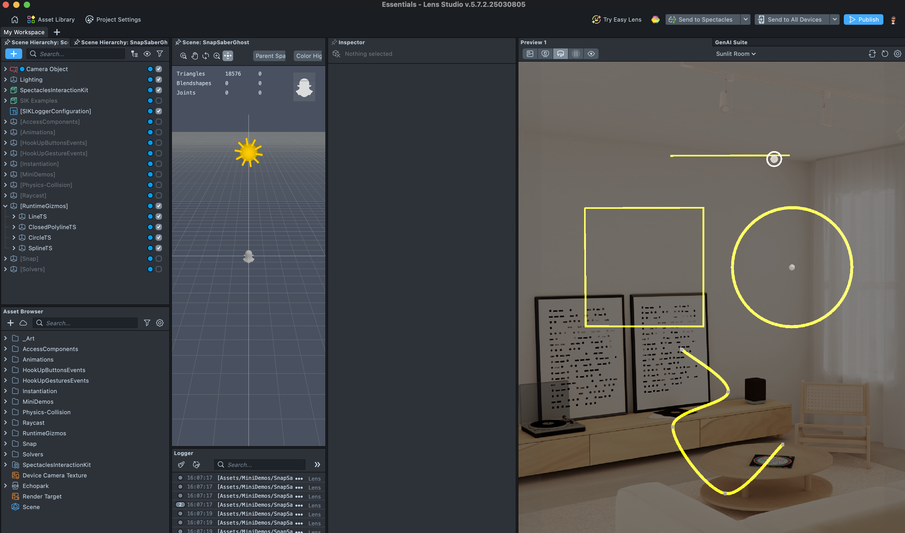
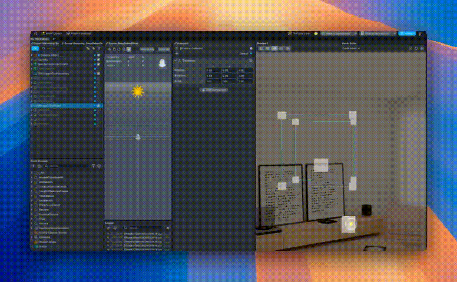

# Essentials

[](https://developers.snap.com/spectacles/spectacles-frameworks/spectacles-interaction-kit/features/overview?) [](https://developers.snap.com/lens-studio/features/physics/physics-overview?) [](https://developers.snap.com/spectacles/about-spectacles-features/apis/gesture-module?) [](https://developers.snap.com/lens-studio/api/lens-scripting/modules/Packages_LSTween_LSTween.html?) [](https://developers.snap.com/lens-studio/api/lens-scripting/classes/Built-In.RayCastHit.html)


## Overview

This project is a comprehensive collection of foundational concepts and examples for creating lenses in Lens Studio and deploying them on Spectacles using Typescript and Javascript. **We strongly recommend the use of Typescript** as it is easier to debug and more in line with existing game engines patterns. 
Each folder contains specific examples and demonstrations that showcase various aspects of lens development and AR interaction.

> **NOTE**:
> This project will only work for the Spectacles platform.
> This projects include a comprehensive collection of foundational concepts and examples for creating lenses! Take advantage of this project providing it as LLM Context for your personal projects! 

## Design Guidelines

Designing Lenses for Spectacles offers all-new possibilities to rethink user interaction with digital spaces and the physical world.
Get started using our [Design Guidelines](https://developers.snap.com/spectacles/best-practices/design-for-spectacles/introduction-to-spatial-design)

## Prerequisites

- **Lens Studio**: v5.10.0+
- **Spectacles OS Version**: v5.62+
- **Spectacles App iOS**: v0.62+
- **Spectacles App Android**: v0.62+

To update your Spectacles device and mobile app, please refer to this [guide](https://support.spectacles.com/hc/en-us/articles/30214953982740-Updating).

You can download the latest version of Lens Studio from [here](https://ar.snap.com/download?lang=en-US).

The camera feature requires you to use Experimental APIs. Please see Experimental APIs for more details [here](https://developers.snap.com/spectacles/about-spectacles-features/apis/experimental-apis).

Extended Permissions mode on device must be enabled for enabling some of the Spectacles APIs. Please see Extended Permissions for more details [here](https://developers.snap.com/spectacles/permission-privacy/extended-permissions).

## Getting Started

To obtain the project folder, clone the repository.

> **IMPORTANT:**
> This project uses Git Large Files Support (LFS). Downloading a zip file using the green button on GitHub **will not work**. You must clone the project with a version of git that has LFS.
> You can download Git LFS [here](https://git-lfs.github.com/).

## Initial Project Setup

The project should be pre-configured to get you started without any additional steps. However, if you encounter issues in the Logger Panel, please ensure your Lens Studio environment is set up for [Spectacles](https://developers.snap.com/spectacles/get-started/start-buiding/preview-panel).

## Table of Contents
- [Project Structure](#project-structure)
- [Getting Started](#getting-started)
- [Key Concepts](#key-concepts)
- [Interaction Patterns](#interaction-patterns)
- [Development Patterns](#development-patterns)
- [Notes](#notes)
- [Materials and Resources](#materials-and-resources)

## Project Structure

The project is organized into topic-specific folders. Click on each section to expand and see details:

For example:



Exemples are purposefully made for you to modify them or add them to your projects.
They highlight a specific logic or mechanics in a legible way.  



<details>
<summary><strong>AccessComponents</strong></summary>

Scripts for accessing and modifying components programmatically:

| Component | Description |
|-----------|-------------|
| **AccessComponentOnSceneObject** | - `AccessComponentOnSceneObjectTS.ts`: TypeScript implementation for accessing RenderMeshVisual<br>- `AccessComponentOnSceneObjectJS.js`: JavaScript equivalent implementation |
| **AccessComponentOnChildSceneObject** | - `AccessComponentOnChildSceneObjectTS.ts`: Traverses SceneObject hierarchy for child components<br>- `AccessComponentOnChildSceneObjectJS.js`: JavaScript implementation for child components |
| **AccessCustomComponentsUsingTypename** | - `AccessCustomComponentsUsingTypenameTS.ts`: Uses @typename decorator for custom components<br>- `AccessCustomComponentsUsingTypenameJS.js`: String-based component type names |
| **AccessCustomComponentsUsingRequired** | - `AccessCustomComponentsUsingRequiredTS.ts`: Uses required pattern for component access<br>- `CustomComponentTS.ts`/`CustomComponentJS.js`: Example components to be accessed |
| **Cross-language Component Access** | - `AccessJSfromJS_ComponentA/B.js`: JS-to-JS component access<br>- `AccessTSfromTS_TSComponentA/B.ts`: TS-to-TS component access<br>- `AccessJSfromTSwithDeclaration_*`: JS from TS with type declarations<br>- `AccessJSfromTSwithouthDeclaration_*`: JS from TS without declarations<br>- `AccessTSfromJS_*`: TS components from JS scripts |

</details>

<details>
<summary><strong>Animations</strong></summary>

Animation tools and examples:

| Component | Description |
|-----------|-------------|
| **LSTween.ts** | Powerful tweening library with methods:<br>- `rawTween()`: Base tween functionality for custom animations<br>- `alphaTo()/alphaFromTo()`: Material transparency animation<br>- `textAlphaTo()/textAlphaFromTo()`: Text element fading<br>- `colorTo()/colorFromTo()`: Color transitions<br>- `moveOffset()/moveToWorld()/moveFromToWorld()`: Position animations<br>- `rotateOffset()/rotateToWorld()/rotateFromToWorld()`: Rotation animations<br>- `scaleOffset()/scaleToWorld()/scaleFromToWorld()`: Scale animations<br>- `enableChange()`: Delayed enable/disable state changes<br>- `shaderColorPropertyFromTo()/shaderFloatPropertyFromTo()`: Shader animations |
| **RotationInterpolationType.ts** | Enum for rotation types:<br>- `LERP`: Linear interpolation (faster, less accurate)<br>- `SLERP`: Spherical linear interpolation (smoother but more intensive) |

</details>

<details>
<summary><strong>HookUpButtonsEvents</strong></summary>

Scripts for connecting UI button events to actions:

| Component | Description |
|-----------|-------------|
| **HookUpButtonsEventsTS.ts** | TypeScript implementation:<br>- Creating callbacks for button trigger events<br>- Binding to onInteractorTriggerStart/End events<br>- Instantiating prefabs on button presses<br>- Managing object lifecycle with destroyDelay |
| **HookUpButtonsEventsJS.js** | JavaScript equivalent implementation |

</details>

<details>
<summary><strong>HookUpGesturesEvents</strong></summary>

Gesture recognition and event binding:

| Component | Description |
|-----------|-------------|
| **HookUpGesturesEventsTS.ts** | TypeScript implementation:<br>- Using SIK.HandInputData.getHand() for hand tracking<br>- Implementing callbacks for hand gestures like pinch<br>- Moving objects in response to gesture events<br>- Smooth interpolation for object movement |
| **HookUpGesturesEventsJS.js** | JavaScript equivalent implementation |

</details>

<details>
<summary><strong>Instantiation</strong></summary>

Scripts for dynamically creating and destroying objects:

| Category | Components |
|----------|------------|
| **Circle-based Instantiation** | - `CircleAreaInstantiatorTS.ts/JS.js`: Random objects in circular area<br>- `CirclePerimeterInstantiatorTS.ts/JS.js`: Objects around circle perimeter<br>- `CirclePerimeterInstantiatorWithFixedArcLengthTS.ts/JS.js`: Consistent spacing<br>- `CircleSlicingInstantiatorTS.ts/JS.js`: Objects in circle slices |
| **Line and Grid Instantiation** | - `InstantiateAlongLineTS.ts/JS.js`: Objects along a straight line<br>- `InstantiateAlongLineWithFixedDistanceTS.ts/JS.js`: Uniform spacing<br>- `InstantiateOn2DGridsTS.ts/JS.js`: 2D grid of objects<br>- `InstantiateOn3DGridsTS.ts/JS.js`: 3D grid of objects |
| **Random Placement** | - `RandomPointsInsideBoxTS.ts/JS.js`: Objects within a 3D box volume<br>- `RandomPointsInsideSphereTS.ts/JS.js`: Objects within spherical volume<br>- `RandomPointsOnBoxSurfaceTS.ts/JS.js`: Objects on box surface<br>- `RandomPointsOnSphereSurfaceTS.ts/JS.js`: Objects on sphere surface |
| **Basic Instantiation** | - `SimpleCircleAreaInstantiatorTS.ts/JS.js`: Simplified circle instantiation<br>- `SimpleColliderInstantiatorTS.ts/JS.js`: Objects with colliders<br>- `SquareAreaInstantiatorTS.ts/JS.js`: Objects in square area |

</details>

<details>
<summary><strong>MiniDemos</strong></summary>

Small, focused demonstrations:

| Demo | Description |
|------|-------------|
| **Archery** | - `ArcheryProjectileManagerTS.ts`: Projectile physics for arrows<br>- `TargetCounterTS.ts`: Score tracking for arrow hits<br>- `RotateTargetTS.ts`: Target rotation for difficulty variation |
| **DirectionShadows** | - `DirectionalWorldQuery.ts`: World-aware shadow placement<br>- `ScaleBasedOnDistance.ts`: Shadow sizing by distance<br>- `Line.ts`: Visualization of projection rays |
| **DotProduct** | - `DotProductDemoTS.ts`: Vector math operations<br>- `findDirectionality()`: Camera-object direction checking<br>- `exampleCheckIfNeededToRecenter()`: View-based repositioning<br>- Vector utilities (angle, dot, cross, reflect, project) |
| **DragAndDrop** | - `DragAndDrop.ts`: Object dragging implementation<br>- Interactable component integration<br>- InteractableManipulation event handling<br>- Physics body modifications<br>- Visual feedback during manipulation |
| **Basic3DPanel** | - `PanelManagerTS.ts`: 3D panel with raycast interaction and scale animations<br>- Raycasting for intersection detection<br>- LSTween scale animations on interaction<br>- Hover state tracking |
| **PreviousNext** | - `PreviousNext.ts`: Paginated content navigation<br>- Event-based navigation controls<br>- Element visibility management<br>- Smooth transition animations |
| **RaycastHover** | - `RaycastHover.ts`: Hover effects using raycasting<br>- Collision detection for UI elements<br>- Visual feedback on hover states<br>- Interactive UI element implementation |
| **RaycastPainter** | - `RaycastPainterTS.ts`: Surface painting with raycasts<br>- `RaycastColorChangerTS.ts`: Dynamic material color changes<br>- Point-based drawing mechanics<br>- Visual feedback for interaction points |
| **SnapSaber** | - `SnapSaberGlobalManager.ts`: Global game state management<br>- `SnapSaberCollisionHandler.ts`: Physics-based collision detection<br>- `SnapSaberInstantiator.ts`: Dynamic target generation<br>- Score tracking and game mechanics |

</details>

<details>
<summary><strong>Physics-Collision</strong></summary>

Physics simulations and collision detection:

| Component | Description |
|-----------|-------------|
| **SoftPressControllerTS.ts/JS.js** | Physics-based press interaction<br>- Collision detection for press events<br>- Physics forces for realistic pressing<br>- Configurable sensitivity parameters |

</details>

<details>
<summary><strong>Raycast</strong></summary>

Raycasting implementation and interaction:

| Component | Description |
|-----------|-------------|
| **SimpleRaycastTS.ts** | Core raycast functionality<br>- Probe creation for world raycasting<br>- Intersection detection with colliders<br>- Ray hit position calculation<br>- Configurable ray parameters<br>- Object attachment to hit positions |

</details>

<details>
<summary><strong>RuntimeGizmos</strong></summary>

Visual tools for runtime object manipulation:

| Component | Description |
|-----------|-------------|
| **Line.ts** | Line renderer example |
| **ClosedPolyline.ts** | Line renderer example for closed polyline |
| **Spline.ts** | Line renderer example for closed Spline |
| **Circle.ts** | Line renderer example for closed Circles |

</details>

<details>
<summary><strong>Snap</strong></summary>

Intelligent surface and element snapping functionality:

| Component | Description |
|-----------|-------------|
| **SnapToPlaneTS.ts/JS.js** | Object placement on planes:<br>- Automatic calculation of the closest point on a plane<br>- Configurable snap distance threshold<br>- Transform-based plane normal calculation<br>- Support for separate snapping and distance objects |
| **SnapToLineTS.ts/JS.js** | Object alignment to linear paths:<br>- Projection-based snapping to line segments<br>- Point-to-line distance calculations<br>- Configurable snap distance threshold<br>- Clamped projection within line segment |

</details>

<details>
<summary><strong>Solvers</strong></summary>

Positional and behavioral solving mechanisms for AR placement and interaction:

| Category | Components |
|----------|------------|
| **Positioning Solvers** | **DirectionalSolver.ts**: Position objects along specific directional constraints<br>- Customizable offset and smoothing parameters<br>- Constraint-based positioning along defined axes<br><br>**FollowSolver.ts**: Objects following targets with configurable smoothing<br>- Position and rotation tracking with damping<br>- Configurable follow speed and deadzone<br>- Supports both immediate and smooth transitions<br><br>**LookAtSolver.ts**: Objects facing specific targets<br>- Axis-constrained look direction<br>- Customizable up vector alignment<br>- Smooth rotation interpolation<br><br>**SurfaceSolver.ts**: Objects positioned on detected surfaces<br>- Ground plane detection and alignment<br>- Normal-based orientation adjustment<br>- Height offset configuration<br><br>**RadialSolver.ts**: Radial object arrangement patterns<br>- Circular/spherical distribution around focal points<br>- Customizable radius and segment count<br>- Even distribution or weighted placement options |
| **Event-based Solvers** | **SharpTurnTS.ts/JS.js**: Detect sharp directional changes<br>- Position history tracking with configurable frame count<br>- Dot product calculation for turn detection<br>- Event callbacks for detected sharp turns<br>- Minimum vertex distance filtering<br><br>**DistanceEventsTS.ts/JS.js**: Distance threshold event triggers<br>- Multiple threshold configuration<br>- Event callbacks for entering/exiting distance ranges<br>- Percentage-based range events (0-1 scale)<br>- Dynamic script function invocation via string references<br><br>**DistanceEventsCallbacks.ts**: Example callback implementations<br>- showElement/hideElement for UI management<br>- triggerAnimation for distance-based animations<br>- Custom callback templates for extending functionality |
| **Utility Solvers** | **InBetweenRotationUtilityTS.ts/JS.js**: Calculate intermediary rotations<br>- Slerp-based rotation between two directions<br>- Forward vector extraction from transforms<br>- Quaternion-based rotation calculations<br>- Automated in-between positioning for objects |

The solvers package provides composable components for precise object manipulation in AR environments. Each solver is designed to address specific spatial challenges and can be combined for complex behaviors. They follow consistent patterns:

- Event-driven architecture with clean callback interfaces
- Configurable parameters exposed through component inputs
- Both TypeScript and JavaScript implementations for flexibility
- Extensible design supporting custom event handling

These solvers are particularly useful for creating responsive AR experiences that react to user movement, handle complex spatial relationships, and maintain proper object positioning in dynamically changing environments.

</details>

## Getting Started

To explore these examples:

1. Open the project in Lens Studio
2. Navigate to the specific topic folder you're interested in
3. Each example is self-contained with its own scripts and scenes
4. Most examples can be run directly or inspected to understand the implementation

## Key Concepts

<details>
<summary><strong>Click to expand all key concepts</strong></summary>

| Concept | Details |
|---------|---------|
| **Component Interaction** | • Direct component access using getComponent()<br>• Accessing components across language boundaries (TS/JS)<br>• Custom component type handling with @typename |
| **User Input** | • Button press detection and handling<br>• Hand tracking with pinch gestures<br>• Touch input detection and processing |
| **Physics and Collision** | • Collision detection between objects<br>• Physics-based interactions<br>• Force application and physical responses |
| **Animation** | • Tweening libraries for smooth motion (LSTween)<br>• Property animations (color, transparency, size)<br>• Rotation and position interpolation |
| **Object Instantiation** | • Prefab instantiation patterns<br>• Spatial distribution algorithms<br>• Object lifecycle management |
| **Raycasting** | • Ray creation and management<br>• Hit detection and processing<br>• Dynamic object positioning along rays |
| **Manipulation** | • Direct manipulation with hand tracking<br>• Indirect manipulation with ray-based interaction<br>• Multi-hand scaling and rotation |
| **Snapping Systems** | • Line snapping for path-based positioning<br>• Plane snapping for surface placement<br>• UI element snapping for organized layouts<br>• World surface snapping with physics |

</details>

## Interaction Patterns

<details>
<summary><strong>Click to expand all interaction patterns</strong></summary>

| Pattern | Implementation |
|---------|---------------|
| **Selection** | • Raycast-based selection with visual feedback<br>• Hover states for interactive elements<br>• Selection event propagation |
| **Manipulation** | • Single-handed manipulation for position/rotation<br>• Two-handed manipulation for scaling<br>• Constraint-based manipulation (axis locking) |
| **Dragging and Dropping** | • Physics-aware dragging<br>• Object placement logic<br>• Visual feedback during dragging operations |
| **Button Interaction** | • Button event handling<br>• Action delegation<br>• Visual feedback for button states |
| **Gesture Recognition** | • Hand gesture tracking<br>• Gesture event processing<br>• Multi-gesture coordination |
| **Snapping** | • Element-to-element snapping with "sticky" zones<br>• World surface placement with grid alignment<br>• Visual previews during snap operations<br>• Smooth animation transitions when snapping |
| **Navigation** | • Previous/next navigation patterns<br>• Pagination of content<br>• Scroll view interactions with momentum |

</details>

## Development Patterns

<details>
<summary><strong>Click to expand all development patterns</strong></summary>

| Pattern | Implementation |
|---------|---------------|
| **Component Communication** | • Direct component referencing<br>• Event-based communication<br>• Dependency injection<br>• Global manager patterns (SnapSaber example) |
| **Code Organization** | • TypeScript/JavaScript interoperability<br>• Module-based structuring<br>• Interface-driven development |
| **Performance Optimization** | • Efficient raycast usage<br>• Event pooling<br>• Object pooling for instantiation<br>• Buffered world queries for stability |
| **State Management** | • Singleton-based global state (via global scope)<br>• Component-based local state<br>• Event-driven state changes |

</details>

## Notes

- These examples demonstrate foundational concepts that can be combined and built upon for more complex lenses
- Each example is designed to focus on a specific concept for clarity
- The code follows best practices for Lens Studio development
- The SpectaclesInteractionKit provides reusable components for common interaction patterns on Spectacles
- Many demos showcase cross-language compatibility between TypeScript and JavaScript

## Materials and Resources

The project includes several material assets (PBR.mat, etc.) and textures that are used throughout the examples. These can be reused in your own projects as needed.

## Code Examples

<details>
<summary><strong>Component Access (TypeScript)</strong></summary>

```typescript
// Accessing a component on the current SceneObject
const visual = this.getComponent("Component.RenderMeshVisual") as RenderMeshVisual;
visual.enabled = false;

// Accessing a component on a child SceneObject using getChild()
const childObj = this.sceneObject.getChild("Button");
const childVisual = childObj.getComponent("Component.RenderMeshVisual") as RenderMeshVisual;
```

</details>

<details>
<summary><strong>Animation with LSTween</strong></summary>

```typescript
// Import the tweening library
import { LSTween, EasingFunction } from './LSTween';

// Scale animation
LSTween.scaleToWorld(
    this.sceneObject,
    new vec3(1.2, 1.2, 1.2),
    0.5,
    EasingFunction.OutBack
);

// Color transition
const material = this.getComponent("Component.RenderMeshVisual").getMaterial(0);
LSTween.colorTo(
    material,
    "diffuse",
    new vec4(1, 0, 0, 1),
    0.3,
    EasingFunction.Linear
);
```

</details>

<details>
<summary><strong>Snapping Objects to Planes</strong></summary>

```typescript
// With SnapToPlaneTS component:
// 1. Create a reference plane object
// 2. Configure inputs:
//    - planeTransform: The object defining the plane
//    - snappingObject: The object to snap
//    - snapDistance: How close objects need to be to snap

// Runtime usage of SnapToPlaneTS:
update() {
    // Get positions
    const objectPosition = this.distanceObject.getTransform().getWorldPosition();
    const planePosition = this.planeTransform.getTransform().getWorldPosition();
    
    // Calculate plane normal from transform
    const planeNormal = this.calculatePlaneNormal();
    
    // Find closest point on plane
    const closestPoint = this.getClosestPointOnPlane(objectPosition, planePosition, planeNormal);
    
    // Check distance and snap if close enough
    if (objectPosition.distance(closestPoint) <= this.snapDistance) {
        this.snappingObject.getTransform().setWorldPosition(closestPoint);
    }
}
```

</details>

<details>
<summary><strong>Hand Gesture Detection</strong></summary>

```typescript
// Get hand tracking data
private leftHand = SIK.HandInputData.getHand("left");

onStart() {
    // Create an event callback for pinch detection
    const onPinchDownCallback = () => {
        // Handle pinch gesture
        this.handlePinchDown();
    };
    
    // Register the callback with the hand tracking system
    this.leftHand.onPinchDown.add(onPinchDownCallback);
}

// Handler for pinch gesture
private handlePinchDown() {
    // Move object, trigger animation, etc.
    const handPosition = this.leftHand.indexTip.position;
    this.moveObjectTo(handPosition);
}
```

</details>

## Testing the Lens

### In Lens Studio Editor

Check out all of the single SceneObjects 1 by 1 and get what you need.  

### In Spectacles Device

To install your Lens on your device, refer to the guide provided [here](https://developers.snap.com/spectacles/get-started/start-buiding/test-lens-on-spectacles).

## Support

If you have any questions or need assistance, please don't hesitate to reach out. Our community is here to help, and you can connect with us and ask for support [here](https://www.reddit.com/r/Spectacles/). We look forward to hearing from you and are excited to assist you on your journey!

## Contributing

Feel free to provide improvements or suggestions or directly contributing via merge request. By sharing insights, you help everyone else build better Lenses.
