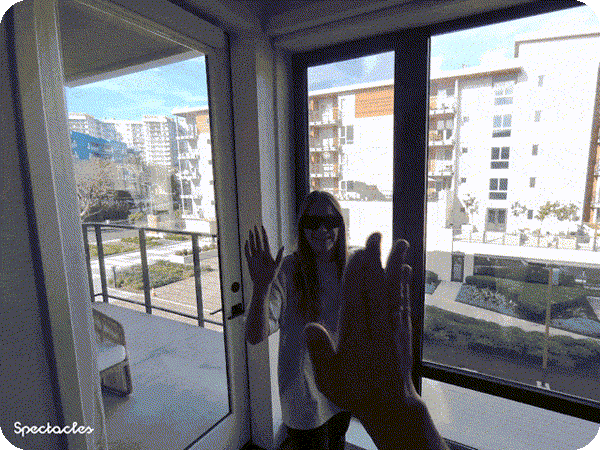

# High Five

    

## Overview

This project showcases a real-time collaborative AR experience where two users perform a high-five gesture. The system synchronizes hand positions across devices and detects when the hands are close enough to trigger the high-five. This interaction activates shared visual effects and displays the users' names. It demonstrates the potential of [Connected Lenses](https://developers.snap.com/spectacles/about-spectacles-features/connected-lenses/overview) for creating engaging social connections in AR.

> **NOTE**:
> This project will only work for the Spectacles platform.

## Design Guidelines

Designing Lenses for Spectacles offers all-new possibilities to rethink user interaction with digital spaces and the physical world.
Get started using our [Design Guidelines](https://developers.snap.com/spectacles/best-practices/design-for-spectacles/introduction-to-spatial-design)

## Prerequisites

- **Lens Studio**: v5.10.0+
- **Spectacles OS Version**: v5.62+
- **Spectacles App iOS**: v0.62+
- **Spectacles App Android**: v0.62+

To update your Spectacles device and mobile app, please refer to this [guide](https://support.spectacles.com/hc/en-us/articles/30214953982740-Updating).

You can download the latest version of Lens Studio from [here](https://ar.snap.com/download?lang=en-US).

The camera feature requires you to use Experimental APIs. Please see Experimental APIs for more details [here](https://developers.snap.com/spectacles/about-spectacles-features/apis/experimental-apis).

Extended Permissions mode on device must be enabled for enabling some of the Spectacles APIs. Please see Extended Permissions for more details [here](https://developers.snap.com/spectacles/permission-privacy/extended-permissions).

## Getting Started

To obtain the project folder, clone the repository.

> **IMPORTANT:**
> This project uses Git Large Files Support (LFS). Downloading a zip file using the green button on GitHub **will not work**. You must clone the project with a version of git that has LFS.
> You can download Git LFS [here](https://git-lfs.github.com/).

## Initial Project Setup

The project should be pre-configured to get you started without any additional steps. However, if you encounter issues in the Logger Panel, please ensure your Lens Studio environment is set up for [Spectacles](https://developers.snap.com/spectacles/get-started/start-buiding/preview-panel).

## Key Script

[EntryPointMain.ts](./Assets/HighFive/Scripts/EntryPointMain/EntryPointMain.ts) - This script serves as the entry point for the Lens logic, initializing and managing the execution of other scripts within the project.

## Testing the Lens

### In Lens Studio Editor

1. Open the Lens in Lens Studio and create two Interactive Previews using the [Interactive Preview Panel](https://developers.snap.com/lens-studio/lens-studio-workflow/previewing-your-lens#interactive-preview)
2. Click the Multiplayer button for both previews. They will connect to the same session and map surroundings automatically.
3. Simulate a high-five gesture by interacting within the connected session:
   - Select the [Webcam mode](https://developers.snap.com/lens-studio/lens-studio-workflow/previewing-your-lens#webcam-mode) and use your left hand to mimic the high-five gesture between the two previews.
   - Verify that the high-five gesture triggers the shared animation between the two users.
   - Confirm that both usernames are displayed correctly in each preview.

### In Spectacles Device

1. Connect two pairs of Spectacles to the same session following the [Playing Connected Lenses Guide](https://developers.snap.com/spectacles/about-spectacles-features/connected-lenses/overview#playing-connected-lenses-on-spectacles).
2. Test functionality:
   - Perform a high-five gesture using the right hands of the two users. Confirm that the shared animation appears between their hands.
   - Verify that both usernames are displayed correctly for each user and that the effect functions seamlessly.

## Support

If you have any questions or need assistance, please don't hesitate to reach out. Our community is here to help, and you can connect with us and ask for support [here](https://www.reddit.com/r/Spectacles/). We look forward to hearing from you and are excited to assist you on your journey!

## Contributing

Feel free to provide improvements or suggestions or directly contributing via merge request. By sharing insights, you help everyone else build better Lenses.