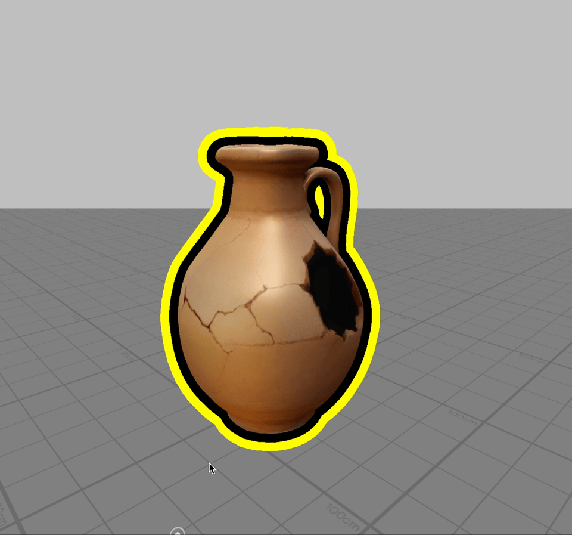

# Laser Pointer

[](https://developers.snap.com/spectacles/spectacles-frameworks/spectacles-interaction-kit/features/overview?) [](https://developers.snap.com/spectacles/about-spectacles-features/connected-lenses/overview?) [](https://developers.snap.com/spectacles/spectacles-frameworks/spectacles-interaction-kit/features/overview?) [](https://developers.snap.com/lens-studio/features/lens-cloud/lens-cloud-overview?) [](https://developers.snap.com/lens-studio/api/lens-scripting/classes/Built-In.RayCastHit.html)
[](https://developers.snap.com/spectacles/about-spectacles-features/connected-lenses/overview?)
[](https://developers.snap.com/spectacles/spectacles-frameworks/spectacles-sync-kit/getting-started)
[](https://developers.snap.com/lens-studio/features/lens-cloud/lens-cloud-overview?)
[](https://developers.snap.com/lens-studio/api/lens-scripting/classes/Built-In.RayCastHit.html)


## Overview

The Laser Pointer project demonstrates how to create interactive pointers that collide with virtual objects. Users can create colored laser pointer marks that persist for a few seconds before fading away by interacting with an object. This project showcases  Spectacles Interaction Kit (SIK) and Spectacles Sync Kit (SSK), allowing multiple users to see and interact with the object through pointers, in a shared space.

> **NOTE:**
> This project will only work for the Spectacles platform.

## Design Guidelines

Designing Lenses for Spectacles offers all-new possibilities to rethink user interaction with digital spaces and the physical world.
Get started using our [Design Guidelines](https://developers.snap.com/spectacles/best-practices/design-for-spectacles/introduction-to-spatial-design)

## Prerequisites

- **Lens Studio**: v5.10.0+
- **Spectacles OS Version**: v5.62+
- **Spectacles App iOS**: v0.62+
- **Spectacles App Android**: v0.62+

To update your Spectacles device and mobile app, refer to this [guide](https://support.spectacles.com/hc/en-us/articles/30214953982740-Updating).

You can download the latest version of Lens Studio from [here](https://ar.snap.com/download?lang=en-US).

## Getting Started

To obtain the project folder, clone the repository.

> **IMPORTANT:**
> This project uses Git Large Files Support (LFS). Downloading a zip file using the green button on GitHub **will not work**. You must clone the project with a version of git that has LFS.
> You can download Git LFS [here](https://git-lfs.github.com/).

## Initial Project Setup

The project is pre-configured and ready to use without additional setup. Simply open the LaserPointer.esproj file in Lens Studio to get started.

## Key Features



### Connected Laser Pointers

The Laser Pointer project allows users to create persistent pointer marks in their environment that are visible to all connected users. Each pointer has a randomly assigned color and will fade away automatically after a short period of inactivity.

Key features include:
- Interactive pointer instantiation using the Instantiator (SSK)
- Synchronized pointers visible to all connected user
- Color synchronization using SyncMaterial (SSK)
- Transform synchronization using SyncTransform (SSK)
- Visual feedback with colorful pointers that fade out over time

```typescript
private spawnPointer(interactor: Interactor) {
    // Create a new pointer instance using the Instantiator
    this.pointerInstantiator.instantiate(this.pointerPrefab, {}, (networkRootInfo: NetworkRootInfo) => {
        const object = networkRootInfo.instantiatedObject;
        const pointerComponent = object.getComponent<Pointer>(Pointer.getTypeName());
        if (pointerComponent) {
            pointerComponent.setInteractor(interactor);
        }
    });
}
```

## Key Scripts

### [Assets/Pointer.ts](./Assets/Pointer.ts)
- Managing the appearance and behavior of individual pointer instances
- Updating pointer positions based on interactor target positions
- Fading out pointers over time after interaction ends
- Cleaning up pointer objects once they've fully faded out

### [Assets/PointerCreation.ts](./Assets/PointerCreation.ts)
- Creating new pointer instances when users interact with the target object
- Connecting pointers to their corresponding interactors once instantiation is complete
- Instantiating pointers with the Instantiator from Spectacles Sync Kit for multi-user visibility

## Testing the Lens

### In Lens Studio Editor
- Open the project in Lens Studio and enter Preview mode
- Select "Multiplayer" in each preview window
- Click or tap on the jug to create pointer marks
- Observe how pointers fade out after interaction stops
- Test with multiple simulated preview windows to verify synchronization

### On Spectacles Device
- Build and deploy the project to multiple Spectacles devices
- Connect the devices together in the same session
- Point at the jug and pinch to create pointer marks
- Verify that all users can see pointers created by others

## Support

If you have any questions or need assistance, please don't hesitate to reach out. Our community is here to help, and you can connect with us and ask for support [here](https://www.reddit.com/r/Spectacles/). We look forward to hearing from you and are excited to assist you on your journey!

## Contributing
Feel free to provide improvements or suggestions or directly contributing via merge request. By sharing insights, you help everyone else build better Lenses.