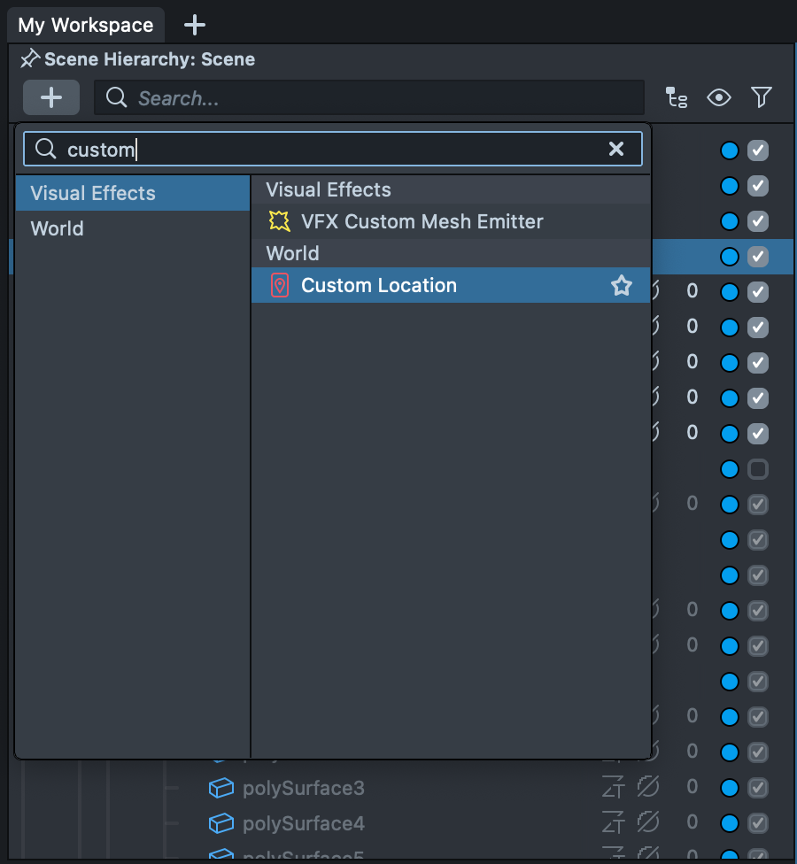
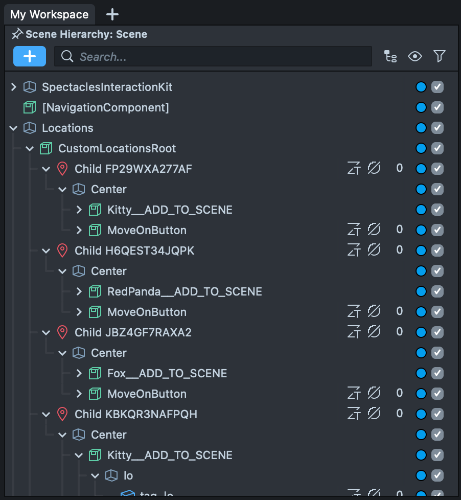
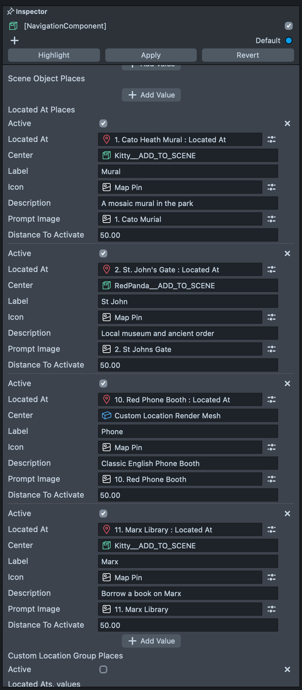

# Navigation Kit

    

## Overview

This project demonstrates how to build guided tour experiences using the [Spectacles Navigation Kit (SNK)](https://developers.snap.com/spectacles/spectacles-frameworks/spectacles-navigation-kit/getting-started). The example is set in London but users can build their own tours by simply replacing the places of interest.

> **NOTE:**
> This project will only work for the Spectacles platform.

### Other Useful Projects

This project differs from the [Outdoor Navigation project](https://github.com/Snapchat/Spectacles-Sample/tree/main/Outdoor%20Navigation) in that it applies the Navigation Kit as the bases for all of it's features. The Map Component used here has been heavily modified for this use case, so if the map available here if the principle feature you wish to use it may be worth evaluating that project for a more stand alone map.

The [Custom Location project](https://github.com/Snapchat/Spectacles-Sample/tree/main/Custom%20Locations) also provides examples of how to use Custom Locations within a project and provides scripts to help with that. This project shows an example of them incorporated into a guided tour, but there is functionality that is specific to that project too. Again, it may be worth looking through that project as well for another example of how to setup Custom Locations. 

## Design Guidelines

Designing Lenses for Spectacles offers opportunities to rethink user interaction with digital spaces and the physical world.
Get started using our [Design Guidelines](https://developers.snap.com/spectacles/best-practices/design-for-spectacles/introduction-to-spatial-design)

## Prerequisites

- **Lens Studio**: v5.10.0+
- **Spectacles OS Version**: v5.62+
- **Spectacles App iOS**: v0.62+
- **Spectacles App Android**: v0.62+

To update your Spectacles device and mobile app, refer to this [guide](https://support.spectacles.com/hc/en-us/articles/30214953982740-Updating).

You can download the latest version of Lens Studio from [here](https://ar.snap.com/download?lang=en-US).

## Getting the project

To obtain the project folder, you need to clone the repository.

> **IMPORTANT**:
> This project uses Git Large Files Support (LFS). Downloading a zip file using the green button on Github
> **will not work**. You must clone the project with a version of git that has LFS.
> You can download Git LFS here: https://git-lfs.github.com/.

## Initial Project Setup

The cloned project has a working example scene. You can create your own guided tour by introducing your own places of interest. Places can be Custom Locations, a Custom Location Group, or longitude and latitude coordinates.

Destinations in a tour are defined with a `ManualPlaceList` component. The example scene has two `ManualPlaceList` components, separately demonstrating indoor and outdoor tours. The `ManualPlaceList` components are parented to, and are selected using, the "ProjectVariant" scene object.

Each `ManualPlaceList` contains one or more of the following place types:

- Manual Geo Locations - A list of places defined by longitude and latitude coordinates.
- Custom Location Places - A list of places defined by `LocatedAt` components representing Custom Locations.
- Custom Location Group Places - A list of places defined by a `CustomLocationGroup` component. Navigation against a Custom Location Group is only supported following successful localization against a child Custom Location.
- Scene Object Places - A list of places defined by `SceneObject`s in the scene. The position of these places is relative to the user's position at Lens start.

Further information about creating scans can be found [here](https://developers.snap.com/spectacles/about-spectacles-features/apis/custom-locations).

## Indoors vs Outdoors

The template provided demonstrates the creation of navigation experiences either indoors or outdoors. Transitions between indoors and outdoors are not currently supported.

Medium to large outdoor experiences should be assembled from individual Custom Locations and geocoordinates. The scale of these experiences is not a good fit for Custom Location Groups. It should be noted that users may launch the Lens a long distance from any place of interest and so navigation will need to be provided from launch.

Indoor experiences should be built on top of a single Custom Location Group. Geopositioning is not reliable indoors and so experiences should not provide arrow based navigation until a member of the group has been localized. Following localization the Spectacles Navigation Kit is capable of accurately calculating the relative position of the other members of the group. The recommended behaviour has been demonsrated on the "WelcomeSignIndoors" prefab, which provides a prompt for the first location and disables the overlay camera object on Lens start via the `TourSplashScreen` script.

To select between the two variants of this template project (indoors and outdoors) use the selection dropdown on the "ProjectVariant" scene object.

## Places

A `Place` in the Spectacles Navigation Kit is a navigable destination. It contains a name, icon, and description. APIs are provided to calculate the position of a `Place` relative to the user. More information can be found in the SNK readme.

## Distance Checks

There are a few distance checks that are performed while running the Lens.

- The nearby radius, this is defined on `ManualPlaceList` and can be set per entry. This governs when the `isNearby` event is fired on a `Place`. In this template this is used for individual Custom Locations to enable them for localization and as such should be large. Our default is 50m. Custom Location Groups are enabled and disabled by the `CustomLocationGroup` script and this should not be overridden, this template will not touch their enabled flag and these scripts should not be extended to do so.
- The prompt radius, this is defined on `CustomLocationPlacesImageDisplay`, found on the UI root scene object. This sets how far away from a location the prompt image becomes available. Our default is 15m, but this is set to 10m for indoor experiences.
- The here radius, this is defined on `ARNavigation` found on the "Overlay Camera/ARNavigation" and sets at which distance the navigation arrow stops pointing towards the target and enters into its "here" state. Our default is 10m, but is adjusted to 0.5m for indoor experiences.
- The dismiss radius, this is defined on `DismissOnWalkAway` found on "UI/MainPanel". This sets how far the user must walk before the main panel is dismissed.

## Key Scripts

The core of this experience is driven by the SNK, more detail on the scripts provided by that component can be found in the SNK readme. Other scripts provided in this template are described below.

[PanelManager.ts](./Assets/NavigationKitAssets/Scripts/PanelManager.ts): This script manages the minimization and maximization of the main panel in the scene.

[MinimapHighlightManager.ts](./Assets/NavigationKitAssets/Scripts/MinimapHighlightManager.ts): This script manages the highlight hoop and icon on the minimized map to signal to the user anything that might impede their chances of localising content.

[CustomLocationPlacesImageDisplay.ts](./Assets/NavigationKitAssets/Scripts/CustomLocationPlacesImageDisplay.ts): This script creates a binding between a `CustomLocationPlace` and a prompt image (texture) that is made available for display when the user is close enough to the destination. Prompt images are useful for guiding users to a localization viewpoint and help mitigate inaccuracies in geopositioning.

[OnlyShowArrowAfterGroupLocalization.ts](./Assets/NavigationKitAssets/Scripts/OnlyShowArrowAfterGroupLocalization.ts): When developing indoor navigation experiences it is recommended that the ARNavigation arrow is only shown after a member of the Custom Location Group has been localized. This script provides that functionality.

## Walkthrough

### Scan Locations

Create a Custom Location at each physical location where AR content is to be anchored.

If creating an indoor or small outdoor experience you may find it preferable to create a Custom Location Group for your whole tour. Instructions on creating a Custom Location Group can be found [here](https://developers.snap.com/spectacles/about-spectacles-features/apis/custom-locations).

### Add the locations to Lens Studio

#### Individual Custom Locations

Add Custom Location objects to your scene and add the ID to the created `LocationAsset`.

More information about adding Custom Locations can be found [here](https://developers.snap.com/lens-studio/features/location-ar/custom-landmarker#adding-multiple-custom-locations)

#### Custom Locations Groups

Groups are imported by adding a `CustomLocationGroup` component to a `SceneObject`. This will import all child Custom Locations to the scene.

### Anchor Content to Locations

Once the Custom Locations have been added to your scene, content can be anchored to these locations. Use the Custom Location mesh to guide the placement of content.
The `EnableObjectsOnFound` script can be used to ensure content is only displayed once the user has localized.

### Add references and descriptions to `ManualPlaceList`

Add Custom Locations to the `ManualPlaceList` component and populate `Place` details such as label, icon, and description. Note:

- Be careful to edit the correct `ManualPlaceList` for your project variant (indoor / outdoor).
- Be careful to populate the `Place` list corresponding to your location type, e.g. group vs individual Custom Locations.

### Adds Prompt Images

Prompt images should be added to `Place`s in the `ManualPlaceList` component to help users find and localize against Custom Locations. When the user is close a `?` will appear on the list item and minimap, tapping on this displays the prompt image.

The distance at which prompta are displayed can be adjusted to help users reach their destination. Geopositioning accuracy is accounted for when triggering prompts.

### Test Your Lens

Once complete, the Navigation Template can be tested with your added locations.

## Support

If you have any questions or need assistance please don't hesitate to reach out. Our community is here to help and you can connect with us and ask for support [here](https://www.reddit.com/r/Spectacles/). We look forward to hearing from you and are excited to assist you on your journey!

## Contributing

Feel free to provide improvements or suggestions or directly contribute via merge request. By sharing insights you help everyone else build better Lenses.
