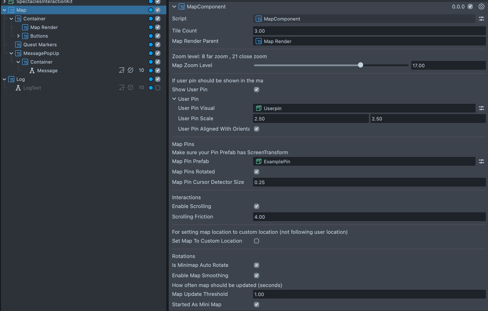

# Outdoor Navigation

[](https://developers.snap.com/spectacles/spectacles-frameworks/spectacles-interaction-kit/features/overview?) [](https://developers.snap.com/lens-studio/features/location-ar/custom-landmarker?) [](https://developers.snap.com/spectacles/about-spectacles-features/compatability-list?) [](https://developers.snap.com/lens-studio/features/location-ar/map-component?) [](https://developers.snap.com/lens-studio/features/remote-apis/snap-places-api?)


## Overview

This project showcases an outdoor Augmented Reality (AR) navigation template. We have re-engineered the Map Component using TypeScript for enhanced reliability and performance. The experience integrates the Places API alongside a bespoke Quest Markers system to provide users with intuitive navigation capabilities.

Key Features:

- **Revamped Map Component** : Users can create and manipulate map pins to any desired location. This is achieved through a revamped Map Component, providing seamless interaction and pin management. The new component aims to minimize effort to set up and removes the need to use additional orthographic camera to render the map texture which optimizes performance on the Spectacles device. Additionally it provides the following features:
  - **Places API Integration** : Enables users to discover nearby locations via the Map Component, which are represented as pins on the map for easy navigation.
  - **Dynamic Map Modes** : Users can effortlessly switch between a minimized map view and a full-screen map mode, tailoring their navigation experience to personal preferences.
- **Map Manipulation Component** : A hassle-free solution for scrolling the map and dragging the map pin that integrates with SIK interactions.
- **AR Quest Markers** : Upon the creation of a map pin, an augmented Quest Marker appears. This serves as a dynamic directional guide, enhancing user orientation within the AR environment.

We invite you to explore, modify, and enhance this foundational experience for broader applications.

> **NOTE:**
>
> - This project will only work for the Spectacles platform.
> - Connect your phone to a solid Wifi network or a mobile hotspot and make sure that your spectacles are synced with the spectacles app.
> - User heading will only become north-aligned after receiving GNSS signal. This template works best outdoor!
> - After a new firmware is installed, heading orientation can take a moment to initialise. This is due to a calibration process that occurs in the background which is invisible to the user. This calibration process can be speed up using the steps below:
>   - Just after a firmware upgrade, wear your Spectacles with the display turned on.
>   - Rotate the device for about 20 seconds. This involves looking around, turning around, and looking up and down to cover several directions.
> - If you need more detailed support or encounter any issues that are not covered here, reaching out to Snapchat developer support or consulting specific sections of the documentation might be necessary. If you have any more questions or need further clarification, feel free to ask!

## Design Guidelines

Designing Lenses for Spectacles offers all-new possibilities to rethink user interaction with digital spaces and the physical world.
Get started using our [Design Guidelines](https://developers.snap.com/spectacles/best-practices/design-for-spectacles/introduction-to-spatial-design)

## Prerequisites

- **Lens Studio**: v5.12.0+
- **Spectacles OS Version**: v5.63+
- **Spectacles App iOS**: v0.62+
- **Spectacles App Android**: v0.62+

To update your Spectacles device and mobile app, refer to this [guide](https://support.spectacles.com/hc/en-us/articles/30214953982740-Updating).

You can download the latest version of Lens Studio from [here](https://ar.snap.com/download?lang=en-US).

## Getting the project

To obtain the project folder, you need to clone the repository.

> **IMPORTANT**:
> This project uses Git Large Files Support (LFS). Downloading a zip file using the green button on Github
> **will not work**. You must clone the project with a version of git that has LFS.
> You can download Git LFS here: https://git-lfs.github.com/.

## Initial Project Setup

The project should be pre-configured to get you started without any additional steps. However, if you encounter issues in the Logger Panel, please ensure your Lens Studio environment is set up for [Spectacles](https://developers.snap.com/spectacles/get-started/start-buiding/preview-panel).

## Integration Guidelines

### Revamped Map Component



1. **Map Component**:

   - Copy the MapComponent folder to your Lens Studio project from the template. The API are mostly similar to the [old Map Component](https://developers.snap.com/lens-studio/features/location-ar/map-component).
   - Add the [MapComponent.ts](./Assets/MapComponent/Scripts/MapComponent.ts) component on a scene object
   - The map tiles will be automatically populated in run-time under the MapRenderParent scene object assigned on the MapComponent on the inspector.

> **NOTE:**
> Different from the old Map Component, the tiles are now rendered directly to the main camera to avoid performance lost to additional camera.

2. **Customize the Map**:
   - Modify the visual of the map’s user pin and location pins through the Inspector panel.
   - Add pins by providing a local position (relative to the map) or a location coordinate

#### Example Script

```typescript
@component
export class ExampleComponent extends BaseScriptComponent {
  @input
  private mapComponent: MapComponent;

  onAwake() {
    script.createEvent("OnStartEvent").bind(() => {
      this.mapComponent.subscribeOnMaptilesLoaded(() => {
        const longitude = -0.129956;
        const latitude = 51.51277;
        const locationMapPin = this.mapComponent.createMapPin(
          longitude,
          latitude
        );

        const localPositionMapPin = this.mapComponent.addPinByLocalPosition(
          new vec2(0, 0)
        );
      });
    });
  }
}
```

### Map Manipulation Component

The [MapManipulation.ts](./Assets/Scripts/MapManipulation.ts) component is fully integrated with [Spectacles Interaction Kit (SIK)](https://developers.snap.com/spectacles/spectacles-frameworks/spectacles-interaction-kit/get-started) and provides interactive features for interacting with a map.
Users can pan and select map pins on the map using SIK interactors.

### Places API Integration

[SnapPlacesProvider](./Assets/MapComponent/Scripts/SnapPlacesProvider.ts) simplifies the Places API usage and would parse the json response from the Places API endpoint to a `PlaceInfo` type. The revamped Map Component provided `showNeaybyPlaces(categoryName: string[])` method to add pins to the nearby places filtered by the given category names. You can also use `SnapPlacesProvider` directly to access additional place information. Please refer to [`MapController.showNearbyPlaces`](./Assets/MapComponent/Scripts/MapController.ts) for the usage.

#### Example Script

```typescript
@component
export class ExampleComponent extends BaseScriptComponent {
  @input
  private mapComponent: MapComponent;

  onAwake() {
    script.createEvent("OnStartEvent").bind(() => {
      this.mapComponent.subscribeOnUserLocationFirstSet(() => {
        this.mapComponent.showNeaybyPlaces(["Coffee"]);
      });
    });
  }
}
```

### AR Quest Markers

[QuestMarkerController](./Assets/Scripts/QuestMarkController.ts) subscribs to various events from the [MapComponent](./Assets/MapComponent/Scripts/MapComponent.ts) to handle generateing and removing of quest markers.

### Dynamic Map Modes

This is a new feature provided by the revamped Map Component, which allows the user to shrink the map into a minimap mode to minimize obstruction to the navigation. The map would started in minimap mode by default in the template but you can also disable `startedAsMiniMap` on the MapComponent on the inspector.

#### Example Script for toggling between minimap and full map mode

```typescript
@component
export class ExampleComponent extends BaseScriptComponent {
  @input
  private mapComponent: MapComponent;

  onAwake() {
    script.createEvent("OnStartEvent").bind(() => {
      this.mapComponent.subscribeOnUserLocationFirstSet(() => {
        this.mapComponent.toggleMiniMap(true);
      });
    });
  }
}
```

## Testing the Lens

### In Lens Studio Editor

1. Open the Preview panel to simulate user location and navigation.
2. Trigger the expand button on the top-left of the minimap which will activate the full map mode.
3. Trigger the spawn pin button and drag the newly added pin on the map. An AR quest marker will be created when a pin is spawned.
4. Trigger Restaurant/Cafe/Bar buttons on top of the map and you will see nearby places added as pins if any places are found.

### On Spectacles Device

1. Ensure the Experiemtal API settings is enabled in the Lens Studio's Project Settings
2. Deploy the project to your Spectacles device.
3. Ensure location services and extended permissions are enabled on the Spectacles App that connected to your device.
4. Use the navigation interface to test live functionality.

## Disclaimer

This project is intended for demonstration purposes. Ensure compliance with Snap Spectacles API usage policies and terms of service when deploying the system.

## Support

If you have any questions or need assistance, please don't hesitate to reach out. Our community is here to help, and you can connect with us and ask for support [here](https://www.reddit.com/r/Spectacles/). We look forward to hearing from you and are excited to assist you on your journey!

## Contributing

Feel free to provide improvements or suggestions or directly contributing via merge request. By sharing insights, you help everyone else build better Lenses.
