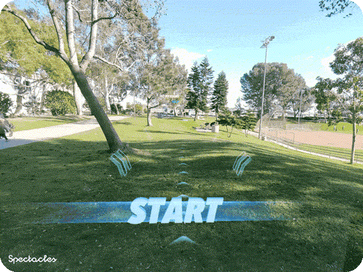

# Path Pioneer

  

## Overview
This is a sample project that demonstrates a path creation and path walking experience in a Typescript codebase. 

> **NOTE:**
> This project will only work for the Spectacles platform and Lens Studio.

> **IMPORTANT:**
> This project enables you to design and store a walkable path using holographic reconstruction technology. To ensure safety and optimal experience, we recommend choosing an outdoor area that is free from traffic and other potential obstacles. For best results, walking is preferred over running. Stay aware of your surroundings!

## Design Guidelines

Designing Lenses for Spectacles offers all-new possibilities to rethink user interaction with digital spaces and the physical world.
Get started using our [Design Guidelines](https://developers.snap.com/spectacles/best-practices/design-for-spectacles/introduction-to-spatial-design)

## Prerequisites

- **Lens Studio**: v5.10.0+
- **Spectacles OS Version**: v5.62+
- **Spectacles App iOS**: v0.62+
- **Spectacles App Android**: v0.62+

To update your Spectacles device and mobile app, please refer to this [guide](https://support.spectacles.com/hc/en-us/articles/30214953982740-Updating).

You can download the latest version of Lens Studio from [here](https://ar.snap.com/download?lang=en-US).

## Getting Started

To obtain the project folder, clone the repository. 

> **IMPORTANT:**
> This project uses Git Large Files Support (LFS). Downloading a zip file using the green button on GitHub **will not work**. You must clone the project with a version of git that has LFS.
> You can download Git LFS [here](https://git-lfs.github.com/).

## Initial Project Setup

The project should be pre-configured to get you started without any additional steps. This project does not use experimental API. To navigate the codebase, start in the LensInitializer script. 

We recommend using [VSCode](https://developers.snap.com/lens-studio/features/scripting/vscode-extension). 

This project attempts to implement a Single Object Single Responsibility (SRP) principle; there are many scripts, but (hopefully) no one script shoulders too much responsibilty. Hopefully you can easily use individual tools and helpers in your project(s).

To decouple dependencies, we have used events.  Events can be challenging to debug, since they are often added to input events, which may catch crashes in a try/catch rather than crashing.  To aid you debugging, you can:
    - Print the stack trace wherever you have concerns for an error: "print(`${new Error().stack}`);"
    - Replace try/catch statements with the clause in the "try" 
    - Explore [SourceMaps](https://sourcemap.tools/)

## Key Scripts

The following scripts control the experience:
- [LensInitializer.ts](./Assets/Scripts/LensInitializer.ts) starts the lens and caches the ground offset from the camera, which is effectively the player height.
- [UI.ts](./Assets/Scripts/UI.ts) controlled the world space soft follow instruction panels and loop lock circle ui. These ui elements are triggered via events. 
- [PathMaker.ts](./Assets/Scripts/PathMaker.ts) controls the various [path making states](./Assets/Scripts/PathMakerStates). There are two possible outcomes: 
    - A "path" has a start line and a finish line
    - A "loop" has only a start line
- [BuildingPathState.ts](./Assets/Scripts/PathMakerStates/BuildingPathState.ts) also controls what the player sees while they build the path:
    - The preview points control the behavior and look of the arrows you see ahead of you. 
    - The "pathRmv" parameter is for the mesh of dotted points trailing from your position back to the start line. 
- The loop lock function is controlled by [LoopController.ts](./Assets/Scripts/LoopController.ts), which [UI.ts](./Assets/Scripts/UI.ts) spawns in a prefab.
- Whether you finish your path as a loop or a line, the path points will be processed to ensure smooth curves from the start/finish lines, and around the path itself.  
- [PathRunner.ts](./Assets/Scripts/PathRunner.ts) controls the running experience:
    - path
        - start and finish line collision events, which increment laps
        - if starting to run at the enpoint of your path rather than the start point of your path, reversing start and finish line colliders
        - when going through either endpoint, reversing the path visuals 
        - playing screenspace stats while running, pausing stats while outside of the track 
    - loop
        - start line collision event, which increments laps
        - playing screenspace stats

## Testing the Lens

### In Lens Studio Editor

1. Open the Preview panel in Lens Studio.
2. Use Interactive Preview, WASD (+QE for elevation), LMB and RMB to move around scene.
3. Follow in-lens UI prompts

### On Spectacles Device

1. Build and deploy the project to your Spectacles device.
2. Follow the [Spectacles guide](https://developers.snap.com/spectacles/get-started/start-building/preview-panel) for device testing.
3. Follow in-lens UI prompts

## Support

If you have any questions or need assistance, please don't hesitate to reach out. Our community is here to help, and you can connect with us and ask for support [here](https://www.reddit.com/r/Spectacles/). We look forward to hearing from you and are excited to assist you on your journey!

## Contributing

Feel free to provide improvements or suggestions or directly contributing via merge request. By sharing insights, you help everyone else build better Lenses.