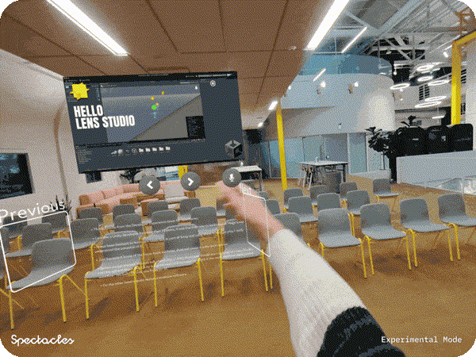
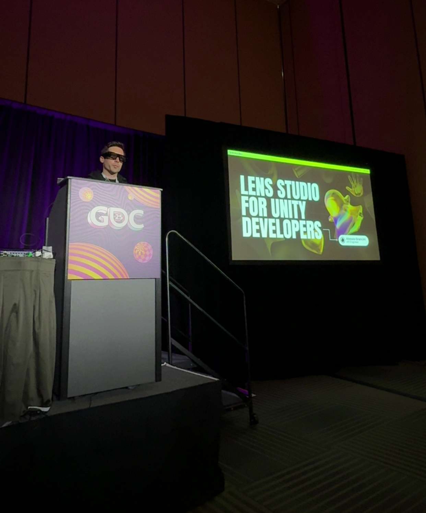
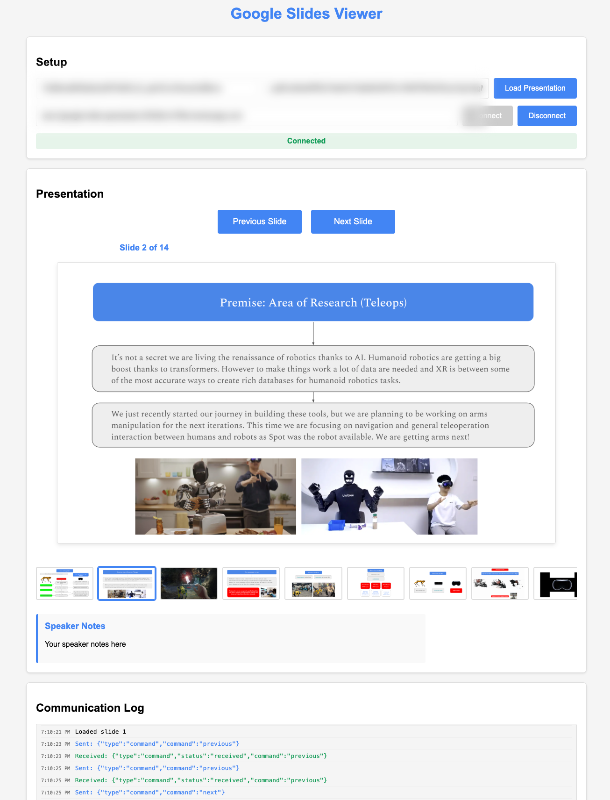
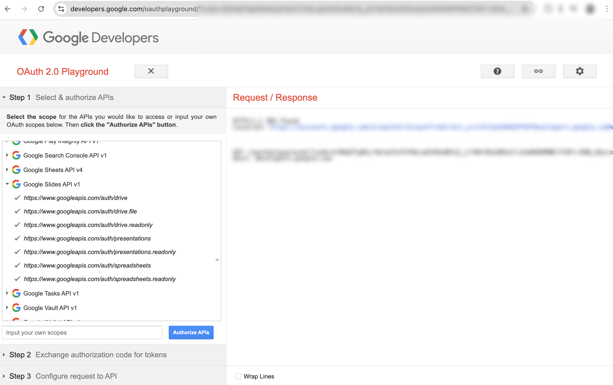
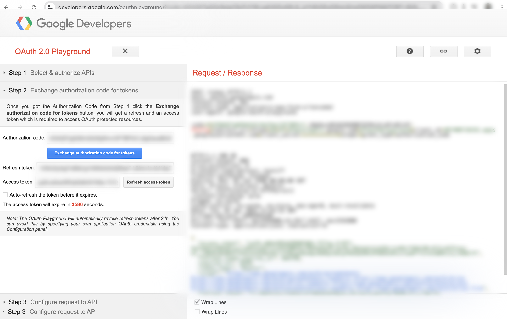
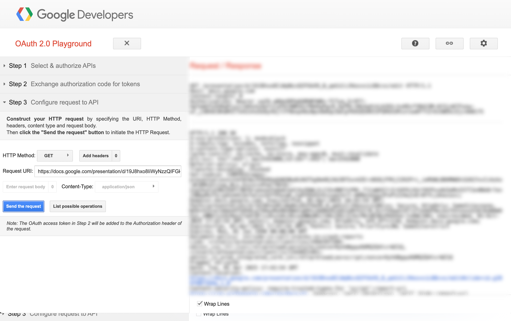
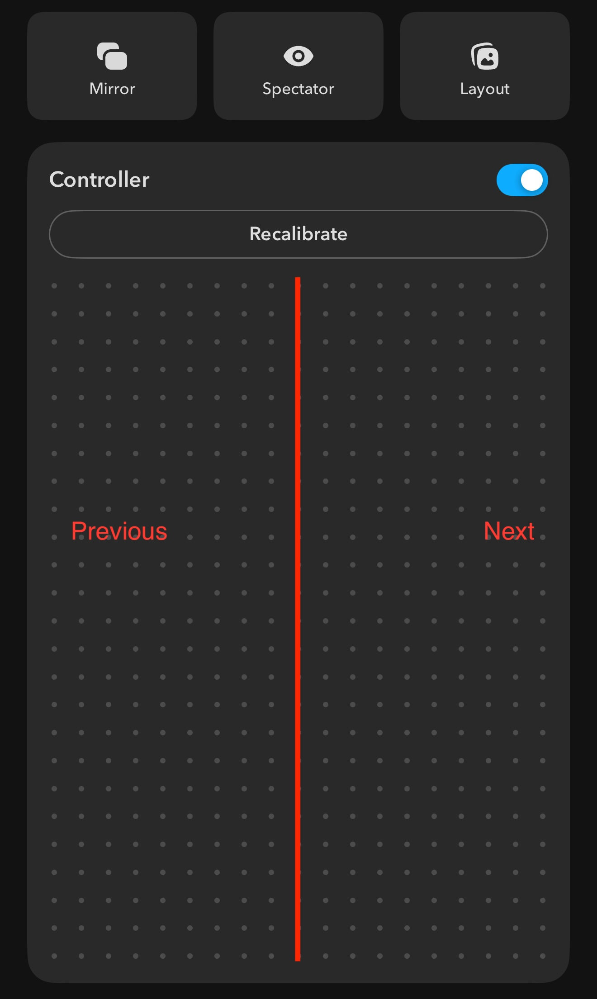
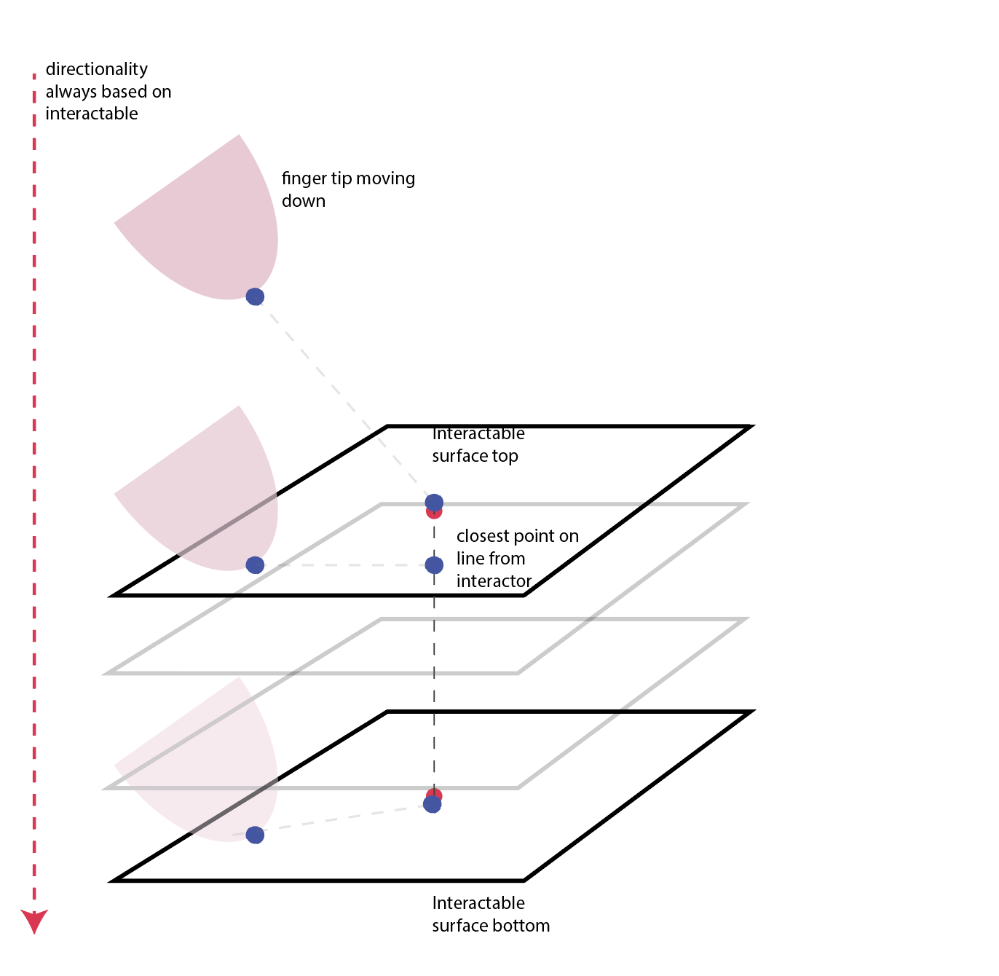
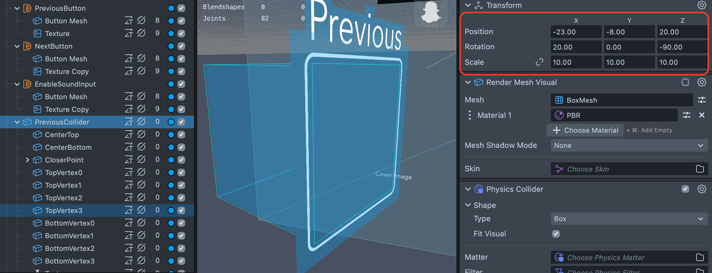
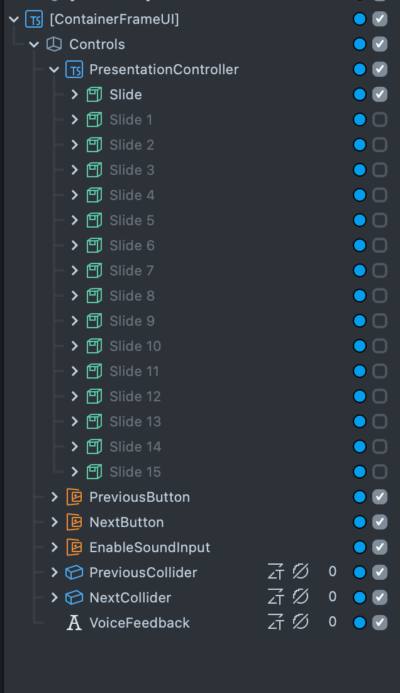

# Public Speaker 

[](https://developers.snap.com/spectacles/spectacles-frameworks/spectacles-interaction-kit/features/overview?) [](https://developers.snap.com/lens-studio/features/audio/playing-audio?) [](https://developers.snap.com/spectacles/about-spectacles-features/apis/gesture-module?) [](https://developers.snap.com/spectacles/about-spectacles-features/apis/motion-controller?)



> **NOTE:**
> The project uses VoiceML - Speech Recognition

## Overview
This project is a fun teleprompter lens integrated into Spectacles designed for both rehearsal and live public speaking. It displays speech text directly within the speaker’s field of view, enabling easy reference without breaking engagement with the audience. The system supports real-time adjustments, allowing the slides to update at a variable pace controlled by intuitive gestures, pinch actions, voice commands, or using the Spectacles mobile app. And yes, we used this lens at GDC 2025 :)! 



## Design Guidelines

Designing Lenses for Spectacles offers all-new possibilities to rethink user interaction with digital spaces and the physical world.
Get started using our [Design Guidelines](https://developers.snap.com/spectacles/best-practices/design-for-spectacles/introduction-to-spatial-design)

## Prerequisites

- **Lens Studio**: v5.10.0+
- **Spectacles OS Version**: v5.62+
- **Spectacles App iOS**: v0.62+
- **Spectacles App Android**: v0.62+

To update your Spectacles device and mobile app, please refer to this [guide](https://support.spectacles.com/hc/en-us/articles/30214953982740-Updating).

You can download the latest version of Lens Studio from [here](https://ar.snap.com/download?lang=en-US).

The camera feature requires you to use Experimental APIs. Please see Experimental APIs for more details [here](https://developers.snap.com/spectacles/about-spectacles-features/apis/experimental-apis).

Extended Permissions mode on device must be enabled for enabling some of the Spectacles APIs. Please see Extended Permissions for more details [here](https://developers.snap.com/spectacles/permission-privacy/extended-permissions).

## Getting Started

To obtain the project folder, clone the repository.

> **IMPORTANT:**
> This project uses Git Large Files Support (LFS). Downloading a zip file using the green button on GitHub **will not work**. You must clone the project with a version of git that has LFS.
> You can download Git LFS [here](https://git-lfs.github.com/).

## Google Slides Integration

This project allows you to connect your Spectacles to Google Slides presentations, enabling you to view and control slides directly from your Spectacles or synchronize with a presenter using Google Slides.



The integration consists of three main components:

1. **Heroku WebSocket Server**: A server that relays commands between your Spectacles and Google Slides
2. **Web Slide Viewer**: A web interface for viewing and controlling Google Slides
3. **Spectacles Scripts**: Components that connect to Google Slides API and the WebSocket server

### Setting Up Heroku Server

#### Step 1: Heroku Setup

1. Sign up for a free Heroku account at [heroku.com](https://www.heroku.com/)
2. Install the [Heroku CLI](https://devcenter.heroku.com/articles/heroku-cli)
3. Log in to Heroku from your terminal:
   ```
   heroku login
   ```
4. Create a new Heroku app:
   ```
   heroku create google-slide-spectacles
   ```
   Note: Choose a unique name for your app, as it will be part of your WebSocket URL

5. Deploy the WebSocket server to Heroku:
   ```
   cd SyncPresentationOnWeb/google-slide-spectacles
   git init
   git add .
   git commit -m "Initial commit"
   heroku git:remote -a your-app-name
   git push heroku master
   ```

6. Verify your server is running by visiting `https://your-app-name.herokuapp.com`

### Setting Up Google OAuth

#### Step 2: Google OAuth Setup

1. Go to the [Google Cloud Console](https://console.cloud.google.com/)
2. Create a new project or select an existing one
3. Enable the Google Slides API:
   - Navigate to "APIs & Services" > "Library"
   - Search for "Google Slides API" and enable it



4. Create OAuth credentials:
   - Go to "APIs & Services" > "Credentials"
   - Click "Create Credentials" > "OAuth client ID"
   - Select "Web application" as the application type
   - Add authorized redirect URIs (including `https://developers.google.com/oauthplayground`)
   - Click "Create" and note your Client ID and Client Secret



5. Get a refresh token using OAuth Playground:
   - Go to [OAuth Playground](https://developers.google.com/oauthplayground/)
   - Click the gear icon in the top right and check "Use your own OAuth credentials"
   - Enter your Client ID and Client Secret
   - Select "Google Slides API v1" from the list of APIs
   - Select the scopes: `https://www.googleapis.com/auth/presentations` and `https://www.googleapis.com/auth/drive.readonly`
   - Click "Authorize APIs" and complete the OAuth flow
   - Click "Exchange authorization code for tokens"
   - Note the Access Token (you'll need to refresh this periodically) and Refresh Token



### Connecting Everything Together

1. Update the `GoogleSlideBridge.ts` script with your Google Slides presentation ID and access token:
   ```typescript
   @input
   @hint("Your presentation id - find it in the google slide link")
   presentationId: string = "your-presentation-id";

   @input
   @hint("Your refreshed access token, find it in the https://developers.google.com/oauthplayground")
   private accessToken: string = "Bearer your-access-token";
   ```

2. Update the `WebSocketController.ts` script with your Heroku WebSocket URL:
   ```typescript
   @input
   @hint("WebSocket server URL (e.g., wss://google-slide-spectacles-03332e1cf78e.herokuapp.com)")
   serverUrl: string = "wss://your-app-name.herokuapp.com";
   ```

3. Open the Web Slide Viewer by visiting:
   ```
   https://your-app-name.herokuapp.com/direct-controller.html
   ```

4. Enter your presentation ID and access token in the Web Slide Viewer
5. Click "Connect" to connect to the WebSocket server
6. Click "Load Presentation" to load your Google Slides presentation

Now your Spectacles will be synchronized with the Google Slides presentation. When you navigate slides on your Spectacles, the Web Slide Viewer will update, and vice versa.

## Input Modalities 

This project include different ways to change slides.

- Target with the cursor the "Next" and "Previous" buttons. 
- Toggle the audio input to use voice commands: "Next", "Previous", "Go Back".
- Use the soft buttons on the side with your hands.
- Use the Spectacle companion app as a "Clicker". 

## Key Scripts

- `PresentationSwitcher.ts` allows you to go next or go previous on the slides using [SIK](https://developers.snap.com/spectacles/spectacles-frameworks/spectacles-interaction-kit/get-started).



- `MobileController.ts` allows you to go next or go previous on the slides using the [Motion Controller Module](https://developers.snap.com/spectacles/about-spectacles-features/apis/motion-controller). Open the Spectacles app, pair it with your Spectacles, and use the controller panel. The left half of the window will call "Previous", the right half of the window will call "Next".



- `SoftPressController.ts` allows you to go next or go previous on the slides using a custom soft press button and [The Gesture Module](https://developers.snap.com/spectacles/about-spectacles-features/apis/gesture-module).

- `VoiceController.ts` allows you to go next or go previous on the slides using [VoiceML](https://developers.snap.com/lens-studio/features/voice-ml/speech-recognition).

## Modify the sample

Change the Orientation of the soft button that includes `SoftPressController.ts` and the distance from the Container UI based on your preference. 



Change the voice commands in `VoiceController.ts`. 

```typescript
        if (this.isListening) { 
          if (this.lastTranscription === "next" 
              || this.lastTranscription === "next.") {
            this.presentationSwitcher.next();
            log.d("Going to next slide");
          } else if (this.lastTranscription === "previous" 
              || this.lastTranscription === "go back"||
              this.lastTranscription === "previous." 
              || this.lastTranscription === "go back.") {
            this.presentationSwitcher.previous();
            log.d("Going to previous slide");
          }
```
Update the slides with your images and text. 



## Testing the Lens

### In Lens Studio Editor

1. Open the Preview panel in Lens Studio.
2. Explore the key script described above.
3. Modify the sample.  

### On Spectacles Device

1. Build and deploy the project to your Spectacles device.
2. Follow the [Spectacles guide](https://developers.snap.com/spectacles/get-started/start-building/preview-panel) for device testing.
3. Rehearse your presentation or delivery it using Spectacles. 

## Support

If you have any questions or need assistance, please don't hesitate to reach out. Our community is here to help, and you can connect with us and ask for support [here](https://www.reddit.com/r/Spectacles/). We look forward to hearing from you and are excited to assist you on your journey!

## Contributing

Feel free to provide improvements or suggestions or directly contributing via merge request. By sharing insights, you help everyone else build better Lenses.
