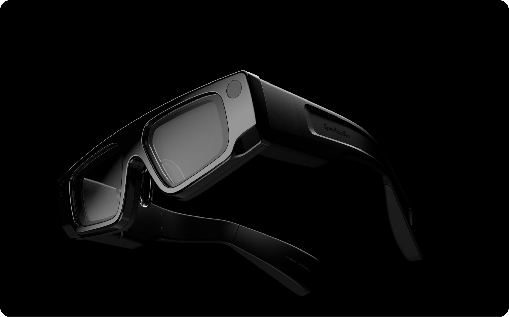

# Spectacles Templates

A comprehensive collection of templates and examples for building Lens experiences on Spectacles.

## What you'll find here

This repository contains multiple template projects showcasing different features and capabilities available when building for Spectacles. Each template is a complete, working example that you can use as a starting point for your own projects.

## AI

AI-powered experiences and integrations

<table>
  <tr>
    <td align="center" valign="top" width="33%">
      
      <h3>AI Playground</h3>
      

      

      
Sample project for AI in using Spectacles Remote Service Gateway.

    </td>
    <td align="center" valign="top" width="33%">
      
      <h3>Agentic Playground</h3>
      

      

      
Advanced AI playground demonstrating agentic behaviors and autonomous interactions using Spectacles platform.

    </td>
    <td align="center" valign="top" width="33%">
      
      <h3>Crop</h3>
      

      

      
Sample project showing how to "crop" the environment using hand gesture.

    </td>
    <td align="center" valign="top" width="33%">
      
      <h3>Depth Cache</h3>
      

      

      
Cache depth frames for pixel-to-3D projection with cloud-based vision models.

    </td>
  </tr>
</table>

## Getting Started

Essential projects to get you started with Spectacles development

<table>
  <tr>
    <td align="center" valign="top" width="33%">
      
      <h3>Fetch</h3>
      

      

      
Sample project using the Spectacles Fetch API.

    </td>
    <td align="center" valign="top" width="33%">
      
      <h3>Essentials</h3>
      

      

      
Collection of foundational concepts for creating lenses in Lens Studio.

    </td>
    <td align="center" valign="top" width="33%">
      
      <h3>Material Library</h3>
      

      

      
Experimental project collecting Materials tested on Spectacles.

    </td>
  </tr>
  <tr>
    <td align="center" valign="top" width="33%">
      
      <h3>Public Speaker</h3>
      

      

      
Teleprompter lens for public speaking practice and presentation delivery.

    </td>
    <td align="center" valign="top" width="33%">
      
      <h3>Spatial Image Gallery</h3>
      

      

      
Convert your 2D images to 3D.

    </td>
    <td align="center" valign="top" width="33%">
      
      <h3>Throw Lab</h3>
      

      

      
Sample project demonstrating realistic throwing mechanics in AR.

    </td>
  </tr>
  <tr>
    <td align="center" valign="top" width="33%">
      
      <h3>Spatial Persistence</h3>
      

      

      
Template project using Spectacles Spatial Anchor API.

    </td>
    <td align="center" valign="top" width="33%">
      
      <h3>Voice Playback</h3>
      

      

      
Sample project for recording and playing back audio on Spectacles.

    </td>
    <td align="center" valign="top" width="33%">
      
      <h3>Path Pioneer</h3>
      

      

      
Sample project for path creation and path walking experience.

    </td>
  </tr>
</table>

## SnapML

Machine learning projects using SnapML

<table>
  <tr>
    <td align="center" valign="top" width="33%">
      
      <h3>SnapML Starter</h3>
      

      

      
Demonstrates how to leverage SnapML on Spectacles for object detection using custom machine learning models.

    </td>
    <td align="center" valign="top" width="33%">
      
      <h3>SnapML Chess Hints</h3>
      

      

      
AI-powered chess move suggestions using computer vision and SnapML to detect pieces and provide intelligent assistance.

    </td>
    <td align="center" valign="top" width="33%">
      
      <h3>SnapML Pool</h3>
      

      

      
Uses SnapML to detect a pool table with all 16 balls and pocket holes.

    </td>
  </tr>
</table>

## Navigation

Location-based and navigation experiences

<table>
  <tr>
    <td align="center" valign="top" width="33%">
      
      <h3>Custom Locations</h3>
      

      

      
Map real life areas and create AR experiences around those locations.

    </td>
    <td align="center" valign="top" width="33%">
      
      <h3>Outdoor Navigation</h3>
      

      

      
Outdoor navigation system using Map Component and Places API.

    </td>
    <td align="center" valign="top" width="33%">
      
      <h3>Navigation Kit</h3>
      

      

      
An example project for indoors or outdoors navigation.

    </td>
  </tr>
</table>

## Connected Lenses

Multi-user collaborative experiences

<table>
  <tr>
    <td align="center" valign="top" width="33%">
      
      <h3>Shared Sync Controls</h3>
      

      

      
Real-time collaborative AR experience for shared controls.

    </td>
    <td align="center" valign="top" width="33%">
      
      <h3>Tic Tac Toe</h3>
      

      

      
Sample Connected Lens project using Spectacles Sync Kit.

    </td>
    <td align="center" valign="top" width="33%">
      
      <h3>Laser Pointer</h3>
      

      

      
Create laser pointers on a virtual object that are visible to all connected users.

    </td>
  </tr>
  <tr>
    <td align="center" valign="top" width="33%">
      
      <h3>High Five</h3>
      

      

      
Real-time collaborative AR experience for high-five interactions.

    </td>
    <td align="center" valign="top" width="33%">
      
      <h3>Air Hockey</h3>
      

      

      
Sample Connected Lens project using Spectacles Sync Kit.

    </td>
    <td></td>
  </tr>
</table>

## BLE (Bluetooth Low Energy)

Bluetooth Low Energy connectivity projects

<table>
  <tr>
    <td align="center" valign="top" width="33%">
      
      <h3>BLE Arduino</h3>
      

      

      
Arduino board with an IMU sending euler angles from Arduino to Spectacles via BLE.

    </td>
    <td align="center" valign="top" width="33%">
      
      <h3>BLE Playground</h3>
      

      

      
General BLE playground for experimenting with Bluetooth Low Energy features on Spectacles.

    </td>
    <td align="center" valign="top" width="33%">
      
      <h3>BLE Game Controller</h3>
      

      

      
Interactive 3D character experience using Bluetooth game controllers with movement, animations, and haptic feedback.

    </td>
  </tr>
</table>

## Additional Resources

- **[Spectacles Developer Documentation](https://developers.snap.com/spectacles)** - Complete guides and API references
- **[Design Guidelines](https://developers.snap.com/spectacles/best-practices/design-for-spectacles/introduction-to-spatial-design)** - Best practices for Spectacles design
- **[Lens Studio](https://ar.snap.com/lens-studio)** - Download the latest version of Lens Studio
- **[Community Forum](https://www.reddit.com/r/Spectacles/)** - Connect with other developers and get support

## Getting Started

1. Clone this repository
2. Open any project folder in Lens Studio
3. Explore the templates and start building!

## Contributing

We welcome contributions on existing project! Feel free to submit pull requests or open issues.

---

*Built with 👻 by the Spectacles team*

