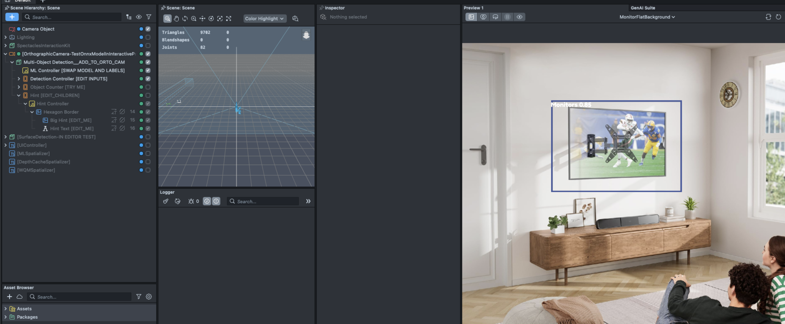

# SnapML Starter

[](https://developers.snap.com/spectacles/spectacles-frameworks/spectacles-interaction-kit/features/overview?) [](https://developers.snap.com/spectacles/spectacles-frameworks/spectacles-interaction-kit/features/overview?) [](https://developers.snap.com/spectacles/spectacles-frameworks/spectacles-interaction-kit/features/overview?) [](https://developers.snap.com/lens-studio/features/physics/physics-overview?) [](https://developers.snap.com/spectacles/about-spectacles-features/apis/world-mesh-api) [](https://developers.snap.com/lens-studio/features/ar-tracking/world/world-mesh-and-depth-texture)


## Overview
This project demonstrates how to leverage SnapML on Spectacles for object detection using custom machine learning models. SnapML brings powerful computer vision capabilities to Spectacles, enabling developers to create AR experiences that can recognize and interact with real-world objects. This template provides a complete workflow for training and deploying custom YOLOv7 models on Spectacles.

> **NOTE:**
> This project is specifically designed for the Spectacles platform.
> The complete workflow involves cloud-based development environments (Paperspace) and dataset management tools (Roboflow).

## Design Guidelines

Designing ML-powered Lenses for Spectacles opens new possibilities for creating context-aware augmented reality experiences. For general Spectacles design guidance, visit our [Design Guidelines](https://developers.snap.com/spectacles/best-practices/design-for-spectacles/introduction-to-spatial-design).

## Prerequisites

- **Lens Studio**: v5.10.0+
- **Spectacles OS Version**: v5.62+
- **Spectacles App iOS**: v0.62+
- **Spectacles App Android**: v0.62+

> **Disclaimer:**
> We do not endorse these service, this project is for educational purposes and you could use other alternatives if you'd like. 

- **Paperspace Account**: For cloud-based ML training environment
- **Roboflow Account**: For dataset management and annotation

For detailed documentation on the complete workflow, visit our [SnapML on Spectacles Documentation](https://developers.snap.com/spectacles-templates/snapml).

## Getting Started

To obtain the project folder, clone the repository.

> **IMPORTANT:**
> This project uses Git Large Files Support (LFS). Downloading a zip file using the green button on GitHub **will not work**. You must clone the project with a version of git that has LFS.
> You can download Git LFS [here](https://git-lfs.github.com/).

## Workflow Overview

The complete SnapML workflow consists of these major phases:

1. **Setup**: Prepare your development environment in Paperspace
2. **Data Preparation**: Manage and export your dataset with Roboflow
3. **Training**: Train a custom YOLOv7 model using your dataset
4. **Export**: Convert your trained model to ONNX format for SnapML
5. **Deployment**: Import your model into Lens Studio for use on Spectacles

```bash
# Quick Start Workflow
# 1. Set up environment in Paperspace with PyTorch template
git clone https://github.com/Snapchat/snapml-templates.git
git clone https://github.com/hartwoolery/yolov7
cd yolov7
git checkout export-snapml
pip install -r requirements.txt

# 2. Download dataset from Roboflow in YOLOv7 format
pip install --upgrade roboflow
# Use Roboflow API to download your dataset

# 3. Download pre-trained weights
wget https://github.com/WongKinYiu/yolov7/releases/download/v0.1/yolov7-tiny.pt

# 4. Train model
python train.py --data your-dataset/data.yaml --cfg cfg/training/yolov7-tiny.yaml \
  --weights yolov7-tiny.pt --img 224 224 --batch-size 64 --epochs 200 \
  --name detection --device 0 --hyp data/hyp.scratch.tiny.yaml

# 5. Export to ONNX for SnapML
python export.py --weights runs/train/detection/weights/best.pt --grid \
  --simplify --export-snapml --img-size 224 224 --max-wh 224
```

## Key Features

### Object Detection

The template provides functionality for detecting multiple objects in real-time using custom-trained YOLOv7 models. This enables your AR experience to understand what the user is looking at through Spectacles.

### 3D Object Placement

Using the PinholeCameraModel class, the template can place 3D objects at the real-world locations of detected objects, creating spatially-aware AR experiences.

### Smoothed Object Tracking

The template includes tracking features to maintain stable AR effects even as detected objects move through the environment, with configurable smoothing options.

## Project Structure

The SnapML template follows a modular architecture designed for object detection and spatial positioning on Spectacles. The key components work together to create a seamless AR experience:

---

### Detection Pipeline Overview

At the heart of this template is the `MLSpatializer.ts` script, which is responsible for:
- Running the YOLOv7 model on the camera input.
- Producing 2D detection results (screen coordinates) for each object.

**Both spatialization modes described below depend on MLSpatializer for detection.**  
The two spatializer scripts—`DepthCacheSpatializer.ts` and `WorldQueryModuleSpatializer.ts`—do not perform detection themselves. Instead, they take the 2D detection results from MLSpatializer and visualize them in 3D space using different spatialization techniques:
- **Depth Cache Spatializer**: Projects detections into 3D using device depth data.
- **World Query Module Spatializer**: Projects detections into 3D using world hit-testing.

You must always have MLSpatializer enabled and configured, regardless of which spatialization mode you use.

---


### Core Scripts & Modes

> **Note:**  
> `MLSpatializer.ts` is always required and must be enabled for both modes.  
> The spatializer scripts (`DepthCacheSpatializer.ts` and `WorldQueryModuleSpatializer.ts`) only handle the visualization of detections in 3D space—they do not perform detection themselves.

This template provides **two main modes for object detection and spatialization**. Only one mode should be enabled at a time. Each mode uses a different set of scripts and has a distinct workflow:

---

#### 1. **Depth Cache Mode** (Supports "Click To Detect" and "Continuous" modes)

- **Purpose:** Uses device depth data to spatialize detected objects in 3D space with high accuracy.
- **Advanced Smoothing & Static Mode:**  
  Depth Cache mode features advanced smoothing and "past effects" techniques to ensure a seamless user experience. The system analyzes camera/user movement to determine if an update is necessary, reducing jitter and unnecessary prefab movement.  

  

  - **Static Mode:** When enabled, a but it was a static and then OK prefab is pre-instantiated and smoothly moved to new detection locations, rather than destroying and recreating it.  

  

  - **Dynamic Mode:** The prefab is destroyed and re-instantiated on each update.  
  This approach allows for reliable continuous updates, as positions are estimated directly from the depth texture, rather than relying on hit-testing surfaces (as in World Query Module).
- **Main Scripts:**
  - `DepthCacheSpatializer.ts`  
    Main controller for this mode. Handles detection, depth-based placement, smoothing, and static/dynamic modes.
  - `DepthCache.ts`  
    Manages depth frame acquisition and mapping between color and depth frames.
  - `MLSpatializer.ts`  
    Runs the ML model (YOLOv7) and provides detection results.
  - `DebugVisualizer.ts`  
    (Optional) Visualizes detection points and bounding boxes for debugging.
  - `DetectionContainer.ts`, `ClosedPolyline.ts`  
    Used for displaying detection info and drawing bounding boxes in 3D.
  - `SpatializerUtils.ts`  
    Utility functions for smoothing, lerping, and geometry.

- **How to use:**  
  - **Enable**: `DepthCacheSpatializer` object and its script.
  - **Disable**: `WorldQueryModuleSpatializer` object and script.
  - **Debugging:** Optionally enable the "DebugDepthImage" for 2D debug visualization.
  - **Modes:**  
    - "Click To Detect": Updates on button press.  
    - "Continuous": Enable `enableContinuousUpdate` for automatic, periodic updates.


---

#### 2. **World Query Module Mode** (Supports only "Click To Detect")

- **Purpose:** Uses the World Query Module to place detected objects on real-world surfaces using hit-testing.
- **Main Scripts:**
  - `WorldQueryModuleSpatializer.ts`  
    Main controller for this mode. Handles detection, hit-testing, and placement.
  - `PinholeCapture.ts`  
    Provides camera pose and projection utilities for mapping detections to world space.
  - `MLSpatializer.ts`  
    Runs the ML model (YOLOv7) and provides detection results.
  - `DetectionContainer.ts`, `ClosedPolyline.ts`  
    Used for displaying detection info and drawing bounding boxes in 3D.

- **How to use:**  
  - **Enable**: `WorldQueryModuleSpatializer` object and its script.
  - **Disable**: `DepthCacheSpatializer` object and script.
  - **Debugging:** Disable "DebugDepthImage" for a clean view.
  - **Mode:**  
    - Only "Click To Detect" is supported (updates on button press).

If you wonder how to test your model when imported in lens studio - use the 2D ML controller in this way:

- Turn off all of the SIK related utility 
- Use the preview as "No Simulation"
- Using a custom background preview - test your model in the editor. 



---

**Supporting Scripts (used in both modes):**
- `DetectionHelpers.ts`, `YOLODetectionProcessor.ts`: Detection data structures and post-processing (NMS, IOU, etc.).
- `CameraService.ts`, `CameraTexture.js`: Camera access and texture management.
- `SmartTether.ts`, `MatchTransform.ts`, `MatchTransformLocal.ts`, `InBetween.ts`, `Line.ts`: Utilities for content positioning, transform matching, and line rendering.

**Important:**  
- Only one spatialization mode should be active at a time.  
- For best results, ensure the object to be detected is fully visible in your field of view.


### Resource Files
- **Model Files**: ONNX model files exported from the ML training pipeline
- **Class Mappings**: Configuration for mapping model outputs to class labels

### Script Relationships

#### Depth Cache Mode

Reminder: Sometimes if the confidence is too low, you might detect similar objects 


- `MLSpatializer` runs the ML model and outputs detections.
- `DepthCacheSpatializer` receives detections, queries `DepthCache` for depth info, and places objects in 3D.
- `DebugVisualizer` (optional) visualizes detection points and bounding boxes.
- `DetectionContainer` and `ClosedPolyline` display detection info and draw bounding boxes.
- `SpatializerUtils` provides smoothing and geometry utilities.

#### World Query Module Mode

- `MLSpatializer` runs the ML model and outputs detections.
- `WorldQueryModuleSpatializer` receives detections, uses `PinholeCapture` for camera pose, and places objects using world hit-testing.
- `DetectionContainer` and `ClosedPolyline` display detection info and draw bounding boxes.

**Switching Modes:**  
- Enable only the relevant spatializer object/script for the mode you want to test.
- Disable the other spatializer and any conflicting debug visualizations.

This modular architecture ensures a clear data flow from camera input, through ML detection, to AR content placement, with mode-specific spatialization logic.

Playing the lens with or without the detection box. 


An example of stabilization of the detection based on our use case using an extracted logic from `Surface Detection`to lock the content to a vertical surface.


## Testing Your Lens

### In Lens Studio Editor

1. Open the project in Lens Studio
2. Import your ONNX model using the SnapML component
3. Configure the class mappings to match your trained model
4. Use the Preview panel to test with simulated camera input

### On Spectacles Device

1. Build and deploy the project to your Spectacles device
2. Test object detection in various environments and lighting conditions
3. Verify tracking performance with moving objects

## Resources

- [Detailed SnapML Workflow Documentation](https://developers.snap.com/spectacles-templates/snapml)
- [SnapML Templates GitHub Repository](https://github.com/Snapchat/snapml-templates)
- [YOLOv7 GitHub Repository](https://github.com/WongKinYiu/yolov7)
- [Roboflow Documentation](https://docs.roboflow.com/)
- [Lens Studio ML Documentation](https://docs.snap.com/lens-studio/references/guides/lens-features/machine-learning/ml-overview)
- [Video Tutorial on YouTube](https://www.youtube.com/watch?v=kr3rvqWLEFE)

## Support

If you have any questions or need assistance, please don't hesitate to reach out. Our community is here to help, and you can connect with us and ask for support [here](https://www.reddit.com/r/Spectacles/). We look forward to hearing from you and are excited to assist you on your journey!

## Contributing

Feel free to provide improvements or suggestions or directly contributing via merge request. By sharing insights, you help everyone else build better ML-powered Lenses.
