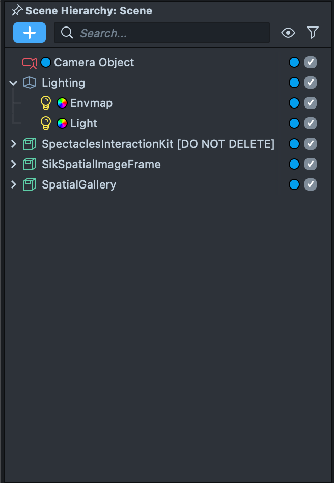
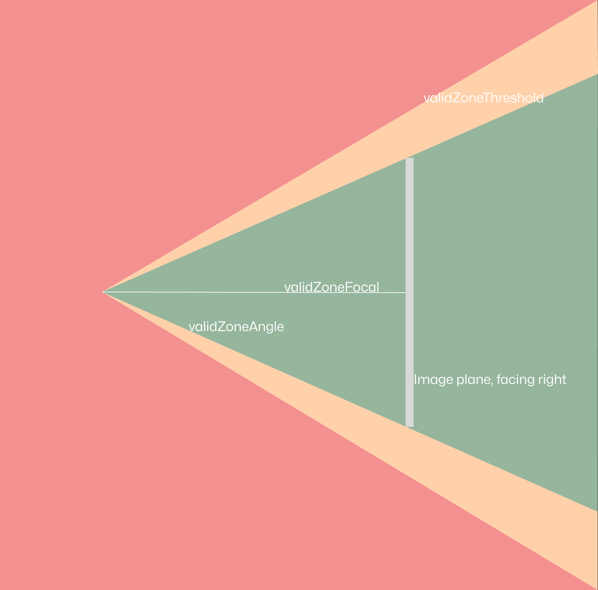

# Spatial Image Gallery

[](https://developers.snap.com/spectacles/spectacles-frameworks/spectacles-interaction-kit/features/overview?) [](https://developers.snap.com/spectacles/about-spectacles-features/apis/spatial-image?)


## Overview

Uploads a normal photo and gets back a 3D spatialized mesh that can be observed within a scene.

> **NOTE:**
> This project will only work for the Spectacles platform.

## Design Guidelines

Designing Lenses for Spectacles offers all-new possibilities to rethink user interaction with digital spaces and the physical world.
Get started using our [Design Guidelines](https://developers.snap.com/spectacles/best-practices/design-for-spectacles/introduction-to-spatial-design)

## Prerequisites

- **Lens Studio**: v5.10.0+
- **Spectacles OS Version**: v5.62+
- **Spectacles App iOS**: v0.62+
- **Spectacles App Android**: v0.62+

To update your Spectacles device and mobile app, refer to this [guide](https://support.spectacles.com/hc/en-us/articles/30214953982740-Updating).

You can download the latest version of Lens Studio from [here](https://ar.snap.com/download?lang=en-US).

## Getting the project

To obtain the project folder, you need to clone the repository.

> **IMPORTANT**:
> This project uses Git Large Files Support (LFS). Downloading a zip file using the green button on Github
> **will not work**. You must clone the project with a version of git that has LFS.
> You can download Git LFS here: https://git-lfs.github.com/.

## Initial Project Setup

The project as cloned has a working example scene, it has easy an easy to edit list of images so new images can be added to the gallery. It also serves as an example project for how to generate and manipulate Spatialized Images for use in your own projects.



The Spatial Image Gallery sample project includes three main scene objects:

- **SpectaclesInteractionKit**: Drives the interactions.
- **SikSpatialImageFrame**: Extends the container frame and allows manipulation of the spatial image.
- **SpatialGallery**: Enables browsing and navigating through multiple images.

## Key Scripts

[SpatialImageAngleValidator.ts](./Assets/Spatial%20Image%20Template/Components/SpatialImageAngleValidator.ts)

The spatial image angle validator monitors the camera's position and emits events to determine if the viewing angle is optimal. In this sample project, these events are utilized by the `SpatialImageDepthAnimator`. Viewing images from extreme angles can reveal defects, which is generally undesirable. To address this, two scripts are employed:

- The first script tracks the camera's position relative to the Spatial Image.
- The second script reduces the depth scale, effectively flattening the image back to its original texture.

Other scripts can track these transitions by registering callbacks via the provided functions.

```javascript
  /**
   * Add a callback to onValidityCallbacks, to be called when the image is fully loaded
   * @param callback - the callback to add
   */
  public addOnValidityCallback(callback: (entered: boolean) => void): void {
    this.onValidityCallbacks.push(callback)
  }

  /**
   * Remove a callback from the onValidityCallbacks.
   * @param callback - the callback to remove
   */
  public removeOnValidityCallback(callback: (entered: boolean) => void): void {
    this.onValidityCallbacks = this.onValidityCallbacks.filter(
      (cb) => cb !== callback
    )
  }
```

The boundaries of the zone are controlled by two variables in the inspector: `validZoneFocal` and `validZoneAngle`.

- `validZoneFocal`: Controls the distance of a point projected behind the image, which is used to compute the angle between the user's camera and the forward direction of the image. This allows the user to approach the image closely.
- `validZoneAngle`: Specifies the range of the valid zone in degrees. The default values are `validZoneFocal` set to 2 and `validZoneAngle` set to 25, but these can be adjusted to create different viewing effects.
- `validZoneThreshold`: Defines a small angle offset to prevent the user from frequently switching between valid and invalid zones.



[SpatialImageDepthAnimator.ts](./Assets/Spatial%20Image%20Template/Components/SpatialImageDepthAnimator.ts)

`Spatial Image Depth Animator` adjusts the "depth scale" of the spatialized image, setting the desired depth. It works with the angle validator to reduce depth to a minimum when the viewing angle is invalid. When a new image is applied, it animates from a minimum depth scale to a user-specified maximum to showcase the effect.

The `setMaxDepthScale` function transitions the image between a flattened state and a fully spatialized state using an easing function. This makes the depth change feel more natural. You can create new visual effects by replacing the "ease-in-out-sine" function with other functions from the easing functions array.

```javascript
if (Math.abs(distance) > 0.01) {
  this.depthFlattenFollower =
    this.depthFlattenFollower +
    Math.sign(distance) * getDeltaTime() * this.animateSpeed
}

const easedAngle = easingFunctions["ease-in-out-sine"](
  this.depthFlattenFollower
)
```


> **NOTE:**
> The maximum depth scale for an image can be edited with the function `SpatialImageDepthAnimator.setBaseDepthScale`. This can be useful for changing how "3D" the image is.

[SpatialGallery.ts](./Assets/Spatial%20Image%20Template/Components/SpatialGallery.ts)

With the gallery scene set up, you can open the `SpatialGallery` script to understand how this example works. Spatial Gallery demonstrates a basic use of the spatializer. Images, represented as `Texture`, are organized in a list and spatialized using `SpatialImageFrame.setImage`, which is called in the `setIndex` function.

```javascript
  private setIndex(newIndex: number) {
    this.index = newIndex
    this.frame.setImage(this.gallery[this.index], true)
  }
```

[SpatialImageSwapper.ts](./Assets/Spatial%20Image%20Template/Components/SpatialImageSwapper.ts)

Spatial Image Swapper manages the transition between a flat image and a spatialized image. It references both the flat image and the spatializer, ensuring the flat image is replaced with the spatialized version. Additionally, it updates the scale of the flat image to render correctly within the frame when the texture is set.

[SpatialImageFrame.ts](./Assets/Spatial%20Image%20Template/Components/SpatialImageFrame.ts)

The Spatial Image Frame acts as the manager, it handles requests to spatialize images, updates the flat image, swaps the images when the spatialized version is ready, and ensures the SIK frame renders correctly without clipping or interfering with either image.

The key function here is `setImage`, which integrates the display components. It first adjusts the SIK container size to match the aspect ratio of the provided image.

Additionally, you can subscribe to the spatial image's `onLoaded` callback. This ensures that once the image is spatialized, the flat image is hidden, leaving only the 3D image visible. The image texture is passed to both the spatializer and the swapper to keep everything updated.

A small timeout is included at the bottom to ensure the first image displayed has the correct aspect ratio. This allows the frame to initialize properly before reading from it.

```javascript
  /**
   * Updates both spatialized and flat images to the passed texture.
   */
  public setImage(image: Texture, swapWhenSpatialized: boolean = false): void {
    // update the size of the container to match the dimensions of the new image.
    const height: number = this.container.innerSize.y
    const newWidth: number = height * (image.getWidth() / image.getHeight())
    this.updateContainerSize(new vec2(newWidth, height))

    // if this argument is true, then when the "onLoaded" event is actuated, this component should update to display the spatialized image.
    if (swapWhenSpatialized) {
      const setSpatialCallback = () => {
        this.setSpatialized(true)
        this.spatializer.onLoaded.remove(setSpatialCallback)
      }
      this.spatializer.onLoaded.add(setSpatialCallback)
    }

    // The swapper is passed a reference to the new flat image and set to be unspatialized until the spatialization result comes through.
    this.spatialImageSwapper.setImage(image)
    this.spatialImageSwapper.setSpatialized(false)
    this.spatializer.setImage(image)

    // A work around to the initialization of the scene
    setTimeout(() => {
      this.updateContainerSize(new vec2(newWidth, height))
    }, 100)
  }
```

When an image is "picked up" with pinching, users are able to move the image closer or further away from them quite rapidly. Doing this can produce a strange effect on the observer as their window into the spatialized world appears to warp in depth. To counter this, the depth animator adjusts the frame offset of the spatialized image.

```javascript
  private setFocalPoint() {
    const cameraPosition = this.camera.getTransform().getWorldPosition()
    const imagePos = this.spatializer.getTransform().getWorldPosition()
    const distance = cameraPosition.distance(imagePos)
    this.spatializer.setFrameOffset(-distance)
  }
```


## Notes on Testing the Lens

### In Lens Studio Editor

Open the project and observe a pre-made Custom Location of an office. The statue in the center has an animated cat set to spawn on approach. Moving the camera preview window will simulate the approach of the user and the cat can be observed to appear and a sound effect is played.

### On Spectacles Device

Custom Locations are by nature attached to real places. To test this Lens on device, the Custom Location Group will need to be changed. Following the guide linked at the start of this document, replace the Group ID on the SceneObject "LocationRoot" with a scan you have made; follow the instructions to recreate the parented assets to this new scan.
Once completed, send the Lens to the Spectacles, launch the new Lens and move to the scanned location.

## Support

If you have any questions or need assistance, please don't hesitate to reach out. Our community is here to help, and you can connect with us and ask for support [here](https://www.reddit.com/r/Spectacles/). We look forward to hearing from you and are excited to assist you on your journey!

## Contributing

Feel free to provide improvements or suggestions or directly contributing via merge request. By sharing insights, you help everyone else build better Lenses.
