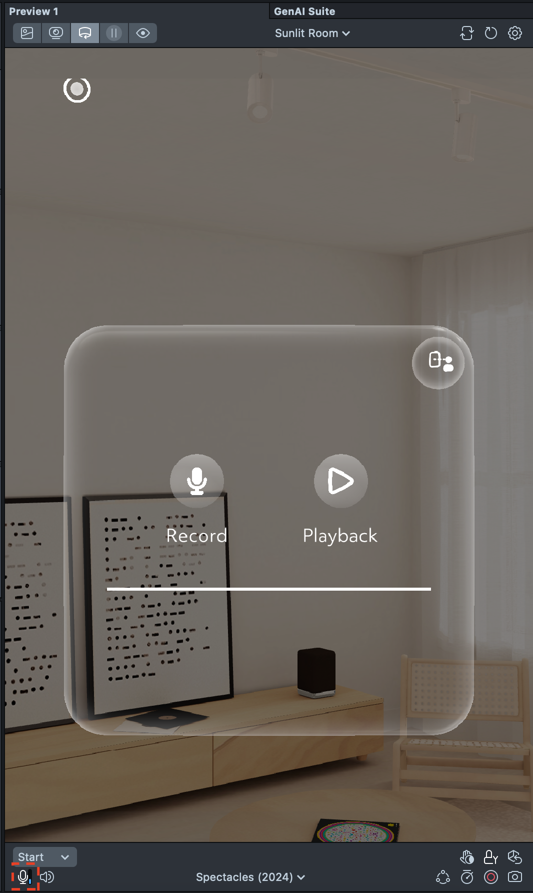

# Voice Playback

 

## Overview

This is a sample project demonstrating how to record audio from the microphone of Spectacles and play it back. Once the Lens is closed, the recordings you have made are no longer available.

> **NOTE:**
> This project will only work for the Spectacles platform.

## Design Guidelines

Designing Lenses for Spectacles offers all-new possibilities to rethink user interaction with digital spaces and the physical world.
Get started using our [Design Guidelines](https://developers.snap.com/spectacles/best-practices/design-for-spectacles/introduction-to-spatial-design)

## Prerequisites

- **Lens Studio**: v5.10.0+
- **Spectacles OS Version**: v5.62+
- **Spectacles App iOS**: v0.62+
- **Spectacles App Android**: v0.62+

To update your Spectacles device and mobile app, refer to this [guide](https://support.spectacles.com/hc/en-us/articles/30214953982740-Updating).

You can download the latest version of Lens Studio from [here](https://ar.snap.com/download?lang=en-US).

## Getting the project

To obtain the project folder, you need to clone the repository.

> **IMPORTANT**:
> This project uses Git Large Files Support (LFS). Downloading a zip file using the green button on Github
> **will not work**. You must clone the project with a version of git that has LFS.
> You can download Git LFS here: https://git-lfs.github.com/.

## Initial Project Setup

The project should be pre-configured to get you started without any additional steps. However, if you encounter issues in the Logger Panel, please ensure your Lens Studio environment is set up for [Spectacles](https://developers.snap.com/spectacles/get-started/start-buiding/preview-panel).

## Key Scripts

- [MicrophoneRecorder.ts](./Assets/Scripts/MicrophoneRecorder.ts) - Controls the logic for recording the microphone input, storing it locally to the device (won't be able to use it after Lens is closed), then playing back the recorded audio.

- [ActivateMicrophoneRecorder.ts](./Assets/Scripts/ActivateMicrophoneRecorder.ts) - UI Helper which listens for when the Microphone Recorder activates a recording.

- [PlaybackMicrophoneRecorder.ts](./Assets/Scripts/PlaybackMicrophoneRecorder.ts) - UI Helper which listens for when the Playback of the recording is active.

## Testing the Lens

### In Lens Studio Editor

Make sure that you have enabled the live microphone input so that Lens Studio can get microphone data.

Once the Live Microphone Input is enabled, you can press and hold the "Record" button. The duration of the microphone recording is determined by how long you hold this button.

> ⚠️ **Warning:** Please be mindful of the size of the recording.

After you finish recording, press the "Playback" button once. If you have recorded audio, you can press this button as many times as you want to replay the recording.

### On Spectacles Device

Use your right or left hand to pinch the "Record" button. Hold your pinch as long as you want to record.

Press the "Playback" button once you have recorded to get the audio playback.

The UI elements are under a Container Frame so you can move the UI frame as you like.

## Support

If you have any questions or need assistance, please don't hesitate to reach out. Our community is here to help, and you can connect with us and ask for support [here](https://www.reddit.com/r/Spectacles/). We look forward to hearing from you and are excited to assist you on your journey!

## Contributing

Feel free to provide improvements or suggestions or directly contributing via merge request. By sharing insights, you help everyone else build better Lenses.
